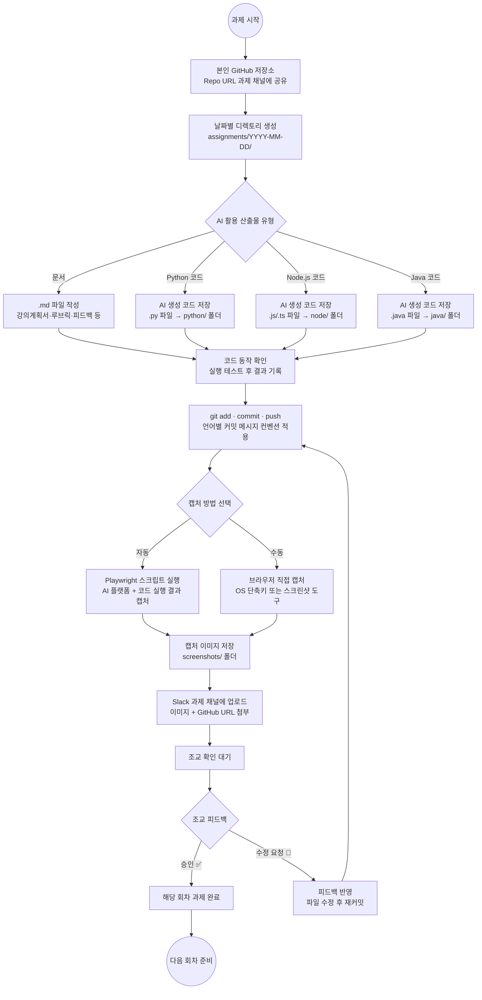
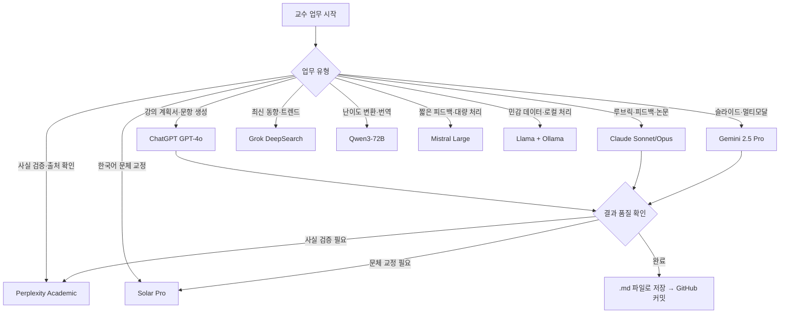
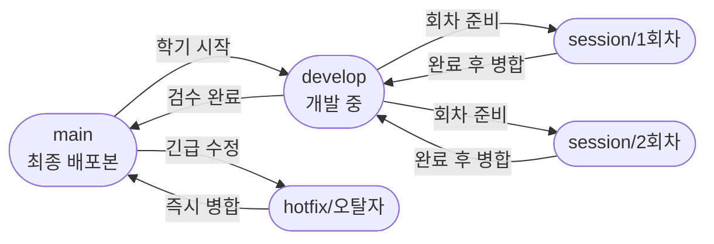
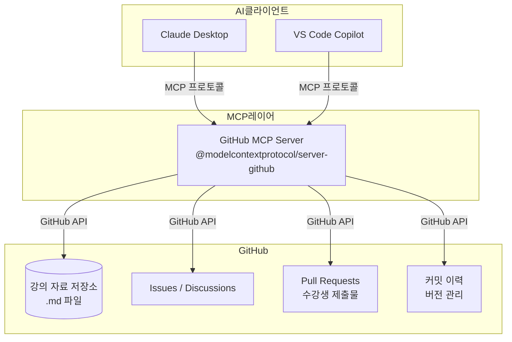

<link rel="stylesheet" href="https://cdnjs.cloudflare.com/ajax/libs/font-awesome/6.5.2/css/all.min.css" />

# edumgt 프로젝트 허브

> **edumgt** 교육 과정에서 운영되는 전체 프로젝트 목록과 상호 연관도입니다.

---

## 프로젝트 목록 (40개)

### <i class="fa-solid fa-cube"></i> 1단계 — 개발환경 & 기초

| 저장소 | 설명 | 핵심 기술 |
|--------|------|-----------|
| **edumgt-lab-init** | 개발환경 최초 설정 가이드. WSL2·Python·Node·Java·Docker·K8s 순차 실습 | WSL2, Python, Node.js, Java, Docker, K8s |
| **python-basic-lab** | 파이썬 기초 + 영상편집·오디오TTS·PDF/이미지 처리·통계 실습 | Python, FastAPI, OpenCV, TTS |
| **Python-Shooting_Game** | asyncio + WebSocket 2인용 네트워크 슈팅 게임 (Python 비동기 학습용) | Python asyncio, WebSocket, HTML5 Canvas |

---

### <i class="fa-brands fa-docker"></i> 2단계 — 인프라 & 클라우드

| 저장소 | 설명 | 핵심 기술 |
|--------|------|-----------|
| **docker-class** | Docker 기초~심화 20개 Lab + Jenkins·GitLab·SonarQube·Nexus·Drone 온프레미스 DevSecOps | Docker, Jenkins, GitLab CE, SonarQube, Nexus |
| **kubernetes-lab** | K8s 아키텍처 → Pod/RS/Deployment → HPA → Ingress 단계별 실습 (VMware/VirtualBox) | kubeadm, kubectl, Calico, MetalLB, NGINX Ingress |
| **k8s-jupyter-lab** | Kubernetes 기반 사용자별 JupyterLab 세션 + Harbor·Nexus 포함 데이터 플랫폼 OVA | kubeadm, JupyterLab, Harbor, Nexus, MetalLB, Kustomize |
| **openstack-private-cloud** | Ansible 기반 OpenStack 프라이빗 클라우드 구축 (Keystone/Glance/Nova/Neutron/Cinder) | Ansible, OpenStack, Ubuntu |
| **aws-ec2-alb-lab** | AWS 계정 보안 설정 → EC2/VPC/ALB → Auto Scaling → ECS Fargate 배포까지 Lab | AWS EC2, ALB, ECS Fargate, FastAPI |
| **aws-serverless** | AWS Lambda + API Gateway 서버리스 실습 (Node.js·Python·Java, CLI/콘솔 양방향) | AWS Lambda, API Gateway, Serverless Framework |
| **aws-eks-lab** | AWS EKS 이중 클러스터 구성 → ECR 이미지 빌드 → ALB Ingress 실전 운영 | AWS EKS, eksctl, ECR, ALB Ingress, MariaDB |
| **aws-polly** | Amazon Polly TTS 실습 — FastAPI + S3 Presigned URL + Lambda 서버리스 배포 | Amazon Polly, S3, Lambda, boto3, FastAPI |
| **aws-rekognition** | AWS Rekognition 얼굴/이미지 분석 + Lambda 자동화 (Node.js 11챕터 커리큘럼) | AWS Rekognition, Lambda, S3, Node.js |
| **aws-sqs-sns** | AWS SQS·SNS 메시지 큐·알림 실습 + ElastiCache Cache-Aside 예제 | AWS SQS, SNS, ElastiCache, boto3 |
| **aws-transcribe** | Amazon Transcribe 음성→텍스트 실습 + SRT/VTT 자막 변환 (Node.js SDK v3) | AWS Transcribe, S3, Node.js AWS SDK v3 |
| **chatbot-app** | Amazon Lex V2 + Lambda Fulfillment 예약 챗봇 + Node.js Express API 연동 | Amazon Lex V2, Lambda, Node.js, Express |

---

### <i class="fa-solid fa-chart-bar"></i> 3단계 — 데이터 수집 & 전처리

| 저장소 | 설명 | 핵심 기술 |
|--------|------|-----------|
| **python-crawling-lab** | 네이버/다음 금융·KRX ETF 크롤러 + Qdrant Vector DB 연동 실습 | Python, BeautifulSoup, Qdrant, OpenSanctions |
| **py-util** | DART·KOSIS·통계청 기업 공시 데이터 수집 크롤링 유틸리티 스크립트 모음 | Python, requests, BeautifulSoup, DART API |

---

### <i class="fa-solid fa-robot"></i> 4단계 — 머신러닝 & 딥러닝

| 저장소 | 설명 | 핵심 기술 |
|--------|------|-----------|
| **py-ml-dl-lab** | Python ML/DL 챕터별 실습 (Bayes·CNN·챗봇·MySQL 연동 등) | scikit-learn, Keras, TensorFlow, MySQL |
| **python-ml-class** | 머신러닝 기초 → Transformer 주가 방향 분류 모델 구현 | scikit-learn, PyTorch, Transformer, yfinance |
| **ai-agent-lab** | Python AI Agent 종합 커리큘럼 (Python→전처리/시각화→ML/DL→NLP/음성→에이전트) | Python, scikit-learn, HuggingFace, LangChain, Qdrant |

---

### <i class="fa-solid fa-feather"></i> 5단계 — LLM & RAG

| 저장소 | 설명 | 핵심 기술 |
|--------|------|-----------|
| **langchain-lab** | LangChain 기능 카탈로그 최신판 (LCEL·RAG·Agent·VectorStore, Ollama/OpenAI 스위칭) | LangChain, Ollama, OpenAI, Qdrant, LangSmith |
| **Python-Langchain-Lab** | LangChain 기능 카탈로그 (Langfuse 모니터링 연동 포함) | LangChain, Ollama, OpenAI, Qdrant, Langfuse |
| **aihub-rag** | AI Hub 데이터 기반 심리상담·의료·법률 도메인 RAG + 자동평가 (반응형 웹 UI) | FastAPI, Qdrant, HuggingFace, Docker |
| **AI-Python-Domain-RAG** | 의학·고교영어 도메인 특화 RAG 에이전트 (Tool Calling + Streamlit UI) | FastAPI, Qdrant, PostgreSQL, Redis, vLLM, Streamlit |
| **education-counsel** | 학생 진로탐색 AI 상담 시스템 (RAG Chatbot, FastAPI + 반응형 웹) | FastAPI, MongoDB, Qdrant, Docker |
| **ollama-llava-canvas** | Ollama LLaVA 기반 캔버스 드로잉 + AI 이미지 향상 (FastAPI + HTML5 Canvas) | Ollama, LLaVA, FastAPI, SQLite |
| **meeting-agent** | 회의 녹음 → STT 전사 → 회의록 리포트 자동 생성 (브라우저 녹음 + FastAPI) | FastAPI, OpenAI Whisper, ffmpeg, Node.js |
| **whisper-agent** | 멀티모달 상담 데이터 분석 + 벡터 검색 기반 RAG 리포트 생성 + PDF 다운로드 | FastAPI, ChromaDB, OpenAI, Ollama, Tailwind |
| **ocr-webapp** | Tesseract OCR + AI 보완 웹앱 — Nginx 프론트 + FastAPI 백엔드 + 관리자 대시보드 | FastAPI, Tesseract 5, Nginx, Ollama, Docker |

---

### <i class="fa-solid fa-chart-line"></i> 6단계 — 금융 & 투자 실전 프로젝트

| 저장소 | 설명 | 핵심 기술 |
|--------|------|-----------|
| **investment-analysis** | 금융자산 지식 RAG 구축 (취업 목적 자산운용 시스템, 데이터 누적형) | FastAPI, Qdrant, MongoDB, Python |
| **python-ai-basic-lab** | AI 기초 + 주식 데이터 실습 (TurboQuant 개념, 캔들+거래량 차트 동기화) | FastAPI, Plotly, yfinance, Docker |
| **stock-ML-DL-project** | 주식 ML/DL 전체 파이프라인 (Django+Airflow+Kafka+Flask+K8s 배포) | Django, Airflow, Kafka, Flask, K8s, Docker |
| **stock-coin-trade** | 한국 4대 코인거래소 시세 + Spring Boot 모의투자 웹앱 (Java) | Spring Boot, Thymeleaf, Tailwind CSS, PostgreSQL |
| **lumina-invest** | 투자 분석 AI 웹앱 (Neo4j 그래프 + FastAPI + 대화관리) ← **선수: openstack-private-cloud** | FastAPI, Neo4j, Qdrant, Docker |
| **invest-flow** | AI 기반 개인 투자 일정 관리 웹앱 — Vue 3 + Node.js + Claude AI + 투자 캘린더 | Vue 3, Node.js, PostgreSQL, Claude AI |

---

### <i class="fa-solid fa-layer-group"></i> 7단계 — 풀스택 & 서비스 개발

| 저장소 | 설명 | 핵심 기술 |
|--------|------|-----------|
| **springboot-lab** | Spring Boot 3 기반 온라인 시험 플랫폼 MSA (Spring Cloud Gateway + 8개 마이크로서비스) | Spring Boot 3, Spring Cloud Gateway, PostgreSQL, Redis, Kafka |
| **platform-backoffice** | Spring MVC 기반 Java 관리자 백오피스 플랫폼 (WAR 배포, MyBatis + JSP) | Spring MVC 4, MyBatis, JSP, Tomcat, Java 17 |
| **fe-vanilla** | AI 기반 관리자 모드 SaaS/PaaS 데모 — Vanilla JS + FastAPI, 동영상 AI 판별 포함 | FastAPI, Vanilla JS, Docker |
| **webrtc-app** | Vue 3 기반 협업형 WebRTC 화상통화 앱 + 운영 대시보드 (Docker Compose) | Vue 3, Vite, WebRTC, Tailwind CSS, Node.js |
| **inquiry-saas** | 한국 내륙 물류 견적 + 알바·용역 인력 수발주 통합 멀티 SaaS 플랫폼 | FastAPI, PostgreSQL, Docker |

---

## 프로젝트 연관도

```
┌─────────────────────────────────────────────────────────────────────────────┐
│                         1단계: 개발환경 & 기초                               │
│                                                                              │
│   edumgt-lab-init ──────────────────────────────────────────────────────┐   │
│   (WSL2·Python·Node·Java·Docker·K8s 환경 구축)                          │   │
└──────────────────────────────────────────────────────────────────────────│──┘
                                                                          │
          ┌───────────────────┬──────────────────────────────┬────────────┘
          ▼                   ▼                              ▼
┌─────────────────┐  ┌────────────────────┐       ┌─────────────────────┐
│ python-basic-   │  │   docker-class     │       │ Python-Shooting_    │
│ lab             │  │ (Docker 기초~심화   │       │ Game                │
│ (Python 기초    │  │  DevSecOps 온프레) │       │ (asyncio 교육용)    │
│  멀티미디어)    │  └────────┬───────────┘       └─────────────────────┘
└────────┬────────┘           │
         │                    │ 선수
         ▼                    ▼
┌─────────────────┐  ┌────────────────────────────────────────────────────────┐
│ python-         │  │           2단계: 인프라 & 클라우드                      │
│ crawling-lab    │  │                                                         │
│ (크롤러 +       │  │  docker-class ──→ kubernetes-lab ──→ k8s-jupyter-lab   │
│  Qdrant 연동)   │  │                         │                               │
│                 │  │                         ▼                               │
│ py-util         │  │             openstack-private-cloud                     │
│ (기업 데이터    │  │             (Ansible + OpenStack)                       │
│  수집 유틸)     │  │                                                         │
└────────┬────────┘  │  docker-class ──→ aws-serverless / aws-ec2-alb-lab     │
         │           │  aws-ec2-alb-lab ──→ aws-eks-lab                       │
         │           │  AWS 서비스: aws-polly / aws-rekognition                │
         │           │             aws-sqs-sns / aws-transcribe / chatbot-app  │
         │           └────────────────────────────────────────────────────────┘
         │
         │     ┌───────────────────────────────────────────┐
         │     │        3 → 4단계: ML/DL 학습 경로         │
         │     │                                           │
         │     │  python-basic-lab                         │
         │     │       │                                   │
         │     │       ▼                                   │
         │     │  py-ml-dl-lab ──→ python-ml-class         │
         │     │       │                │                  │
         │     │       └────────┬───────┘                  │
         │     │                ▼                          │
         │     │  ai-agent-lab (종합 커리큘럼)             │
         │     │  Python→전처리→ML/DL→NLP→에이전트         │
         │     └───────────────────────────────────────────┘
         │
         │     ┌───────────────────────────────────────────────────────┐
         │     │              5단계: LLM & RAG                         │
         │     │                                                       │
         │     │  langchain-lab / Python-Langchain-Lab ─────────────┐ │
         │     │  (LangChain 카탈로그, Ollama/OpenAI 스위칭)          │ │
         │     │           │                                          │ │
         │     │           ├──→ aihub-rag (심리상담·의료·법률 RAG)   │ │
         └─────┼──────────→│                                          │ │
               │           ├──→ AI-Python-Domain-RAG                 │ │
               │           │   (의학·고교영어 도메인 RAG)             │ │
               │           ├──→ education-counsel                    │ │
               │           │   (학생 진로상담 RAG Chatbot)            │ │
               │           ├──→ meeting-agent (STT + 회의록)         │ │
               │           ├──→ whisper-agent (상담 분석 RAG)        │ │
               │           ├──→ ocr-webapp (OCR + AI 보완)           │ │
               │           └──→ ollama-llava-canvas ←────────────────┘ │
               │               (Ollama LLaVA + 캔버스)                 │
               └───────────────────────────────────────────────────────┘

     ┌─────────────────────────────────────────────────────────────────────┐
     │                  6단계: 금융 & 투자 실전                             │
     │                                                                     │
     │  investment-analysis ─────────────────────────┐                    │
     │  (금융 knowledge RAG 기초)                     │                    │
     │           │                                   │                    │
     │           ├──→ invest-flow                    │                    │
     │           │   (Vue3+Node+Claude AI 투자 일정)  │                    │
     │           │                                   │                    │
     │           └──→ lumina-invest ←────────────────┘                    │
     │               (Neo4j + FastAPI 투자분석 AI)                         │
     │               ※ 선수: openstack-private-cloud                       │
     │                                                                     │
     │  python-crawling-lab ────────────────────────────┐                 │
     │  python-ml-class     ────────────────────────────┤                 │
     │                                                  ▼                 │
     │                                     stock-ML-DL-project            │
     │                                     (Django+Airflow+Kafka+K8s)     │
     │                                              │                     │
     │                                              ▼                     │
     │  python-ai-basic-lab ──→ stock-coin-trade                          │
     │  (AI 기초 + 주식 차트)   (Spring Boot 코인 모의투자)                │
     └─────────────────────────────────────────────────────────────────────┘

     ┌─────────────────────────────────────────────────────────────────────┐
     │              7단계: 풀스택 & 서비스 개발                             │
     │                                                                     │
     │  springboot-lab    (Spring Boot 3 MSA 시험 플랫폼)                  │
     │  platform-backoffice (Spring MVC 관리자 백오피스)                   │
     │  fe-vanilla        (Vanilla JS + FastAPI SaaS 데모)                 │
     │  webrtc-app        (Vue3 WebRTC 협업 화상통화)                      │
     │  inquiry-saas      (물류+인력 수발주 멀티 SaaS)                     │
     └─────────────────────────────────────────────────────────────────────┘
```

---

## 학습 경로 (권장 순서)

### 경로 A — 백엔드/풀스택 개발자

```
edumgt-lab-init → python-basic-lab → docker-class
  → kubernetes-lab → aws-ec2-alb-lab
  → langchain-lab → AI-Python-Domain-RAG 또는 education-counsel
  → springboot-lab 또는 fe-vanilla (서비스 개발)
```

### 경로 B — MLOps/데이터 엔지니어

```
edumgt-lab-init → python-basic-lab → python-crawling-lab
  → py-ml-dl-lab → python-ml-class
  → docker-class → kubernetes-lab → k8s-jupyter-lab
  → stock-ML-DL-project → ai-agent-lab
```

### 경로 C — AI/LLM 엔지니어

```
edumgt-lab-init → python-basic-lab → python-crawling-lab (Qdrant 연동)
  → langchain-lab → aihub-rag → AI-Python-Domain-RAG
  → ai-agent-lab → meeting-agent 또는 whisper-agent
```

### 경로 D — 클라우드/인프라 엔지니어

```
edumgt-lab-init → docker-class → kubernetes-lab → k8s-jupyter-lab
  → openstack-private-cloud → aws-serverless → aws-ec2-alb-lab
  → aws-eks-lab → (aws-polly, aws-rekognition, aws-sqs-sns, aws-transcribe)
```

### 경로 E — 핀테크/금융 AI

```
edumgt-lab-init → python-basic-lab → python-crawling-lab
  → python-ml-class → python-ai-basic-lab → investment-analysis
  → stock-ML-DL-project → stock-coin-trade 또는 lumina-invest 또는 invest-flow
```

---

## 명시적 선후 관계

| 프로젝트 | 선수 프로젝트 | 근거 |
|----------|--------------|------|
| kubernetes-lab | docker-class | K8s 실습 전 Docker 컨테이너 이해 필수 |
| k8s-jupyter-lab | kubernetes-lab | K8s 기반 플랫폼 배포 경험 필요 |
| aws-eks-lab | aws-ec2-alb-lab | AWS 네트워크·IAM 구성 경험 후 EKS |
| openstack-private-cloud | docker-class | Ansible 실습 환경에 Docker 사용 |
| lumina-invest | openstack-private-cloud | README에 "선수" 명시 |
| aws-ec2-alb-lab | docker-class | ECS Fargate = 컨테이너 기반 |
| AI-Python-Domain-RAG | python-crawling-lab | Qdrant Vector DB 연동 경험 필요 |
| aihub-rag | python-crawling-lab | 데이터 정규화·Qdrant 구조 이해 필요 |
| education-counsel | aihub-rag / AI-Python-Domain-RAG | RAG 응용 패턴 이해 후 진행 |
| stock-ML-DL-project | python-ml-class + kubernetes-lab | ML 모델 + K8s 배포 병행 |
| ai-agent-lab | langchain-lab | LangChain Agent 기반 커리큘럼 |
| invest-flow | investment-analysis | 금융 도메인 지식 기반 앱 |

---

## 기술 스택 분포

| 레이어 | 기술 | 관련 프로젝트 수 |
|--------|------|-----------------|
| **프레임워크** | FastAPI | aws-ec2-alb-lab, AI-Python-Domain-RAG, aihub-rag, education-counsel, investment-analysis, lumina-invest, ollama-llava-canvas, python-ai-basic-lab, aws-polly, meeting-agent, whisper-agent, ocr-webapp, fe-vanilla, inquiry-saas (14개) |
| **프레임워크** | Spring Boot | stock-coin-trade, springboot-lab, platform-backoffice (3개) |
| **AI/LLM** | LangChain | langchain-lab, Python-Langchain-Lab, ai-agent-lab (3개) |
| **AI/LLM** | Ollama | langchain-lab, Python-Langchain-Lab, ollama-llava-canvas, whisper-agent, ocr-webapp (5개) |
| **AI/LLM** | OpenAI Whisper/GPT | meeting-agent, whisper-agent (2개) |
| **Vector DB** | Qdrant | python-crawling-lab, aihub-rag, AI-Python-Domain-RAG, education-counsel, investment-analysis, ai-agent-lab, langchain-lab (7개) |
| **Vector DB** | ChromaDB | whisper-agent (1개) |
| **스트리밍** | Kafka | stock-ML-DL-project, springboot-lab (2개) |
| **워크플로** | Airflow | stock-ML-DL-project (1개) |
| **클라우드** | AWS | aws-serverless, aws-ec2-alb-lab, aws-eks-lab, aws-polly, aws-rekognition, aws-sqs-sns, aws-transcribe, chatbot-app (8개) |
| **프라이빗 클라우드** | OpenStack | openstack-private-cloud (1개) |
| **Graph DB** | Neo4j | lumina-invest (1개) |
| **프론트엔드** | Vue 3 | invest-flow, webrtc-app (2개) |
| **OCR** | Tesseract | ocr-webapp (1개) |


## 수강생 사전 준비 및 회차별 체크리스트

### 수강생 입장 준비 워크플로우

```mermaid
flowchart TD
    A((수강 준비 시작)) --> B{GitHub 계정 있음?}
    B -->|없음| C[github.com 회원가입\n2FA 활성화]
    B -->|있음| D[저장소 Fork 또는 Clone]
    C --> D
    D --> E[본인 PC 환경 점검\nNode.js / Python / Git 설치 확인]
    E --> F{AI 플랫폼 계정 준비}
    F --> G[ChatGPT / Claude / Gemini\n각 계정 생성 및 로그인 확인]
    G --> H[수업 전날 밤\n해당 회차 목표 README 읽기]
    H --> I[당일 수업 시작]
    I --> J[AI 플랫폼 접속 확인]
    J --> K{접속 불가?}
    K -->|예| L[대체 플랫폼으로 전환\nChatGPT → Claude → Gemini 순]
    K -->|아니오| M[실습 진행\n프롬프트 작성 및 결과 비교]
    L --> M
    M --> N[실습 결과를 .md 파일로 정리]
    N --> O[git add → git commit → git push]
    O --> P{PR 제출 필요?}
    P -->|예| Q[GitHub Pull Request 생성]
    P -->|아니오| R((회차 완료)]
    Q --> R
```

### 수강 전 1회성 환경 구성 체크리스트

> 과정 시작 전 아래 항목을 모두 완료해야 실습에 원활하게 참여할 수 있습니다.

#### GitHub / Git 환경

- [ ] GitHub 계정 생성 (https://github.com)
- [ ] 2단계 인증(2FA) 활성화 — Settings → Password and authentication
- [ ] 과정 저장소 Fork 또는 Clone 완료
  ```bash
  git clone https://github.com/edumgt/edumgt-lab-init.git
  cd edumgt-lab-init
  ```
- [ ] Git 사용자 정보 설정
  ```bash
  git config --global user.name "본인 이름"
  git config --global user.email "본인 이메일"
  ```
- [ ] 첫 커밋 테스트 — 본인 소개 `.md` 파일 작성 후 push 성공 확인

#### AI 플랫폼 계정 (3개 필수 + 선택)

| 플랫폼 | URL | 필수 여부 | 확인 |
|--------|-----|----------|------|
| ChatGPT | https://chatgpt.com | 필수 | [ ] |
| Claude | https://claude.ai | 필수 | [ ] |
| Gemini | https://gemini.google.com | 필수 | [ ] |
| Perplexity | https://www.perplexity.ai | 권장 | [ ] |
| Grok | https://grok.com | 선택 | [ ] |
| NotebookLM | https://notebooklm.google.com | 권장 | [ ] |

#### 개발 도구

- [ ] VS Code 설치 (https://code.visualstudio.com)
  - [ ] Markdown Preview Enhanced 확장 설치
  - [ ] GitHub Copilot 확장 설치 (선택)
- [ ] Python 3.11+ 설치 확인: `python --version`
- [ ] Node.js 20 LTS 설치 확인: `node --version`
- [ ] Docker Desktop 설치 확인: `docker --version`
- [ ] Ollama 설치 (4회차 로컬 AI 실습용, 권장)
  ```bash
  curl -fsSL https://ollama.com/install.sh | sh
  ollama pull llama3.2:3b   # 경량 모델 사전 다운로드
  ```

---

### 회차별 수강생 체크리스트

#### 1회차 (7/13 월) 사전 준비
- [ ] GitHub 계정 + 저장소 클론 완료
- [ ] ChatGPT / Claude / Gemini 3개 플랫폼 로그인 상태 확인
- [ ] VS Code + Markdown Preview Enhanced 설치 완료
- [ ] 본인 교과목 강의 계획서 초안 (기존 버전) 지참 또는 파일 준비
- [ ] 수업 중 메모할 `.md` 파일 생성: `1회차_메모.md`

#### 2회차 (7/14 화) 사전 준비
- [ ] 1회차 산출물 `.md` GitHub push 완료 여부 확인
- [ ] NotebookLM (https://notebooklm.google.com) 계정 로그인 확인
- [ ] 업로드할 강의 자료 PDF 1개 이상 준비
- [ ] Qwen (https://chat.qwen.ai) 계정 생성 확인
- [ ] 수업 중 메모할 `.md` 파일 생성: `2회차_메모.md`

#### 3회차 (7/15 수) 사전 준비
- [ ] 2회차 산출물 `.md` GitHub push 완료 여부 확인
- [ ] 평가할 교과목 시험 문제 또는 과제 설명서 1개 준비
- [ ] Claude (https://claude.ai) 접속 및 프로젝트 생성 확인
- [ ] 샘플 학생 답안 3개 (우수/보통/미흡 수준) 준비
- [ ] 수업 중 메모할 `.md` 파일 생성: `3회차_메모.md`

#### 4회차 (7/16 목) 사전 준비
- [ ] 3회차 산출물 `.md` GitHub push 완료 여부 확인
- [ ] Perplexity (https://www.perplexity.ai) Academic Focus 모드 동작 확인
- [ ] 1~3회차 산출물 정리 및 최종 발표 자료 준비
- [ ] Ollama 설치 및 `llama3.2:3b` 모델 다운로드 완료 (로컬 AI 보안 실습)
- [ ] 최종 발표 파트너(2인 1조) 사전 확인

---

### 매 회차 공통 실습 진행 체크리스트

```
수업 시작 전
  [ ] 저장소 최신 상태 동기화: git pull origin main
  [ ] AI 플랫폼 3종 탭 오픈 (ChatGPT / Claude / Gemini)
  [ ] 당일 회차 .md 파일 생성 및 VS Code 오픈

실습 중
  [ ] 프롬프트 작성 → AI 결과 → 개선 프롬프트 → 재생성 사이클 반복
  [ ] 모델 간 동일 프롬프트 비교 결과 캡처 또는 텍스트로 .md에 기록
  [ ] 유용한 프롬프트는 개인 프롬프트 레시피 파일에 별도 저장

수업 종료 전 (17:50~18:00)
  [ ] 실습 결과 .md 파일 최종 저장
  [ ] git add <파일명>.md
  [ ] git commit -m "feat: N회차 [주제] 실습 산출물"
  [ ] git push origin main (또는 본인 브랜치)
  [ ] GitHub에서 push 반영 확인
```

---

## 과제하기

> 수강생은 매 회차 종료 후 아래 프로세스에 따라 산출물을 GitHub에 업로드하고,
> Slack 과제 채널에 캡처 이미지를 제출하여 조교에게 확인을 받습니다.
> AI가 생성한 코드(.py / .js / .java)는 `.md` 문서와 함께 날짜별 디렉토리에 포함합니다.

### 전체 과제 제출 프로세스



---

### Step 1 — 본인 GitHub 저장소 공유

과정 시작 첫날, 본인 저장소 URL을 Slack 과제 채널에 한 번만 공유합니다.

```
# Slack 과제 채널 공유 메시지 형식
[이름] GitHub 저장소 공유합니다.
https://github.com/<본인-아이디>/edumgt-lab-init

# 저장소가 없으면 Fork 후 URL 공유
1. https://github.com/edumgt/edumgt-lab-init 접속
2. 우측 상단 [Fork] 클릭
3. 본인 계정으로 Fork 완료 후 URL 복사
```

---

### Step 2 — 날짜별 디렉토리 구조 만들기

매 회차 산출물은 **날짜 기준 디렉토리** 아래에 언어별로 구분하여 저장합니다.
`.md` 문서뿐 아니라 AI가 생성한 **Python / Node.js / Java 코드**도 함께 포함합니다.

```
edumgt-lab-init/
├── assignments/
│   └── YYYY-MM-DD/
│       ├── README.md          ← 당일 작업 요약 (필수)
│       ├── *.md               ← 문서 산출물 (강의계획서, 루브릭 등)
│       ├── python/            ← AI 생성 Python 코드
│       │   ├── main.py
│       │   └── requirements.txt
│       ├── node/              ← AI 생성 Node.js 코드
│       │   ├── index.js
│       │   └── package.json
│       ├── java/              ← AI 생성 Java 코드
│       │   └── src/Main.java
│       └── screenshots/       ← 캡처 이미지
│           └── *.png
```

```bash
# 날짜별 전체 디렉토리 구조 한 번에 생성
DATE=$(date +%Y-%m-%d)

mkdir -p assignments/$DATE/python
mkdir -p assignments/$DATE/node
mkdir -p assignments/$DATE/java/src
mkdir -p assignments/$DATE/screenshots

# 당일 README 자동 생성
cat > assignments/$DATE/README.md << EOF
# ${DATE} 산출물

## 작업 내용
- [ ] 문서 산출물 (.md)
- [ ] Python 코드
- [ ] Node.js 코드
- [ ] Java 코드
- [ ] 캡처 이미지

## GitHub 링크
https://github.com/<본인-아이디>/edumgt-lab-init/tree/main/assignments/${DATE}
EOF

echo "✅ ${DATE} 디렉토리 생성 완료"
```

**언어별 커밋 컨벤션**

```bash
DATE=$(date +%Y-%m-%d)

# 문서 산출물 커밋
git add assignments/$DATE/*.md
git commit -m "docs: $DATE 강의계획서·루브릭 산출물 추가"

# Python 코드 커밋
git add assignments/$DATE/python/
git commit -m "feat(python): $DATE AI 생성 FastAPI 예제 추가"

# Node.js 코드 커밋
git add assignments/$DATE/node/
git commit -m "feat(node): $DATE AI 생성 Express 서버 추가"

# Java 코드 커밋
git add assignments/$DATE/java/
git commit -m "feat(java): $DATE AI 생성 Spring Boot 예제 추가"

# 캡처 이미지 커밋
git add assignments/$DATE/screenshots/
git commit -m "chore: $DATE 캡처 이미지 추가"

# 전체 한 번에 커밋 (단순 제출 시)
git add assignments/$DATE/
git commit -m "feat: $DATE 회차 전체 산출물 제출 (md + python + node + java)"

git push origin main
```

**언어별 코드 실행 확인 방법**

```bash
# Python — AI 생성 코드 실행 테스트
cd assignments/$DATE/python
pip install -r requirements.txt
python main.py

# Node.js — AI 생성 코드 실행 테스트
cd assignments/$DATE/node
npm install
node index.js

# Java — AI 생성 코드 컴파일 및 실행
cd assignments/$DATE/java
javac src/Main.java -d out
java -cp out Main
```

---

### Step 3-A — Playwright 자동 캡처 (권장)

Playwright로 브라우저를 자동 제어해 AI 결과 화면을 캡처합니다.

```bash
# Playwright 설치
pip install playwright
playwright install chromium
```

```python
# capture_result.py — AI 플랫폼 화면 자동 캡처 스크립트
from playwright.sync_api import sync_playwright
from datetime import date
import os

DATE = date.today().isoformat()           # 예: 2025-07-13
SAVE_DIR = f"assignments/{DATE}/screenshots"
os.makedirs(SAVE_DIR, exist_ok=True)

def capture(url: str, filename: str, wait_ms: int = 3000):
    with sync_playwright() as p:
        browser = p.chromium.launch(headless=False)
        page = browser.new_page(viewport={"width": 1440, "height": 900})
        page.goto(url)
        page.wait_for_timeout(wait_ms)          # 렌더링 대기
        page.screenshot(
            path=f"{SAVE_DIR}/{filename}",
            full_page=True
        )
        browser.close()
        print(f"저장 완료: {SAVE_DIR}/{filename}")

# 실행 — 캡처할 페이지 URL과 파일명 지정
capture("https://chatgpt.com",          "chatgpt_session.png")
capture("https://claude.ai",            "claude_session.png")
capture("https://gemini.google.com",    "gemini_session.png")
```

```bash
# 스크립트 실행
python capture_result.py

# 특정 URL만 즉시 캡처 (one-liner)
python -c "
from playwright.sync_api import sync_playwright
with sync_playwright() as p:
    b = p.chromium.launch(); pg = b.new_page()
    pg.goto('https://chatgpt.com'); pg.wait_for_timeout(3000)
    pg.screenshot(path='assignments/$(date +%Y-%m-%d)/screenshots/result.png', full_page=True)
    b.close()
"
```

> **로그인이 필요한 경우** `headless=False`로 실행해 직접 로그인한 뒤, 쿠키를 저장해두면 이후 자동 캡처가 가능합니다.

```python
# 로그인 세션 저장 및 재사용
from playwright.sync_api import sync_playwright

# 최초 1회: 수동 로그인 후 세션 저장
with sync_playwright() as p:
    browser = p.chromium.launch(headless=False)
    ctx = browser.new_context()
    page = ctx.new_page()
    page.goto("https://claude.ai")
    input("브라우저에서 로그인 완료 후 Enter 키를 누르세요...")
    ctx.storage_state(path="claude_session.json")   # 세션 저장
    browser.close()

# 이후: 저장된 세션으로 자동 캡처
with sync_playwright() as p:
    browser = p.chromium.launch(headless=True)
    ctx = browser.new_context(storage_state="claude_session.json")
    page = ctx.new_page()
    page.goto("https://claude.ai")
    page.wait_for_timeout(3000)
    page.screenshot(path=f"{SAVE_DIR}/claude_result.png", full_page=True)
    browser.close()
```

---

### Step 3-B — 수동 캡처 방법

자동 캡처가 어려운 경우 OS 단축키 또는 도구를 사용합니다.

| OS | 방법 | 단축키 / 도구 |
|----|------|-------------|
| **Windows** | 전체 화면 | `PrtSc` → 그림판 붙여넣기 후 저장 |
| **Windows** | 영역 선택 | `Win + Shift + S` → 클립보드 저장 |
| **Windows** | 스니핑 도구 | 시작 → "캡처 도구" 검색 → 지연 캡처 가능 |
| **macOS** | 전체 화면 | `Cmd + Shift + 3` → 바탕화면에 자동 저장 |
| **macOS** | 영역 선택 | `Cmd + Shift + 4` → 드래그로 영역 지정 |
| **WSL** | 브라우저 캡처 | Windows 단축키 사용 후 `/mnt/c/` 경로로 복사 |

```bash
# WSL에서 Windows 캡처 파일을 프로젝트로 복사
cp /mnt/c/Users/$USER/Pictures/*.png assignments/$(date +%Y-%m-%d)/screenshots/
```

**캡처 시 포함해야 할 화면 요소**
- 사용한 AI 플랫폼 URL (주소창 포함)
- 입력한 프롬프트 전체
- AI 응답 결과 (전체 스크롤 캡처 권장)
- 화면 좌측 하단에 날짜/시간이 보이도록

---

### Step 4 — Slack 과제 채널 제출

**채널명:** `#과제제출` (또는 강사 안내 채널명 사용)

```
# Slack 메시지 작성 형식 (복사해서 사용)

[이름] 2025-07-13 (1회차) 과제 제출합니다.

📁 GitHub: https://github.com/<아이디>/edumgt-lab-init/tree/main/assignments/2025-07-13
📝 산출물 목록:
  - 강의계획서_초안.md
  - AI모델_비교분석.md
  - 프롬프트_레시피.md

📸 캡처 이미지: (이미지 파일 첨부)
```

**Slack 파일 첨부 방법**

```
방법 1: 드래그 앤 드롭
  → 캡처 이미지 파일을 Slack 메시지 입력창으로 드래그

방법 2: 클립보드 붙여넣기
  → 캡처 직후 Slack 입력창 클릭 → Ctrl+V (Windows) / Cmd+V (Mac)

방법 3: 파일 첨부 버튼
  → 입력창 좌측 [+] 버튼 → [파일 업로드] → 파일 선택
```

---

### Step 5 — 조교 확인 프로세스

```mermaid
flowchart LR
    A[수강생\nSlack 제출] --> B[조교\n메시지 확인]
    B --> C{GitHub URL\n접속 확인}
    C -->|디렉토리 없음| D[조교: ❌ 'N회차 디렉토리\n생성 후 재제출 요청']
    C -->|파일 있음| E{.md 파일\n내용 확인}
    E -->|내용 부실| F[조교: 🔁 '피드백 내용 반영 요청'\n구체적 보완 사항 댓글]
    E -->|내용 충분| G{캡처 이미지\n확인}
    G -->|이미지 없음| H[조교: ❌ '캡처 첨부 요청']
    G -->|이미지 있음| I[조교: ✅ 이모지로 승인\n':white_check_mark: 확인완료']
    D --> J[수강생 수정 후 재제출]
    F --> J
    H --> J
    J --> A
    I --> K((과제 완료)]
```

**조교 확인 기준표**

| 확인 항목 | 기준 | 승인 | 반려 |
|----------|------|------|------|
| GitHub 디렉토리 | `assignments/YYYY-MM-DD/` 형식 | ✅ | ❌ |
| .md 파일 존재 | 회차 산출물 1개 이상 | ✅ | ❌ |
| .md 파일 내용 | 프롬프트 + AI 결과 + 본인 분석 포함 | ✅ | 🔁 |
| 캡처 이미지 | AI 플랫폼 화면 1장 이상, URL 주소창 포함 | ✅ | ❌ |
| 커밋 메시지 | `feat: YYYY-MM-DD 회차 산출물` 형식 준수 | ✅ | 🔁 |
| 제출 시간 | 수업 당일 자정(24:00) 이전 | ✅ | ❌ |

**Slack 반응 이모지 의미**

| 이모지 | 의미 |
|--------|------|
| ✅ | 과제 승인 완료 |
| 🔁 | 수정 후 재제출 필요 |
| ❌ | 필수 항목 누락, 즉시 보완 필요 |
| 👀 | 조교 확인 중 (검토 시작) |

---

### 디렉토리 구조 최종 예시

```
assignments/
├── 2025-07-13/                          # 1회차 — AI 기반 교수 설계 + GitHub 환경 구성
│   ├── README.md
│   ├── 강의계획서_초안.md
│   ├── AI모델_비교분석.md
│   ├── 프롬프트_레시피.md
│   ├── python/
│   │   ├── bloom_classifier.py          # Bloom 분류학 기반 학습목표 분류기 (AI 생성)
│   │   └── requirements.txt
│   ├── node/
│   │   ├── prompt_router.js             # 9개 모델 라우팅 로직 (AI 생성)
│   │   └── package.json
│   ├── java/
│   │   └── src/LectureGenerator.java    # 강의계획서 초안 생성기 (AI 생성)
│   └── screenshots/
│       ├── chatgpt_강의계획서.png
│       ├── claude_루브릭.png
│       └── gemini_슬라이드.png
│
├── 2025-07-14/                          # 2회차 — 학습자료 제작 & AI 보안
│   ├── README.md
│   ├── 학습자료_3종.md
│   ├── 수업운영_시나리오.md
│   ├── AI보안_체크리스트.md
│   ├── python/
│   │   ├── notebooklm_parser.py         # NotebookLM 결과 파싱 (AI 생성)
│   │   ├── injection_defense.py         # 프롬프트 인젝션 방어 테스트 (AI 생성)
│   │   └── requirements.txt
│   ├── node/
│   │   ├── material_generator.js        # 수업자료 자동 생성 스크립트 (AI 생성)
│   │   └── package.json
│   ├── java/
│   │   └── src/SecurityPrompt.java      # 보안 프롬프트 검증기 (AI 생성)
│   └── screenshots/
│
├── 2025-07-15/                          # 3회차 — 평가 설계 AI 활용
│   ├── README.md
│   ├── 시험문제_세트.md
│   ├── 채점_루브릭.md
│   ├── 학생피드백_문장집.md
│   ├── python/
│   │   ├── rubric_generator.py          # 루브릭 자동 생성 (AI 생성)
│   │   ├── feedback_batch.py            # 학생 피드백 배치 생성 (AI 생성)
│   │   └── requirements.txt
│   ├── node/
│   │   ├── quiz_builder.js              # 퀴즈 문항 생성기 (AI 생성)
│   │   └── package.json
│   ├── java/
│   │   └── src/GradeAnalyzer.java       # 성적 분포 분석기 (AI 생성)
│   └── screenshots/
│
└── 2025-07-16/                          # 4회차 — AI 품질 관리 & 윤리·혁신 프로토콜
    ├── README.md
    ├── 품질검증_보고서.md
    ├── AI활용_교수프로토콜.md
    ├── python/
    │   ├── hallucination_checker.py     # AI 텍스트 오류 탐지 (AI 생성)
    │   ├── perplexity_verifier.py       # Perplexity API 팩트 체크 (AI 생성)
    │   └── requirements.txt
    ├── node/
    │   ├── protocol_formatter.js        # 교수 프로토콜 문서 포매터 (AI 생성)
    │   └── package.json
    ├── java/
    │   └── src/EthicsValidator.java     # AI 윤리 기준 검증기 (AI 생성)
    └── screenshots/
```

```bash
# 전체 제출 현황 확인 (언어별 파일 포함)
echo "=== 전체 산출물 현황 ==="
for d in assignments/*/; do
  md_cnt=$(find $d -name "*.md" | wc -l)
  py_cnt=$(find $d -name "*.py" | wc -l)
  js_cnt=$(find $d -name "*.js" | wc -l)
  java_cnt=$(find $d -name "*.java" | wc -l)
  img_cnt=$(find $d -name "*.png" | wc -l)
  echo "$d → md:${md_cnt}개 | py:${py_cnt}개 | js:${js_cnt}개 | java:${java_cnt}개 | 이미지:${img_cnt}개"
done

# 커밋 히스토리로 제출 내역 확인
git log --oneline --all -- "assignments/"
```

**Slack 과제 채널 제출 메시지 (코드 포함 버전)**

```
[이름] 2025-07-13 (1회차) 과제 제출합니다.

📁 GitHub:
  https://github.com/<아이디>/edumgt-lab-init/tree/main/assignments/2025-07-13

📝 문서 산출물:
  - 강의계획서_초안.md
  - AI모델_비교분석.md

💻 코드 산출물:
  - python/bloom_classifier.py  (AI가 생성한 Bloom 분류기)
  - node/prompt_router.js       (AI가 생성한 모델 라우터)
  - java/src/LectureGenerator.java

📸 캡처: (이미지 첨부)
```

---

## 멀티플랫폼 운용 전략 — 9개 AI 모델 교수 업무별 라우팅

본 과정은 교수 업무 맥락에 따라 최적의 도구를 선택·활용하는 **공통 원리와 구조**를 중심으로 설계합니다.
특정 플랫폼에 종속되지 않도록 아래 9개 모델의 강점을 교수 업무에 매핑하여 활용합니다.

### 요약 라우팅 표

| AI 모델 | 접속 URL | 무료 여부 | 교수 맥락별 강점 | 주요 활용 영역 |
|---------|---------|----------|----------------|--------------|
| **ChatGPT** | https://chatgpt.com | 무료(GPT-4o mini) / Plus $20/월 | 논리적 구조화, 범용성 | 강의 계획서, 시험 문항, 설문 초안, Q&A |
| **Claude** | https://claude.ai | 무료(Sonnet) / Pro $20/월 | 고급 문체, 비판적 분석, 긴 문서 처리 | 논문서론, 루브릭, 피드백 생성, 오류 탐지 |
| **Gemini** | https://gemini.google.com | 무료(Flash) / Advanced $20/월 | 멀티모달, Google 생태계 통합 | 강의 슬라이드, 개념 시각화, 학습자료 구조 설계 |
| **Qwen** | https://chat.qwen.ai | 무료 | 난이도 조정, 교육형 변환 | 학부생↔대학원생 버전 변환, 활동지 수준 조정 |
| **Solar** | https://solar.upstage.ai | 무료(기본) / API 유료 | 한국어 맥락 최적화 | 보고서, 계획서 한국어 문체 교정 |
| **Grok** | https://grok.com | 무료(Grok 3) / SuperGrok $30/월 | 실시간 웹 검색, 트렌드 반영 | 최신 이슈 강의 사례 발굴, 수업 혁신 사례 탐색 |
| **Llama** | https://ollama.com (로컬) | 완전 무료(로컬 실행) | 오픈 소스, 데이터 외부 전송 없음 | 민감 데이터 로컬 처리, 프롬프트 비교 실험 |
| **Mistral** | https://chat.mistral.ai | 무료(Le Chat) / API 유료 | 경량·고속, 압축형 출력 | 짧은 피드백, 메타데이터, 복습 퀴즈 해설 |
| **Perplexity** | https://www.perplexity.ai | 무료(기본) / Pro $20/월 | 실시간 사실 검증, 출처 명시 | 선행 연구 탐색, 수치 교차 검증, 팩트 체크 |

---

### 1. ChatGPT (OpenAI)

**접속:** https://chatgpt.com | **API:** https://platform.openai.com

| 항목 | 내용 |
|------|------|
| 무료 플랜 | GPT-4o mini 무제한, GPT-4o 제한적 사용 |
| 유료 플랜 | Plus $20/월 — GPT-4o 우선, 이미지 생성(DALL·E), 고급 분석 |
| 주력 모델 | GPT-4o (멀티모달), o1/o3 (추론 특화) |
| 컨텍스트 | 최대 128K 토큰 |

**교수 업무별 활용법**

```
# 강의 계획서 생성
"[교과목명] 3학년 대상 16주 강의 계획서를 작성해줘.
 주차별 주제, Bloom 동사 포함 학습 목표, 주요 활동, 평가 방법을 표 형식으로."

# 시험 문항 생성
"[주제]에 대한 4지선다형 문항 10개를 Bloom 적용·분석 수준으로 생성해줘.
 각 문항에 정답과 오답 설명을 포함해."

# Canvas 모드 (문서 협업)
ChatGPT 화면 우측 상단 [Canvas] 버튼 → 강의안 공동 편집 가능
```

**핵심 기능**
- **Projects**: 교과목별 대화 히스토리·파일 분리 관리
- **Custom GPT**: 본인 강의 자료를 학습시킨 전용 GPT 생성 (Plus 플랜)
- **고급 데이터 분석**: 학생 성적 CSV 업로드 → 자동 분포 분석·시각화
- **실시간 웹 검색**: 최신 학술 동향 조회 (Plus 플랜)

**주의사항**
- 2023년 1월 이후 학습 데이터 → 최신 정보는 웹 검색 모드 병행 필수
- 개인정보·학생 성적 데이터 직접 입력 금지 (익명화 후 사용)

---

### 2. Claude (Anthropic)

**접속:** https://claude.ai | **API:** https://console.anthropic.com

| 항목 | 내용 |
|------|------|
| 무료 플랜 | Claude Sonnet 4 일일 제한 사용 |
| 유료 플랜 | Pro $20/월 — 우선 접근, Projects, 확장 컨텍스트 |
| 주력 모델 | Claude Sonnet 4.6 (균형), Claude Opus 4.8 (최고 성능) |
| 컨텍스트 | 최대 200K 토큰 (약 15만 단어 — 논문 전체 입력 가능) |

**교수 업무별 활용법**

```
# 루브릭 생성 (Claude 최강 영역)
"아래 과제 설명을 읽고 4단계(미흡·보통·우수·탁월) 분석적 루브릭을
 마크다운 표로 생성해. 각 기준은 관찰 가능한 행동 지표로 작성.
 [과제 설명 붙여넣기]"

# 논문 서론 초안
"아래 연구 주제로 APA 7판 스타일 논문 서론 초안을 작성해줘.
 선행 연구 흐름 → 연구 공백 → 본 연구 목적 순서로 구성.
 [연구 주제 및 키워드]"

# 학생 피드백 생성
"아래 학생 답안을 읽고 구체적이고 성장 지향적인 피드백을 5문장으로 작성해.
 노력 인정 → 강점 → 개선점 2가지 + 방법 → 격려 순서로.
 [학생 답안]"
```

**핵심 기능**
- **Projects**: 교과목별 파일·대화 분리, 파일 업로드 후 지속 참조
- **Artifacts**: 생성된 HTML·코드·문서를 우측 패널에서 바로 미리보기
- **긴 문서 분석**: PDF 전체(200K 토큰) 업로드 후 요약·질의응답
- **스타일 일관성**: 동일 스레드 내 문체·형식 일관성이 9개 모델 중 최상

**주의사항**
- 수학·코드 연산은 ChatGPT o1 또는 Gemini 병행 권장
- 이미지 생성 기능 없음 (분석만 가능)

---

### 3. Gemini (Google)

**접속:** https://gemini.google.com | **AI Studio:** https://aistudio.google.com | **NotebookLM:** https://notebooklm.google.com

| 항목 | 내용 |
|------|------|
| 무료 플랜 | Gemini 2.0 Flash 무제한 |
| 유료 플랜 | Advanced $20/월 — Gemini 2.5 Pro, Google One 연동 |
| 주력 모델 | 2.5 Pro (최고 성능), 2.0 Flash (빠름), Flash Lite (초경량) |
| 컨텍스트 | 2.5 Pro 기준 최대 1M 토큰 (세계 최대) |

**교수 업무별 활용법**

```
# Google Slides 강의 자료 자동 생성
Gemini 채팅 → "@Slides 새 프레젠테이션 만들어줘"
→ [주제]에 대한 10슬라이드 구성 자동 생성

# NotebookLM 강의 자료 분석
https://notebooklm.google.com 접속
→ PDF·YouTube·URL 업로드
→ AI 오디오 요약, 퀴즈, 마인드맵 자동 생성

# 이미지·표 분석
강의 자료 이미지를 드래그&드롭 → "이 그래프의 핵심 포인트를 3가지로 정리해줘"

# AI Studio 프롬프트 테스트 및 API 키 발급
https://aistudio.google.com → 시스템 프롬프트 설정 → 무료 API 키 발급
```

**핵심 기능**
- **Google Workspace 직접 연동**: Docs·Sheets·Slides에서 `@Gemini` 호출
- **NotebookLM**: 강의 자료 기반 AI 튜터 생성, 오디오 요약 팟캐스트 제작
- **Deep Research**: 주제 입력 시 10~30분 심층 리포트 자동 생성
- **Gems(맞춤 AI)**: PTCF 지침으로 교수용 전용 AI 설정 저장

**모델 선택 가이드**

| 모델 | 선택 기준 |
|------|----------|
| Gemini 2.5 Pro | 복잡한 강의 자료 분석, 긴 논문 요약 |
| Gemini 2.0 Flash | 일상적 강의 준비, 빠른 초안 생성 |
| Flash Lite | 단순 번역·요약, API 비용 최소화 |

---

### 4. Qwen (Alibaba Cloud)

**접속:** https://chat.qwen.ai

| 항목 | 내용 |
|------|------|
| 무료 플랜 | Qwen-Plus 무료 (일일 제한) |
| 유료 플랜 | API 종량제 (토큰당 과금, GPT-4o 대비 60~80% 저렴) |
| 주력 모델 | Qwen3-72B (최고), Qwen3-32B (균형), Qwen-VL (멀티모달) |
| 컨텍스트 | 최대 128K 토큰 |

**교수 업무별 활용법**

```
# 난이도별 학습자료 버전 변환
"아래 학습 내용을 두 가지 버전으로 작성해줘:
 버전 A: 학부 1학년 수준 (개념 중심, 쉬운 용어)
 버전 B: 대학원생 수준 (이론적 깊이, 선행 연구 포함)
 [원본 내용]"

# 활동지 수준 조정
"아래 활동지를 '기초·심화·도전' 3단계로 재구성해줘.
 각 단계별 문항 난이도와 Bloom 수준을 명시해.
 [원본 활동지]"

# 학술 용어 다국어 번역
"아래 영문 강의 자료를 한국어로 번역해줘.
 학술 용어는 한국어 표준 용어집 기준으로 번역하고
 원어를 괄호 안에 병기해줘."
```

**핵심 기능**
- 한국어·영어·중국어 3개 언어 간 학술 번역 품질 우수
- 교육용 콘텐츠 변환에 최적화된 instruction-following 능력
- Qwen-VL 모델로 도표·수식 이미지 분석 가능
- API 비용이 타 모델 대비 저렴 → 대량 문서 처리에 유리

**주의사항**
- 중국 기업 서비스 → 민감한 연구 데이터 입력 시 내부 보안 정책 확인 필요
- 최신 한국 교육 동향보다는 콘텐츠 변환·번역에 집중 활용 권장

---

### 5. Solar (Upstage)

**접속:** https://solar.upstage.ai | **API 콘솔:** https://console.upstage.ai

| 항목 | 내용 |
|------|------|
| 무료 플랜 | Solar Chat 무료 (일부 기능 제한) |
| 유료 플랜 | API — Solar Pro: $0.0014/1K 입력 토큰 |
| 주력 모델 | Solar Pro (한국어 최적화), Solar Mini (경량) |
| 컨텍스트 | 최대 32K 토큰 |

**교수 업무별 활용법**

```
# 한국어 공문서·보고서 문체 교정
"아래 텍스트를 대학 행정 공문서 문체에 맞게 교정해줘.
 존댓말 통일, 피동형 축소, 공식 용어 사용 기준 적용.
 [원본 텍스트]"

# 강의 계획서 한국어 표현 개선
"아래 강의 계획서 학습 목표 문장을 더 명확하고 전문적인
 한국어 표현으로 다듬어줘. 행위 동사를 명확히 해.
 [학습 목표 목록]"

# 학생 공지문 작성
"아래 내용을 바탕으로 학부생 대상 수업 공지문을 작성해줘.
 친근하되 격식 있는 문체, 핵심 사항은 번호 목록으로.
 [공지 내용]"
```

**핵심 기능**
- **Document AI**: PDF·HWP 문서 파싱 → 표·이미지 포함 구조 추출 (OCR 포함)
- 한국 대학 행정·법률·학술 문체 이해도가 국산 모델 중 최상위
- **HWP 파일 처리** 지원 (타 해외 모델과 차별화)
- 한국 대학 행정 서식·보고서 작성에 특히 유리

**주의사항**
- 영어권 최신 논문 분석은 Claude·ChatGPT 병행 권장
- 컨텍스트 윈도우(32K)가 작아 매우 긴 문서 분할 필요

---

### 6. Grok (xAI)

**접속:** https://grok.com | **X(Twitter) 앱:** X 앱 내 Grok 탭 직접 접근

| 항목 | 내용 |
|------|------|
| 무료 플랜 | Grok 3 일일 제한, DeepSearch 제한적 사용 |
| 유료 플랜 | SuperGrok $30/월 — Grok 3 무제한, DeepSearch, 이미지 생성 |
| 주력 모델 | Grok 3 (최고), Grok 3 mini (빠름) |
| 컨텍스트 | 최대 131K 토큰 |

**교수 업무별 활용법**

```
# 최신 교육 혁신 사례 탐색 (실시간 웹 검색)
"2025년 국내외 대학에서 AI를 활용한 수업 혁신 사례 5건을
 최신 순서로 요약해줘. 각 사례의 도입 방법과 성과를 포함해."

# 학문 분야 최신 연구 트렌드
"[전공 분야] 분야에서 2025년 주목받는 연구 주제 10개를
 각 주제별 핵심 키워드와 참고할 저널명과 함께 나열해줘."

# DeepSearch 모드 활성화
Grok 채팅창 하단 [DeepSearch] 버튼 클릭
→ 웹 전체 실시간 탐색 + 종합 리포트 자동 생성
```

**핵심 기능**
- **DeepSearch**: 웹 전체를 실시간 검색·종합 → 최신 트렌드 파악에 최강
- **Think(추론 모드)**: 복잡한 교육 정책·사례 다각도 분석
- **X 실시간 데이터**: 학계 최신 논쟁·동향 파악
- **이미지 생성(Aurora)**: 강의용 개념도·일러스트 제작 (SuperGrok)

**주의사항**
- X 플랫폼 정보 포함 → 비학술 출처 혼재 가능, Perplexity로 교차 검증 필수
- 한국어 처리 능력은 ChatGPT·Claude 대비 다소 떨어짐

---

### 7. Llama (Meta) — 로컬 실행

**Ollama 공식:** https://ollama.com | **온라인 데모:** https://www.llama.com

| 항목 | 내용 |
|------|------|
| 비용 | 완전 무료 (로컬 실행 — 인터넷 연결 불필요) |
| 주력 모델 | Llama 3.3:70B (고성능), Llama 3.2:3B (경량·빠름) |
| 최소 사양 | RAM 8GB (7B 모델), RAM 16GB (13B), RAM 40GB+ (70B) |
| 컨텍스트 | 최대 128K 토큰 |

**로컬 설치 및 실행 (Ollama)**

```bash
# 1. Ollama 설치 (Linux/WSL)
curl -fsSL https://ollama.com/install.sh | sh

# 2. 모델 다운로드 및 실행
ollama pull llama3.2:3b          # 경량 (RAM 4GB)
ollama pull llama3.1:8b          # 권장 (RAM 8GB)
ollama pull llama3.3:70b         # 고성능 (RAM 40GB+)

# 3. 대화 시작
ollama run llama3.1:8b

# 4. Open WebUI 설치 (ChatGPT 같은 웹 인터페이스)
docker run -d -p 3000:8080 \
  -v open-webui:/app/backend/data \
  --add-host=host.docker.internal:host-gateway \
  ghcr.io/open-webui/open-webui:main
# 접속: http://localhost:3000
```

**교수 업무별 활용법**

```
# 민감 데이터 처리 (학생 개인정보, 미발표 연구)
→ 인터넷 미연결 환경에서 Ollama 실행
→ 학생 성적·상담 기록 분석 가능 (외부 유출 없음)

# 교수 페르소나 영구 설정 (Modelfile)
FROM llama3.1:8b
SYSTEM "당신은 교육공학 전문가입니다. 항상 Bloom 분류학 기준으로
        분석하고 한국어로 답변하며 루브릭은 마크다운 표로 제공합니다."

ollama create edu-prof -f Modelfile
ollama run edu-prof

# 모델 간 프롬프트 비교 실험
ollama run llama3.1:8b  "[동일 프롬프트]"
ollama run mistral:7b   "[동일 프롬프트]"
→ 모델별 출력 비교 후 최적 모델 선정
```

**핵심 기능**
- **완전한 데이터 프라이버시**: 모든 처리가 로컬 — 민감 연구·학생 정보 안전
- **무제한 사용**: API 비용 없음, 토큰 제한 없음
- **오프라인 작동**: 인터넷 없는 강의실·실험실에서 사용 가능
- **커스터마이징**: Modelfile로 교수 전용 AI 영구 설정

**주의사항**
- PC 사양이 낮으면 70B 대형 모델 실행 어려움 → 8B 모델로 시작 권장
- 최초 모델 다운로드 시 수 GB 용량 필요 (3B: 2GB, 8B: 4.7GB, 70B: 40GB)

---

### 8. Mistral (Mistral AI)

**접속:** https://chat.mistral.ai | **API 콘솔:** https://console.mistral.ai

| 항목 | 내용 |
|------|------|
| 무료 플랜 | Le Chat 무료 (Mistral Large 포함) |
| 유료 플랜 | Pro €14.99/월, API 종량제 |
| 주력 모델 | Mistral Large 2 (최고), Mistral Small (경량), Codestral (코드) |
| 컨텍스트 | 최대 128K 토큰 |

**교수 업무별 활용법**

```
# 복습 퀴즈 해설 (압축형 — 학생 전달용)
"아래 퀴즈 문항에 대한 해설을 각 2~3문장으로 작성해줘.
 핵심 개념만 정확히, 군더더기 없이.
 [퀴즈 문항 목록]"

# 짧은 피드백 (대량 처리용)
"학생 답안에 대해 2문장 피드백을 작성해줘.
 1문장: 잘한 점 / 1문장: 개선 제안
 [학생 답안]"

# 강의 핵심 요약 (슬라이드 화자 노트용)
"아래 강의 내용을 슬라이드 화자 노트로 요약해줘.
 각 포인트 1~2문장, 전체 5개 포인트 이내.
 [강의 원고]"

# 메타데이터 태깅
"아래 강의 자료에서 핵심 키워드 10개를 추출하고
 관련 학문 분야와 Bloom 수준을 각각 표기해줘."
```

**핵심 기능**
- **Le Chat Canvas**: 문서 협업 편집 기능 (Claude Artifacts와 유사)
- **빠른 응답 속도**: Mistral Small은 GPT-4o 대비 2~3배 빠름
- **유럽 기반 서버(GDPR 준수)**: 유럽 공동 연구 시 데이터 규정 대응 유리
- **Agents API**: 교수 업무 자동화 파이프라인 구축 가능

**주의사항**
- 한국어 문화·교육 맥락 이해는 ChatGPT·Claude 대비 약함
- 복잡한 논리적 분석보다 짧고 명확한 출력 업무에 집중 활용

---

### 9. Perplexity AI

**접속:** https://www.perplexity.ai | **모바일:** iOS / Android 앱 제공

| 항목 | 내용 |
|------|------|
| 무료 플랜 | 기본 검색 무제한, Pro Search 일 5회 |
| 유료 플랜 | Pro $20/월 — 무제한 Pro Search, 파일 업로드, API 포함 |
| 주력 기능 | 실시간 웹 검색 + AI 종합 답변 + 출처 자동 인용 |
| 통합 소스 | Google, Bing, arXiv, PubMed, YouTube 통합 |

**교수 업무별 활용법**

```
# 선행 연구 탐색 (출처 포함)
"[연구 주제]에 관한 최근 5년간(2020~2025) 주요 선행 연구를
 학술 저널 중심으로 요약해줘. 저자·연도·핵심 결과 포함."

# AI 생성 텍스트 사실 검증
"아래 AI 생성 텍스트에 포함된 수치와 고유명사를
 신뢰할 수 있는 출처로 교차 검증해줘.
 [AI 생성 텍스트]"

# Academic Focus 모드 설정
검색창 하단 [Focus] → [Academic] 선택
→ arXiv, PubMed, Semantic Scholar 논문 집중 검색

# Spaces(공유 검색 공간) 생성
[Spaces] 탭 → 새 Space 생성 → 교과목명 지정
→ 수강생과 검색 결과 공유 가능
```

**핵심 기능**
- **출처 자동 인용**: 모든 답변에 참고 URL·논문 자동 표시
- **Focus 모드**: Academic(학술), YouTube(영상), Reddit(커뮤니티) 등 소스 특정
- **Spaces**: 교과목별 검색 공간 생성, 팀원과 공유
- **파일 업로드 분석**: PDF 논문 업로드 → 요약·질의응답 + 외부 교차 검증

**검색 모드 선택 가이드**

| 모드 | 활용 상황 |
|------|----------|
| Quick Search | 간단한 사실 확인, 용어 정의 |
| Pro Search | 복잡한 선행 연구 탐색, 다각도 분석 |
| Academic Focus | arXiv·PubMed 논문 집중 검색 |
| Writing Mode | 검색 결과 기반 초안 작성 |

**주의사항**
- 문서 생성·편집보다 **검증·탐색 전용** 도구로 포지셔닝
- AI 생성 결과물 → Perplexity 팩트 체크 → 최종 검토의 3단계 워크플로우 권장
- 최신 정보 필요 시 Grok DeepSearch와 병행 활용

---

### 모델 선택 의사결정 흐름



---

## GitHub 강의 산출물 버전 관리 전략

강의 자료는 매 학기·회차마다 개선됩니다. Git 버전 관리를 활용하면 개선 전후를 정확히 추적하고, 필요 시 이전 버전으로 복구하며, 강사 간 협업도 가능합니다.

### 브랜치 전략



| 브랜치 | 역할 | 사용 시점 |
|--------|------|----------|
| `main` | 최종 배포본 — 수강생 공유용 | 회차 종료 후 병합 |
| `develop` | 강의 자료 개발 중 | 강의 준비 전 기간 |
| `session/N회차` | 특정 회차 자료 작업 | 회차별 독립 작업 |
| `hotfix/*` | 긴급 수정 (오탈자, 링크 오류) | 즉시 수정 필요 시 |

### 커밋 메시지 규칙

| 태그 | 의미 | 예시 |
|------|------|------|
| `feat:` | 새 강의 내용 추가 | `feat: 3회차 루브릭 실습 추가` |
| `fix:` | 오류·오탈자 수정 | `fix: 2회차 프롬프트 예시 오류 수정` |
| `update:` | 기존 내용 개선 | `update: 1회차 AI 모델 라우팅 최신화` |
| `refactor:` | 구조 재편성 | `refactor: 회차별 폴더 구조 정리` |

### 버전 태깅 — 학기별 스냅샷

```bash
# 학기 최종본 태깅
git tag -a v1.0-2025-1 -m "2025년 1학기 공통과정 최종본"
git push origin v1.0-2025-1

# 태그 목록 확인
git tag -l

# 특정 학기 버전으로 복구
git checkout v1.0-2025-1
```

### 강의 개선 이력 확인 명령어

```bash
# 특정 .md 파일의 변경 이력 조회
git log --oneline -- 1회차_강의안.md

# 두 버전 간 내용 차이 비교
git diff v1.0-2025-1 v2.0-2025-2 -- 1회차_강의안.md

# 특정 커밋 시점의 파일 내용 확인
git show HEAD~3:1회차_강의안.md
```

---

## GitHub MCP 서버 활용 (Claude Desktop / VS Code Copilot)

### MCP(Model Context Protocol)란?

MCP는 AI 모델이 외부 도구·저장소·서비스에 표준화된 방식으로 접근할 수 있게 하는 오픈 프로토콜입니다. **GitHub 공식 MCP 서버**를 설정하면 Claude·Copilot 등의 AI가 이 저장소 파일을 직접 읽고, 이슈를 생성하고, PR을 관리할 수 있습니다.

### 전체 아키텍처



### Claude Desktop 설정

`~/.config/claude/claude_desktop_config.json`에 추가:

```json
{
  "mcpServers": {
    "github": {
      "command": "npx",
      "args": ["-y", "@modelcontextprotocol/server-github"],
      "env": {
        "GITHUB_PERSONAL_ACCESS_TOKEN": "ghp_xxxxxxxxxxxx"
      }
    }
  }
}
```

> GitHub Personal Access Token 발급: **Settings → Developer settings → Personal access tokens → Fine-grained tokens**
> 필요 권한: `Contents (Read/Write)`, `Issues (Read/Write)`, `Pull requests (Read/Write)`

### VS Code + GitHub Copilot MCP 설정

저장소 루트에 `.vscode/mcp.json` 파일 생성:

```json
{
  "servers": {
    "github": {
      "type": "http",
      "url": "https://api.githubcopilot.com/mcp/",
      "headers": {
        "Authorization": "Bearer ${env:GITHUB_TOKEN}"
      }
    }
  }
}
```


## AI 기반 개발자 페르소나 예시 10선

PTCF 프레임워크의 **Persona** 요소로 프롬프트 앞에 삽입하여 사용합니다.
개발 실무 맥락에 맞는 역할을 AI에게 부여하면 출력의 기술적 정확성과 실용성이 크게 높아집니다.

| # | 페르소나 | 프롬프트 설정 문구 |
|---|---------|-----------------|
| 1 | **시니어 백엔드 아키텍트** | "당신은 10년 경력의 시니어 백엔드 아키텍트입니다. FastAPI·Spring Boot·Node.js 중 주어진 요구사항에 가장 적합한 기술 스택을 선정하고, 확장성·유지보수성·팀 러닝 커브 기준으로 근거를 제시하십시오." |
| 2 | **DevOps/MLOps 엔지니어** | "당신은 Docker·Kubernetes·GitLab CI 전문 DevOps 엔지니어입니다. 제시된 애플리케이션을 컨테이너화하고, 무중단 배포(Rolling Update 또는 Blue-Green) 전략을 Kubernetes YAML과 함께 설계하십시오." |
| 3 | **LLM 애플리케이션 개발자** | "당신은 LangChain·RAG·프롬프트 엔지니어링 전문가입니다. 제시된 도메인 요구사항에 맞는 RAG 파이프라인 아키텍처를 설계하고, 청킹 전략·임베딩 모델·벡터 DB 선택 근거를 포함하십시오." |
| 4 | **코드 리뷰어** | "당신은 클린 코드와 SOLID 원칙에 정통한 시니어 개발자입니다. 제시된 코드를 리뷰하여 (1) 버그 및 잠재적 오류, (2) 성능 병목, (3) 가독성·유지보수성 개선점을 항목별로 지적하고 수정 코드를 제안하십시오." |
| 5 | **보안 전문가 (AppSec)** | "당신은 OWASP Top 10에 정통한 애플리케이션 보안 전문가입니다. 제시된 코드 또는 아키텍처에서 SQL 인젝션·XSS·인증 취약점·민감 정보 노출 위험을 식별하고, 각 취약점별 수정 방법과 방어 코드를 제시하십시오." |
| 6 | **데이터 엔지니어** | "당신은 Python·Airflow·Kafka·Spark 경험이 풍부한 데이터 엔지니어입니다. 제시된 데이터 수집·변환·적재 요구사항을 분석하여 ELT/ETL 파이프라인 설계안과 스케줄링 전략을 코드 예시와 함께 제시하십시오." |
| 7 | **클라우드 비용 최적화 전문가** | "당신은 AWS 비용 최적화 전문 솔루션 아키텍트입니다. 제시된 AWS 아키텍처를 분석하여 Reserved Instance·Spot Instance·Auto Scaling 전략으로 월 비용을 30% 이상 절감하는 방안을 구체적 수치와 함께 제시하십시오." |
| 8 | **API 설계 전문가** | "당신은 RESTful API 및 OpenAPI 스펙 설계 전문가입니다. 제시된 요구사항을 바탕으로 REST API 엔드포인트를 설계하고, HTTP 메서드·상태 코드·응답 스키마·에러 처리를 OpenAPI 3.0 YAML 형식으로 작성하십시오." |
| 9 | **ML 모델 최적화 전문가** | "당신은 PyTorch·HuggingFace 기반 모델 경량화 전문가입니다. 제시된 모델의 추론 속도와 메모리 사용량을 줄이기 위한 Quantization·Pruning·Knowledge Distillation 전략을 비교하고 각 기법의 정확도-속도 트레이드오프를 분석하십시오." |
| 10 | **기술 문서 작성 전문가** | "당신은 개발자 경험(DX) 중심의 기술 문서 전문가입니다. 제시된 API 또는 라이브러리에 대한 README·사용 가이드·코드 예제를 작성하십시오. 초보자도 5분 안에 시작할 수 있도록 Quick Start를 먼저 작성하고, 상세 레퍼런스는 이후에 배치하십시오." |

### 복합 페르소나 활용 예시

단일 페르소나보다 **역할을 조합**하면 더 입체적인 분석이 가능합니다.

```
# 예시 1: 아키텍처 리뷰 복합 페르소나
"당신은 시니어 백엔드 아키텍트이면서 AWS 비용 최적화 전문가입니다.
 아래 시스템 아키텍처를 (1) 확장성, (2) 비용, (3) 운영 복잡도 세 축으로 평가하고
 각 항목별 1~5점 점수와 개선 제안을 표 형식으로 제시하십시오.
 [아키텍처 다이어그램 또는 설명]"

# 예시 2: 코드 보안 리뷰 복합 페르소나
"당신은 클린 코드 전문 코드 리뷰어이자 AppSec 전문가입니다.
 아래 FastAPI 코드를 리뷰하여 (1) 코드 품질 문제와 (2) 보안 취약점을 각각 구분하여
 우선순위와 수정 코드를 함께 제시하십시오.
 [코드 붙여넣기]"
```

---

## 프롬프트 예시 10선

### ① 강의 계획서 초안 생성
```
당신은 대학 교육과정 설계 전문가입니다.
아래 정보를 바탕으로 16주 강의 계획서 초안을 마크다운 표 형식으로 작성하십시오.

- 교과목명: [교과목명]
- 대상: [학년, 전공]
- 주요 학습 목표 (3개): [목표1 / 목표2 / 목표3]
- 평가 방법: [중간고사 30%, 기말고사 30%, 과제 40%]

각 주차에는 주제, 학습 목표(Bloom 동사 포함), 주요 활동, 사전 학습 자료를 포함하십시오.
```

### ② Bloom 분류학 기반 학습 목표 재작성
```
다음 학습 목표를 Bloom의 개정 분류학 6단계(기억·이해·적용·분석·평가·창조) 기준으로 분류하고,
현재 수준보다 한 단계 높은 상위 인지 활동을 포함하는 개선된 목표 문장을 3가지 제안하십시오.

현재 학습 목표: [기존 학습 목표 입력]
대상 수준: [학부/대학원], 전공: [전공명]
```

### ③ 수업 단계별 학습자료 생성
```
당신은 멀티미디어 교육 콘텐츠 전문가입니다.
아래 강의 주제에 대해 수업 3단계(도입·전개·정리)에 맞는 학습자료를 각 1종씩 생성하십시오.

강의 주제: [주제]
수강자 수준: [학부 2학년]
수업 시간: [75분]

- 도입(15분): 흥미 유발을 위한 사례 또는 질문 자료
- 전개(50분): 핵심 개념 설명을 위한 구조화된 학습지
- 정리(10분): 핵심 내용 3줄 요약 + 복습 퀴즈 3문항
```

### ④ 계열별 채점 루브릭 생성
```
당신은 대학 평가 설계 전문가입니다.
아래 과제에 대한 4단계(미흡·보통·우수·탁월) 분석적 루브릭을 마크다운 표로 생성하십시오.

과제 설명: [과제 내용]
평가 항목 4가지: [내용의 정확성 / 논리적 구성 / 비판적 사고 / 표현의 명확성]
각 수준 설명은 관찰 가능한 행동 지표로, 긍정적·성장 지향적 언어로 작성하십시오.
```

### ⑤ 개인화 학생 피드백 생성
```
당신은 학습 코치입니다. 아래 학생 답안을 읽고 구체적이고 건설적인 피드백을 작성하십시오.

[학생 답안]: [답안 내용]
[채점 기준]: [루브릭 또는 기준]
[학생 수준]: [현재 점수 또는 수준]

피드백 조건:
- 학생의 노력을 인정하는 문장으로 시작
- 잘한 점 1가지 구체적으로 언급
- 개선이 필요한 점 2가지 + 개선 방법 제시
- 격려하는 문장으로 마무리 / 전체 5~7문장
```

### ⑥ AI 생성 텍스트 품질 검증
```
당신은 학술 문서 품질 관리 전문가입니다.
아래 AI 생성 텍스트를 다음 3가지 기준으로 점검하고, 각 항목별로 문제 문장과 수정안을 제시하십시오.

[AI 생성 텍스트]: [텍스트 입력]

점검 기준:
1. 사실 정확성: 수치·날짜·고유명사 오류 여부
2. 논리 비약: 근거 없이 결론으로 도약한 구절
3. 편향적 표현: 특정 관점만 반영된 단정적 언어
```

### ⑦ AI 활용 수업 운영 시나리오 작성
```
당신은 AI 기반 고등교육 혁신 전문가입니다.
아래 교과목의 75분 수업에서 AI를 단계별로 활용하는 운영 시나리오를 작성하십시오.

교과목: [교과목명] / 주차 주제: [해당 주제] / 수강 인원: [명]
활용 가능 AI 도구: ChatGPT, Gemini, NotebookLM

- 도입(10분): AI 활용 방법
- 전개(55분): AI 보조 활동 2~3단계
- 정리(10분): AI로 학습 확인
- 교수자 역할과 AI 역할을 명확히 구분하여 작성
```

### ⑧ 프롬프트 인젝션 방어 모델 작성
```
당신은 AI 보안 전문가입니다.
교수 업무에서 사용하는 아래 프롬프트에 대한 인젝션 공격 시나리오를 작성하고,
이를 방어하는 강화된 프롬프트 버전을 제시하십시오.

원본 프롬프트: [교수가 사용하는 프롬프트]

방어 요소: 역할 고정(Role Anchoring) / 입력값 범위 제한 / 출력 형식 고정 / 이탈 시 응답 거부 조건
```

### ⑨ 개인 AI 활용 교수 프로토콜 문서화
```
당신은 교육 혁신 컨설턴트입니다.
아래 정보를 바탕으로 본인 교과목에 맞는 AI 활용 교수 프로토콜을 마크다운 문서로 작성하십시오.

- 교과목명 및 특성: [입력]
- 주로 사용하는 AI 도구: [입력]
- AI 활용 주요 업무: [강의 준비 / 평가 / 피드백 / 연구]

포함 항목:
1. 교과목별 AI 활용 범위 및 제한
2. 단계별 검증 절차 (사실 확인 → 품질 검점 → 윤리 검토)
3. 학생 대상 AI 사용 정책 공지 문구
4. 비상 시 대체 도구 목록
```

### ⑩ 강의안 정합성 검점
```
당신은 교육과정 정합성 검증 전문가입니다.
아래 세 문서를 비교하여 논리적 일관성 여부를 판단하고 불일치 항목을 구체적으로 지적하십시오.

[학습 목표]: [입력]
[강의안 주요 내용]: [입력]
[평가 문항 또는 과제]: [입력]

검점 기준:
- 학습 목표에 명시된 역량이 강의안에서 다루어지는가?
- 평가가 학습 목표와 강의 내용을 실질적으로 측정하는가?
- Bloom 분류학 기준으로 목표·활동·평가의 인지 수준이 일치하는가?
```

---

# 개발환경 기본 설정

## 시작 전 개인 준비 요약 (필독)

이 저장소는 **Python(FastAPI) · Node.js(Express) · Java(Spring Boot) · Docker · Kubernetes**를 순차적으로 실습하는 구조입니다.  
아래 항목을 먼저 개인 기준으로 채워두면 이후 실습 진행 속도가 크게 빨라집니다.

### 1) 개인별 습득 기술 스택 (필수/권장)

| 구분 | 필수 수준 | 저장소 기준 학습 포인트 |
|------|-----------|--------------------------|
| Python 3.11+ | 기초 문법 + 패키지 설치 가능 | `lab01-python-app`에서 FastAPI/uvicorn 실행, `requirements.txt` 이해 |
| Node.js 20+ | npm, 모듈 실행 가능 | `lab02-node-app`에서 Express 서버 실행 및 헬스체크 확인 |
| Java 17 + Maven | 빌드/테스트 실행 가능 | `lab03-java-app`에서 `mvn test`, Spring Boot 기동 |
| Docker | 이미지 빌드/컨테이너 실행 가능 | 각 lab의 `Dockerfile` 빌드 및 실행 |
| Kubernetes 기초 | Deployment/Service YAML 이해 | `lab04-k8s/*.yaml` 배포 구조 이해 |
| Git/GitHub | clone/branch/commit/PR | 팀 협업 및 과제 제출 기본 흐름 수행 |
| VS Code | 확장 설치, 터미널 사용 | 언어별 실습 코드 실행/디버깅 |

### 2) 본인 PC 사양 점검 기준 (개인 기록용)

| 항목 | 최소 권장 | 팀 프로젝트 권장 | 내 PC 실측값(작성) |
|------|-----------|------------------|--------------------|
| CPU | 4코어 8스레드 이상 | 8코어 16스레드 이상 | |
| RAM | 16GB | 32GB 이상 | |
| 저장공간 | 여유 50GB 이상(SSD 권장) | 여유 100GB 이상(NVMe 권장) | |
| 운영체제 | Windows 10/11 + WSL2 | Windows 11 + WSL2 최신 | |
| 네트워크 | 유선 또는 안정적인 Wi-Fi | 유선 LAN 우선 | |

- 아래 PC/네트워크 점검 섹션의 명령어로 실측값을 먼저 채우세요.
- Docker/VM/K8s 실습 시 메모리 부족이 가장 큰 병목이므로, 여유 RAM 확인을 최우선으로 권장합니다.

### 3) 가입해야 할 플랫폼 (개인 체크리스트)

실습 진행 전 아래 계정을 동일 이메일 기준으로 준비하세요.

- [ ] Gmail (기준 이메일/복구 수단)
- [ ] GitHub (2FA 활성화)
- [ ] Slack (팀 커뮤니케이션)
- [ ] Docker Hub (이미지 푸시/풀)
- [ ] AWS (MFA + 예산 알림 설정)

> 상세 가입 절차는 아래 **필수 플랫폼 계정 준비** 섹션을 그대로 따르면 됩니다.

### 4) 예상 비용(카드 청구 예상금액)

아래 금액은 개인 실습 기준의 **보수적 예상 범위**입니다. (환율/사용량에 따라 변동)

| 항목 | 필수 여부 | 월 예상 비용(USD) | 월 예상 비용(KRW, 환율에 따라 변동) | 비고 |
|------|-----------|-------------------|-----------------------------------------|------|
| Gmail | 필수 | 0 | 0원 | 개인 무료 |
| GitHub | 필수(Free 사용) | 0 | 0원 | 유료 플랜은 선택 |
| Slack | 필수(Free 사용) | 0 | 0원 | 팀 정책에 따라 유료 가능 |
| Docker Hub | 필수(Free 사용) | 0 | 0원 | 사용량 초과 시 유료 전환 가능 |
| AWS 실습 | 필수(가입) | 0 ~ 20 | 0 ~ 약 27,000원 | 프리티어 내 사용 권장, 초과 시 과금 |
| 선택: GitHub Copilot Individual | 선택 | 10 | 약 13,500원 | 학생/오픈소스 기여자는 무료 가능 |
| 선택: OpenAI/Claude/Gemini API | 선택 | 5 ~ 30+ | 약 6,750 ~ 40,500원+ | 호출량 기반 종량제 |
| 선택: Ollama + 로컬 모델 | 선택 | 0 | 0원 | 로컬 PC 자원(RAM/디스크) 추가 사용 |

- **최소 시나리오(필수만, 프리티어 준수)**: 월 **0 ~ 약 27,000원**
- **권장 시나리오(필수 + Copilot)**: 월 **약 13,500 ~ 40,500원**
- AWS는 가입 직후 결제 수단 검증용 소액 승인(임시 결제/환불)이 발생할 수 있으므로 카드 알림을 켜두세요.

---

## AI 기반 비용 체크는 매일 오전 오후 체크해야 합니다.

- https://github.com/settings/billing/usage
- https://platform.openai.com/usage
- https://claude.ai/settings/usage

## 0) PC 기본 정보 및 네트워크 환경 확인 (PowerShell)

> 팀 프로젝트를 시작하기 전, 본인 PC의 하드웨어 사양과 네트워크 환경을 파악해두면 개발 환경 구성 및 팀원 간 자원 공유가 훨씬 수월해집니다.  
> 아래 명령어는 모두 **Windows PowerShell** (또는 **PowerShell 7 이상**) 에서 실행합니다.

---

### 0-1) CPU 정보 확인

```powershell
# CPU 이름, 코어 수, 논리 프로세서(스레드) 수
Get-CimInstance -ClassName Win32_Processor |
    Select-Object Name, NumberOfCores, NumberOfLogicalProcessors, MaxClockSpeed

# 간단 요약 (한 줄)
(Get-CimInstance Win32_Processor).Name
```

---

예상 출력 예시:
```
Name                                       NumberOfCores NumberOfLogicalProcessors MaxClockSpeed
----                                       ------------- ------------------------- -------------
Intel(R) Core(TM) i7-12700H CPU @ 2.30GHz            14                        20          2304
```

---

### 0-2) 메모리(RAM) 정보 확인

```powershell
# 전체 물리 메모리 (GB 단위)
$mem = Get-CimInstance Win32_ComputerSystem
[math]::Round($mem.TotalPhysicalMemory / 1GB, 2)

# 현재 사용 중인 메모리와 여유 메모리
$os = Get-CimInstance Win32_OperatingSystem
[PSCustomObject]@{
    "전체(GB)"  = [math]::Round($os.TotalVisibleMemorySize / 1MB, 2)
    "사용중(GB)" = [math]::Round(($os.TotalVisibleMemorySize - $os.FreePhysicalMemory) / 1MB, 2)
    "여유(GB)"  = [math]::Round($os.FreePhysicalMemory / 1MB, 2)
}

# 메모리 슬롯별 세부 정보 (용량, 속도, 제조사)
Get-CimInstance Win32_PhysicalMemory |
    Select-Object BankLabel, Capacity, Speed, Manufacturer |
    Format-Table -AutoSize
```

---

### 0-3) 디스크 용량 확인

```powershell
# 드라이브별 전체/사용/여유 용량 (GB)
Get-PSDrive -PSProvider FileSystem |
    Select-Object Name,
        @{N="전체(GB)"; E={[math]::Round($_.Used/1GB + $_.Free/1GB, 2)}},
        @{N="사용(GB)"; E={[math]::Round($_.Used/1GB, 2)}},
        @{N="여유(GB)"; E={[math]::Round($_.Free/1GB, 2)}} |
    Format-Table -AutoSize

# 물리 디스크 모델·타입 확인 (HDD/SSD 구분)
Get-PhysicalDisk |
    Select-Object FriendlyName, MediaType, Size, HealthStatus |
    Format-Table -AutoSize

# 디스크 파티션 상세 정보
Get-CimInstance Win32_LogicalDisk |
    Where-Object { $_.DriveType -eq 3 } |
    Select-Object DeviceID,
        @{N="전체(GB)"; E={[math]::Round($_.Size/1GB, 2)}},
        @{N="여유(GB)"; E={[math]::Round($_.FreeSpace/1GB, 2)}},
        @{N="사용률(%)"; E={[math]::Round((1 - $_.FreeSpace/$_.Size)*100, 1)}} |
    Format-Table -AutoSize
```

---

### 0-4) 시스템 전체 요약 한 번에 보기

```powershell
# OS, CPU, 메모리, 호스트명 한 번에 확인
Get-ComputerInfo |
    Select-Object CsName, OsName, OsVersion, OsArchitecture,
                  CsProcessors, CsNumberOfLogicalProcessors,
                  @{N="RAM(GB)"; E={[math]::Round($_.CsTotalPhysicalMemory/1GB,2)}}

# Windows 시스템 정보 (전통적인 방법)
systeminfo | Select-String "Host Name|OS|Processor|Total Physical"
```

---

### 0-5) 네트워크 어댑터 목록 확인

```powershell
# 활성화된 네트워크 어댑터 전체 목록
Get-NetAdapter | Select-Object Name, InterfaceDescription, Status, MacAddress, LinkSpeed

# 연결된(Up 상태) 어댑터만 필터링
Get-NetAdapter | Where-Object { $_.Status -eq "Up" }
```

---

### 0-6) 유선(Ethernet) 네트워크 설정 확인

```powershell
# 유선 어댑터의 IP, 서브넷, 게이트웨이, DNS 확인
Get-NetAdapter | Where-Object { $_.InterfaceDescription -match "Ethernet|Realtek|Intel.*Ethernet" -and $_.Status -eq "Up" } |
    ForEach-Object {
        $adapter = $_
        $ip = Get-NetIPAddress -InterfaceIndex $adapter.InterfaceIndex -AddressFamily IPv4 -ErrorAction SilentlyContinue
        $gw = Get-NetRoute -InterfaceIndex $adapter.InterfaceIndex -DestinationPrefix "0.0.0.0/0" -ErrorAction SilentlyContinue
        $dns = Get-DnsClientServerAddress -InterfaceIndex $adapter.InterfaceIndex -AddressFamily IPv4 -ErrorAction SilentlyContinue
        [PSCustomObject]@{
            어댑터      = $adapter.Name
            IP주소      = $ip.IPAddress
            서브넷길이  = $ip.PrefixLength
            게이트웨이  = $gw.NextHop
            DNS서버     = ($dns.ServerAddresses -join ", ")
            MAC주소     = $adapter.MacAddress
            링크속도    = $adapter.LinkSpeed
        }
    } | Format-List

# DHCP 또는 고정 IP 여부 확인
Get-NetIPConfiguration | Where-Object { $_.InterfaceAlias -match "Ethernet" } |
    Select-Object InterfaceAlias, IPv4Address, IPv4DefaultGateway, DNSServer
```

---

### 0-7) 무선(Wi-Fi) 네트워크 설정 확인

```powershell
# Wi-Fi 어댑터 정보 및 현재 연결 상태
Get-NetAdapter | Where-Object { $_.InterfaceDescription -match "Wi-Fi|Wireless|802.11" }

# 현재 연결된 Wi-Fi SSID 및 신호 세기
netsh wlan show interfaces

# 저장된 Wi-Fi 프로필 목록 조회
netsh wlan show profiles

# 특정 Wi-Fi 프로필의 비밀번호 확인 (관리자 권한 필요)
# netsh wlan show profile name="<SSID이름>" key=clear

# Wi-Fi 어댑터의 IP 설정 확인
Get-NetIPConfiguration | Where-Object { $_.InterfaceAlias -match "Wi-Fi|WiFi|Wireless" } |
    Select-Object InterfaceAlias, IPv4Address, IPv4DefaultGateway, DNSServer

# 주변 Wi-Fi 네트워크 스캔
netsh wlan show networks mode=bssid
```

---

### 0-8) IP 주소 및 연결 상태 종합 확인

```powershell
# 모든 어댑터의 IP 주소 (IPv4/IPv6) 확인
Get-NetIPAddress | Where-Object { $_.AddressFamily -eq "IPv4" -and $_.IPAddress -ne "127.0.0.1" } |
    Select-Object InterfaceAlias, IPAddress, PrefixLength, PrefixOrigin |
    Format-Table -AutoSize

# 라우팅 테이블 확인
Get-NetRoute -AddressFamily IPv4 | Where-Object { $_.NextHop -ne "0.0.0.0" } |
    Select-Object DestinationPrefix, NextHop, InterfaceAlias, RouteMetric |
    Format-Table -AutoSize

# 인터넷 연결 테스트 (Google DNS ping)
Test-Connection -ComputerName 8.8.8.8 -Count 4

# 특정 도메인 DNS 조회
Resolve-DnsName google.com

# 열려 있는 포트와 연결 상태 확인
Get-NetTCPConnection | Where-Object { $_.State -eq "Established" } |
    Select-Object LocalAddress, LocalPort, RemoteAddress, RemotePort, State |
    Format-Table -AutoSize
```

---

### 0-9) 팀 단위 네트워크 공유 설정

팀원들이 같은 LAN(로컬 네트워크) 환경에서 파일·폴더를 공유하거나 서버에 접근할 수 있도록 설정하는 방법입니다.

#### ① 폴더 공유 (SMB/Windows 파일 공유)

```powershell
# 공유할 폴더 생성 (예: C:\TeamShare)
New-Item -ItemType Directory -Path "C:\TeamShare" -Force

# SMB 공유 생성 (팀원 전체에게 읽기/쓰기 권한)
New-SmbShare -Name "TeamShare" -Path "C:\TeamShare" -FullAccess "Everyone"

# 현재 공유 폴더 목록 확인
Get-SmbShare

# 공유에 접속 중인 세션 확인
Get-SmbSession

# 공유 폴더에 접근하는 방법 (다른 팀원 PC에서 실행)
# \\<공유하는PC의IP>\TeamShare  ← 파일 탐색기 주소창에 입력
# 또는 PowerShell에서:
# net use Z: \\192.168.1.100\TeamShare
```

#### ② 공유 폴더 접근 (팀원 PC에서 네트워크 드라이브 연결)

```powershell
# 네트워크 드라이브 연결 (Z: 드라이브로 매핑)
New-PSDrive -Name "Z" -PSProvider FileSystem -Root "\\192.168.1.100\TeamShare" -Persist

# 또는 net use 명령어로 연결
net use Z: \\192.168.1.100\TeamShare /persistent:yes

# 연결된 네트워크 드라이브 확인
Get-PSDrive -PSProvider FileSystem | Where-Object { $_.DisplayRoot -like "\\*" }
net use

# 네트워크 드라이브 연결 해제
Remove-PSDrive -Name "Z"
net use Z: /delete
```

#### ③ 팀원 PC 검색 및 연결 가능 여부 확인

```powershell
# 같은 네트워크의 PC 목록 스캔 (네트워크 대역 192.168.1.0/24 예시)
1..254 | ForEach-Object {
    $ip = "192.168.1.$_"
    if (Test-Connection -ComputerName $ip -Count 1 -Quiet -TimeoutSeconds 1) {
        [PSCustomObject]@{ IP = $ip; Status = "응답함" }
    }
} | Format-Table -AutoSize

---

# PowerShell IP 스캔 스크립트 정리

## 문제 원인

`-TimeoutSeconds` 파라미터는 PowerShell 6+에서만 지원됩니다.\
Windows PowerShell 5.x에서는 사용할 수 없습니다.

------------------------------------------------------------------------

## 해결 방법 1 (기본)

``` powershell
1..254 | ForEach-Object {
    $ip = "192.168.1.$_"
    if (Test-Connection -ComputerName $ip -Count 1 -Quiet) {
        [PSCustomObject]@{ IP = $ip; Status = "응답함" }
    }
} | Format-Table -AutoSize
```

단점: 기본 타임아웃이라 속도가 느릴 수 있음

------------------------------------------------------------------------

## 해결 방법 2 (추천)

``` powershell
1..254 | ForEach-Object {
    $ip = "192.168.1.$_"
    if (Test-Connection -ComputerName $ip -Count 1 -Quiet -TimeoutMilliseconds 500) {
        [PSCustomObject]@{ IP = $ip; Status = "응답함" }
    }
} | Format-Table -AutoSize
```

장점: 속도 개선

------------------------------------------------------------------------

## 해결 방법 3 (.NET Ping 사용 - 빠름)

``` powershell
1..254 | ForEach-Object {
    $ip = "192.168.1.$_"
    $ping = New-Object System.Net.NetworkInformation.Ping
    try {
        if ($ping.Send($ip, 300).Status -eq "Success") {
            [PSCustomObject]@{ IP = $ip; Status = "응답함" }
        }
    } catch {}
} | Format-Table -AutoSize
```

장점: 가장 빠른 방식

------------------------------------------------------------------------

## PowerShell 7 이상 (병렬 처리)

``` powershell
1..254 | ForEach-Object -Parallel {
    $ip = "192.168.1.$_"
    if (Test-Connection -ComputerName $ip -Count 1 -Quiet -TimeoutSeconds 1) {
        [PSCustomObject]@{ IP = $ip; Status = "응답함" }
    }
} -ThrottleLimit 50
```

장점: 초고속 병렬 스캔

------------------------------------------------------------------------

## 정리

  방법                   속도        권장
  ---------------------- ----------- ---------
  기본 Test-Connection   느림        ❌
  TimeoutMilliseconds    보통        ✅
  .NET Ping              빠름        ⭐ 추천
  병렬 (PS7)             매우 빠름   🚀 최고


---

# 특정 팀원 PC IP로 Ping 테스트
Test-Connection -ComputerName 192.168.1.100 -Count 4

# 특정 포트 열려 있는지 확인 (예: 8080 포트)
Test-NetConnection -ComputerName 192.168.1.100 -Port 8080

# 호스트명으로 IP 조회
[System.Net.Dns]::GetHostAddresses("팀원PC이름")

# ARP 테이블에서 같은 네트워크 장비 목록 확인
arp -a
```

#### ④ Windows 방화벽 설정 (공유 허용)

```powershell
# 파일 및 프린터 공유 방화벽 규칙 활성화 (공유 서버 역할 PC에서 실행)
Enable-NetFirewallRule -DisplayGroup "파일 및 프린터 공유"

# 또는 특정 포트 허용 (예: 개발 서버 포트 8080 개방)
New-NetFirewallRule -DisplayName "DevServer 8080" `
    -Direction Inbound -Protocol TCP -LocalPort 8080 -Action Allow

# 현재 활성화된 방화벽 규칙 확인
Get-NetFirewallRule | Where-Object { $_.Enabled -eq "True" -and $_.Direction -eq "Inbound" } |
    Select-Object DisplayName, Profile, Action |
    Format-Table -AutoSize

# 방화벽 규칙 삭제 (불필요할 때)
Remove-NetFirewallRule -DisplayName "DevServer 8080"
```

#### ⑤ 개발 서버 공유 (팀원이 내 PC의 개발 서버에 접속)

```powershell
# 내 PC의 현재 IP 주소 확인 (팀원에게 알려줄 IP)
(Get-NetIPAddress -AddressFamily IPv4 |
    Where-Object { $_.IPAddress -notmatch "^127\." -and $_.PrefixOrigin -ne "WellKnown" }
).IPAddress

# Python 개발 서버를 팀 전체에 오픈 (0.0.0.0 바인딩)
# python -m uvicorn main:app --host 0.0.0.0 --port 8000
# 팀원은 http://<위에서 확인한 내 IP>:8000 으로 접속

# Node.js 개발 서버 예시
# npx serve -l 3000 --host 0.0.0.0
```

#### ⑥ 네트워크 공유 설정 요약표

| 목적 | 방법 | 명령어 예시 |
|------|------|------------|
| 폴더 공유 (서버 측) | SMB 공유 생성 | `New-SmbShare -Name "TeamShare" -Path "C:\TeamShare" -FullAccess "Everyone"` |
| 폴더 접근 (클라이언트) | 네트워크 드라이브 매핑 | `net use Z: \\192.168.1.100\TeamShare` |
| 팀원 PC 검색 | Ping 스캔 | `Test-Connection -ComputerName 192.168.1.X -Count 1` |
| 포트 접근 확인 | TCP 연결 테스트 | `Test-NetConnection -ComputerName 192.168.1.100 -Port 8080` |
| 방화벽 허용 | 인바운드 규칙 추가 | `New-NetFirewallRule -LocalPort 8080 -Action Allow` |
| 개발 서버 공유 | 0.0.0.0 바인딩 | `uvicorn main:app --host 0.0.0.0 --port 8000` |


---

## 1) WSL 환경 구축 (Windows 사용자)

### 설치 목적
- Windows에서도 Linux 기반 개발 환경을 사용하기 위함
- Docker, Python, Node.js, Java CLI 도구를 일관된 방식으로 사용 가능

### 설치 순서
1. 관리자 권한 PowerShell 실행
2. 아래 명령어 실행

```powershell
wsl --install
```

3. 재부팅 후 Ubuntu 배포판 계정 생성
4. WSL 버전 확인

```powershell
wsl --status
wsl -l -v
```

### 공식 사이트
- https://learn.microsoft.com/windows/wsl/install

---

## 2) Python 다운로드 및 환경 구축

### 설치 순서 (Windows)
1. 공식 다운로드 페이지 접속
2. 최신 Python 3 설치 파일 다운로드
3. 설치 시 **Add Python to PATH** 체크 후 설치
4. 버전 확인

```bash
python --version
pip --version
```

### 동작 확인 (Hello World)
```bash
python -c "print('Hello, World!')"
```

예상 출력:
```
Hello, World!
```

### 권장 가상환경 생성

Python 프로젝트마다 독립적인 패키지 환경을 유지하기 위해 가상환경을 사용합니다.

#### venv (내장 모듈 — 가장 기본)
```bash
python -m venv .venv

# Windows PowerShell
.\.venv\Scripts\Activate.ps1

# macOS / Linux / WSL
source .venv/bin/activate

# 비활성화
deactivate
```

#### pyenv — 여러 Python 버전 관리 (macOS/Linux/WSL 권장)

pyenv 를 사용하면 프로젝트별로 다른 Python 버전을 사용할 수 있습니다.

```bash
# pyenv 설치 (Linux/WSL/macOS)
curl https://pyenv.run | bash

# 셸 설정 추가 (~/.bashrc 또는 ~/.zshrc)
echo 'export PYENV_ROOT="$HOME/.pyenv"' >> ~/.bashrc
echo 'command -v pyenv >/dev/null || export PATH="$PYENV_ROOT/bin:$PATH"' >> ~/.bashrc
echo 'eval "$(pyenv init -)"' >> ~/.bashrc
source ~/.bashrc

# 특정 Python 버전 설치
pyenv install 3.12.4
pyenv install 3.11.9

# 전역 버전 설정
pyenv global 3.12.4

# 특정 프로젝트 디렉터리에만 버전 고정
cd my-project
pyenv local 3.11.9

# 설치된 버전 목록 확인
pyenv versions
```

#### conda / Miniconda — 데이터 분석·ML 환경에 적합

```bash
# Miniconda 설치 (Linux/WSL)
wget https://repo.anaconda.com/miniconda/Miniconda3-latest-Linux-x86_64.sh
bash Miniconda3-latest-Linux-x86_64.sh -b -p $HOME/miniconda3
eval "$($HOME/miniconda3/bin/conda shell.bash hook)"
conda init

# 환경 생성 및 활성화
conda create -n myenv python=3.12
conda activate myenv

# 환경 목록 확인
conda env list

# 환경 삭제
conda remove -n myenv --all
```

---

### pip 기본 설정 및 패키지 관리

```bash
# pip 최신화 (항상 먼저 실행 권장)
pip install --upgrade pip

# 사내 또는 사설 PyPI 미러 설정 (Nexus 연동 등)
pip config set global.index-url http://<NEXUS-IP>:8081/repository/pypi-proxy/simple/
pip config set global.trusted-host <NEXUS-IP>

# 설치된 패키지 목록 저장 / 복원
pip freeze > requirements.txt
pip install -r requirements.txt

# 특정 패키지 설치 / 삭제
pip install requests fastapi uvicorn
pip uninstall requests

# 패키지 정보 확인
pip show requests
pip list --outdated
```

#### pyproject.toml 기반 현대적 프로젝트 구성 (PEP 518)

```bash
# pip 대신 uv (Rust 기반 초고속 패키지 관리자) 사용 권장
pip install uv

# 새 프로젝트 초기화
uv init my-project
cd my-project

# 패키지 추가 / 삭제
uv add fastapi uvicorn
uv remove requests

# 가상환경 생성 및 활성화
uv venv
source .venv/bin/activate

# pyproject.toml 기반 동기화
uv sync
```

---

### 코드 품질 도구 설치 및 설정

```bash
# 포매터 (코드 스타일 자동 정렬)
pip install black isort

# 린터 (코드 오류·스타일 검사)
pip install flake8 pylint

# 타입 검사
pip install mypy

# 통합 린터 (black + isort + flake8 대체)
pip install ruff

# 한 번에 설치
pip install black isort flake8 mypy ruff
```

**ruff 설정 예시** (`pyproject.toml`):

```toml
[tool.ruff]
line-length = 88
select = ["E", "F", "I", "N", "W"]
ignore = ["E501"]

[tool.black]
line-length = 88

[tool.isort]
profile = "black"
```

**실행 예시**:
```bash
# 코드 포매팅
black .
isort .

# 린트 검사
ruff check .
mypy src/

# 자동 수정
ruff check --fix .
```

---

### 테스트 환경 구성

```bash
# pytest 설치
pip install pytest pytest-cov

# 테스트 실행
pytest

# 커버리지 포함 실행
pytest --cov=src --cov-report=html

# 특정 파일/함수만 실행
pytest tests/test_main.py::test_hello -v
```

**테스트 파일 예시** (`tests/test_main.py`):

```python
def add(a: int, b: int) -> int:
    return a + b

def test_add():
    assert add(1, 2) == 3
    assert add(-1, 1) == 0
```

---

### VS Code Python 개발 환경 설정

**필수 확장(Extension) 설치**:

| 확장 이름 | 용도 |
|-----------|------|
| Python (Microsoft) | 기본 Python 지원 |
| Pylance | 타입 검사, IntelliSense |
| Black Formatter | 저장 시 자동 포매팅 |
| Ruff | 빠른 린터 통합 |
| Python Test Explorer | pytest GUI 실행 |

**`.vscode/settings.json` 권장 설정**:

```json
{
  "python.defaultInterpreterPath": "${workspaceFolder}/.venv/bin/python",
  "editor.formatOnSave": true,
  "[python]": {
    "editor.defaultFormatter": "ms-python.black-formatter"
  },
  "python.linting.enabled": true,
  "python.linting.ruffEnabled": true,
  "python.testing.pytestEnabled": true,
  "python.testing.pytestArgs": ["tests"]
}
```

---

### Python 개발 환경 구성 요약표

| 구성 요소 | 도구 | 역할 |
|-----------|------|------|
| 버전 관리 | pyenv | 여러 Python 버전 전환 |
| 가상환경 | venv / conda | 프로젝트별 패키지 격리 |
| 패키지 관리 | pip / uv | 패키지 설치·삭제·동기화 |
| 포매터 | black / ruff | 코드 스타일 자동 정렬 |
| 린터 | ruff / flake8 | 코드 오류 검사 |
| 타입 검사 | mypy | 정적 타입 분석 |
| 테스트 | pytest | 단위·통합 테스트 |
| IDE | VS Code + Pylance | 통합 개발 환경 |

### 공식 사이트
- https://www.python.org/downloads/
- https://github.com/pyenv/pyenv
- https://docs.conda.io/en/latest/miniconda.html
- https://github.com/astral-sh/uv
- https://github.com/astral-sh/ruff

---

## 2-1) Google Antigravity — Python Easter Egg

### 개요

`import antigravity`는 Python에 내장된 이스터 에그(Easter Egg)입니다.  
Python 2.7부터 표준 라이브러리에 포함되어 있으며, 실행하면 기본 브라우저가 열리고 유명한 xkcd 만화 [#353 — Python](https://xkcd.com/353/)으로 이동합니다.

만화의 핵심 메시지: *"파이썬을 배우면 마치 하늘을 날 수 있는 것처럼 느껴진다."*

### 별도 설치 없음

Python 설치 시 자동으로 포함됩니다. 추가 패키지 설치가 필요 없습니다.

### 실행 방법

```bash
python -c "import antigravity"
```

또는 Python 대화형 셸에서:

```python
>>> import antigravity
```

실행 시 기본 브라우저가 자동으로 열리고 아래 URL로 이동합니다:

```
https://xkcd.com/353/
```

### antigravity 모듈 소스 확인

```python
import antigravity, inspect
print(inspect.getsource(antigravity))
```

예상 출력 (핵심 부분):

```python
import webbrowser
import hashlib

webbrowser.open("https://xkcd.com/353/")

def geohash(latitude, longitude, datedow):
    '''Compute geohash() using the Munroe algorithm.
    https://xkcd.com/426/
    '''
    h = hashlib.md5(datedow).digest()
    ...
```

> **참고**: 모듈 안에는 xkcd 위치 해시 알고리즘(`geohash`)도 숨어 있습니다.

### 학습 포인트

| 항목 | 설명 |
|------|------|
| `webbrowser` 모듈 | Python 표준 라이브러리 — OS 기본 브라우저 제어 |
| `hashlib` 모듈 | MD5 등 해시 알고리즘 제공 |
| Easter Egg 전통 | Python 커뮤니티의 유머 코드 관행 |

### 다른 Python Easter Egg

```python
import this        # The Zen of Python (파이썬 설계 철학 19가지)
import __hello__   # "Hello world!" 출력
```

### 공식 참고
- xkcd #353: https://xkcd.com/353/
- CPython 소스: https://github.com/python/cpython/blob/main/Lib/antigravity.py

---

## 2-2) Google Colab (가장 추천)

> **설치 없이 1초 만에 Python을 시작할 수 있는 가장 쉬운 방법입니다.**

Google에서 제공하는 무료 클라우드 기반 서비스로, 웹 브라우저만 있으면 별도의 설치 없이 바로 Python Notebook을 실행할 수 있습니다.

### 장점

| 항목 | 내용 |
|------|------|
| 비용 | 구글 계정만 있으면 100% 무료 |
| 성능 | 컴퓨터 성능과 무관하게 구글 서버를 사용 (무료 GPU 제공) |
| 저장/공유 | 구글 드라이브와 연동되어 저장 및 공유가 매우 쉬움 |
| 설치 | 별도 설치 불필요 — 브라우저만 있으면 즉시 시작 |

### 시작하는 방법

1. 웹 브라우저에서 **Google Colab** 에 접속합니다.
   - https://colab.research.google.com
2. 구글 계정으로 로그인합니다.
3. **새 노트** 를 클릭하면 즉시 Python 코드를 작성하고 실행할 수 있습니다.

### 기본 사용 예시

```python
# 셀에 입력 후 Shift+Enter 로 실행
print("Hello, Google Colab!")

# 패키지 설치 (셀에서 직접 실행)
!pip install requests

# 구글 드라이브 마운트
from google.colab import drive
drive.mount('/content/drive')
```

### import antigravity 실행해보기

Colab에서도 Python Easter Egg를 바로 실행할 수 있습니다:

```python
import antigravity
```

> Colab 환경에서는 브라우저 팝업 차단으로 인해 새 탭이 열리지 않을 수 있으며, 이는 정상적인 동작입니다.

### 무료 GPU 사용 방법

1. 상단 메뉴 → **런타임** → **런타임 유형 변경**
2. 하드웨어 가속기: **T4 GPU** 선택
3. **저장** 클릭 후 런타임이 재시작되면 GPU 사용 가능

```python
# GPU 사용 확인
import torch
print(torch.cuda.is_available())   # True 이면 GPU 사용 중
```

### 공식 사이트
- https://colab.research.google.com
- https://colab.research.google.com/notebooks/intro.ipynb (튜토리얼)

---

## 2-3) Google AI Studio — Gemini 모델 직접 실습

> **설치 없이 Google Gemini 모델을 바로 사용할 수 있는 무료 AI 개발 플랫폼입니다.**

Google에서 제공하는 AI 개발자 도구로, 브라우저에서 Gemini 모델과 직접 대화하고 프롬프트를 테스트하며 코드를 생성할 수 있습니다.

### 장점

| 항목 | 내용 |
|------|------|
| 비용 | 구글 계정만 있으면 무료 사용 가능 (API 키 발급 포함) |
| 모델 | Gemini 2.0 Flash / Gemini 2.5 Pro 등 최신 모델 즉시 사용 |
| 기능 | 텍스트·이미지·오디오·영상 멀티모달 입력 지원 |
| API | API 키 발급 → Python/Node.js 코드에 바로 연동 가능 |
| 저장 | 프롬프트 저장 및 공유, 시스템 프롬프트 설정 |

### 시작하는 방법

1. 웹 브라우저에서 **Google AI Studio** 에 접속합니다.
   - https://aistudio.google.com/prompts/new_chat
2. 구글 계정으로 로그인합니다.
3. 상단에서 모델(예: **Gemini 2.0 Flash**)을 선택합니다.
4. 채팅창에 프롬프트를 입력하면 즉시 응답을 받을 수 있습니다.

### 기본 사용 예시

```
# 텍스트 프롬프트 예시
"Python으로 FastAPI 서버를 만드는 예제 코드를 작성해줘"

# 이미지 분석
이미지 파일을 드래그&드롭 → "이 이미지에 무엇이 있는지 설명해줘"

# 코드 디버깅
오류 메시지를 붙여넣기 → "이 오류의 원인과 해결 방법을 알려줘"
```

### API 키 발급 및 Python 연동

AI Studio에서 발급한 API 키로 코드에서 직접 Gemini를 호출할 수 있습니다.

```python
# 패키지 설치
# pip install google-generativeai

import google.generativeai as genai

genai.configure(api_key="YOUR_API_KEY")  # AI Studio에서 발급한 키

model = genai.GenerativeModel("gemini-2.0-flash")
response = model.generate_content("안녕하세요! Python 학습에 대해 알려주세요.")
print(response.text)
```

### 시스템 프롬프트(System Instruction) 설정

```python
model = genai.GenerativeModel(
    model_name="gemini-2.0-flash",
    system_instruction="당신은 Python 전문가입니다. 항상 한국어로 답변하고 코드 예시를 포함하세요."
)
response = model.generate_content("FastAPI와 Flask의 차이점은?")
print(response.text)
```

### 멀티모달 사용 (이미지 분석)

```python
import google.generativeai as genai
from PIL import Image

genai.configure(api_key="YOUR_API_KEY")
model = genai.GenerativeModel("gemini-2.0-flash")

image = Image.open("diagram.png")
response = model.generate_content(["이 다이어그램을 설명해줘", image])
print(response.text)
```

### Google Colab과의 차이점

| 구분 | Google Colab | Google AI Studio |
|------|--------------|-----------------|
| 주 목적 | Python 코드 실행 환경 | AI 모델 프롬프트 테스트 |
| 실행 방식 | Jupyter Notebook | 채팅/프롬프트 인터페이스 |
| 모델 | 사용자가 직접 로드 | Gemini 모델 내장 |
| API 키 | 별도 설정 | AI Studio에서 바로 발급 |
| 무료 GPU | T4 GPU 제공 | 해당 없음 (모델 서버 측 실행) |

> **활용 팁**: AI Studio에서 프롬프트를 테스트한 뒤 → API 키를 발급받아 → Colab 또는 로컬에서 코드로 연동하는 흐름이 가장 효율적입니다.

### 학습 포인트

| 항목 | 설명 |
|------|------|
| 프롬프트 엔지니어링 | 시스템 프롬프트, Few-shot, Chain-of-thought 실습 |
| 멀티모달 AI | 텍스트·이미지·PDF·영상 복합 입력 처리 |
| API 연동 | `google-generativeai` SDK로 Python/Node.js 앱에 AI 통합 |
| 모델 비교 | Gemini 2.0 Flash(빠름) vs Gemini 2.5 Pro(정확) 성능 비교 |

### 공식 사이트
- https://aistudio.google.com/prompts/new_chat
- https://ai.google.dev/gemini-api/docs (Gemini API 문서)
- https://github.com/google-gemini/cookbook (예제 모음)

---

## 3) Node.js 다운로드 및 환경 구축

### 설치 순서
1. 공식 페이지에서 LTS 버전 다운로드
2. 기본 옵션으로 설치
3. 버전 확인

```bash
node --version
npm --version
```

### 동작 확인 (Hello World)
```bash
node -e "console.log('Hello, World!')"
```

예상 출력:
```
Hello, World!
```

### npm 초기 설정 예시
```bash
npm config set init-author-name "your-name"
npm config set init-license "MIT"
```

### 공식 사이트
- https://nodejs.org/en/download

---

## 4) Docker 환경 구축

Docker 설치/호환성/장애조치 내용은 별도 폴더 문서로 분리했습니다.

- 문서 경로: [`docker-setup/README.md`](docker-setup/README.md)

### 빠른 설치 순서 (Docker Desktop 기준)
1. Docker Desktop 다운로드 및 설치
2. 설치 중 WSL2 연동 옵션 활성화
3. 설치 후 Docker Desktop 실행
4. 버전 확인

```bash
docker --version
docker compose version
```

### 동작 확인
```bash
docker run hello-world
```

### 공식 사이트
- https://www.docker.com/products/docker-desktop/

---

## 5) Java (OpenJDK) 설치 (요약)

> 상세 설치 가이드는 문서 맨 아래 **[부록: Java OpenJDK 상세 설치 가이드](#부록-java-openjdk-상세-설치-가이드-windows)** 를 참조하세요.

### 빠른 설치 요약

1. https://jdk.java.net/17/ 에서 Windows용 `.zip` 파일 다운로드
2. 압축 해제 후 `C:\jdk17` 경로로 이동
3. 시스템 환경 변수에 `JAVA_HOME=C:\jdk17` 추가, `Path`에 `%JAVA_HOME%\bin` 추가
4. 새 터미널에서 설치 확인

```bash
java --version
javac --version
```

### 공식 사이트
- https://jdk.java.net/ (OpenJDK Reference Implementation)

---

## 6) Git for Windows 설치

### 설치 목적
- 소스 코드 버전 관리 및 GitHub 연동

### 설치 순서
1. 아래 공식 사이트에서 최신 버전 다운로드
   - https://git-scm.com/download/win
2. **Click here to download the latest x64 version** 링크 클릭


3. 다운로드된 `.exe` 파일 실행 → UAC(사용자 계정 컨트롤) 허용 클릭


4. 설치 마법사 기본 옵션 유지하며 진행
5. 설치 완료 후 버전 확인

```bash
git --version
```

---

## 7) Visual Studio Code (VS Code) 설치

### 설치 목적
- Java, Python, Node.js 등 다양한 언어를 지원하는 경량 IDE

### 설치 순서
1. 아래 공식 사이트 접속
   - https://code.visualstudio.com/download
2. 운영체제에 맞는 버전 선택 (Windows: **User Installer** 권장)


3. 다운로드된 설치 파일 실행 → 기본 옵션으로 설치
4. VS Code 실행 후 Java Extension Pack 설치 권장

### Java 프로젝트 실행 예시

VS Code 탐색기(Explorer) 패널에서 Java 소스 파일 구조를 확인하고 실행할 수 있습니다.


---

## 8) 필수 플랫폼 계정 준비 (Gmail · GitHub · Slack · Docker Hub · AWS)

### 8-1) Gmail 계정 가입 및 보안 설정
1. https://accounts.google.com/signup 접속 → Google 계정 생성
2. 휴대전화/복구 이메일 등록으로 계정 복구 수단 설정
3. Google 계정 관리 → **보안** → **2단계 인증** 활성화
4. 보안 알림/로그인 기기 내역을 주기적으로 확인
5. 교육용 서비스 가입 시 동일 Gmail 주소를 기준 계정으로 통일 권장

### 8-2) GitHub 가입 및 2FA 설정
1. https://github.com 접속 → **Sign up**으로 계정 생성
2. 이메일 인증 완료 후 프로필 기본 설정
3. 우측 상단 프로필 → **Settings** → **Password and authentication**
4. **Two-factor authentication** 활성화
   - 권장: Authentication app(TOTP)
   - 대안: Security key (FIDO2)
5. 복구 코드(Recovery codes) 안전한 위치에 백업

### 8-3) Slack 가입 및 워크스페이스 사용
1. https://slack.com/get-started 접속 → 계정 생성(또는 Google 계정으로 계속)
2. 초대 링크 또는 이메일 도메인으로 팀 워크스페이스 참여
3. 프로필 이름/사진/표시명 설정 후 본인 소개 업데이트
4. 필수 채널(`announcements`, `general`, `qna` 등) 우선 참여
5. 기본 사용법
   - 스레드(Thread)로 답글 작성해 대화 맥락 유지
   - 코드/로그는 코드 블록(백틱 3개)으로 공유
   - 멘션(`@here`, `@channel`)은 필요한 경우에만 사용
6. 알림 설정 최적화
   - 모바일/데스크톱 알림 시간대 설정
   - 중요 채널은 알림 유지, 기타 채널은 음소거 권장

### 8-4) Docker Hub 가입 및 2FA 설정
1. https://hub.docker.com 접속 → **Sign Up**으로 계정 생성
2. 이메일 인증 후 로그인
3. 우측 상단 계정 메뉴 → **Account Settings** → **Security**
4. **Two-factor authentication** 활성화 (Authenticator 앱 권장)
5. CLI 사용 시 토큰 기반 인증 권장

```bash
docker login -u <dockerhub-username>
```

### 8-5) AWS 가입 및 MFA 설정
1. https://portal.aws.amazon.com/billing/signup 접속 → **Create an AWS Account**
2. 루트 계정 생성(결제 정보/전화 인증 포함)
3. AWS Console 로그인 후 우측 상단 계정 메뉴 → **Security credentials**
4. **Multi-factor authentication (MFA)** 에서 MFA 디바이스 등록
   - 권장: 가상 MFA 앱(TOTP) 또는 하드웨어 보안키
5. 루트 계정은 일상 작업에 사용하지 말고, 관리자 IAM 사용자 별도 생성 후 사용

### 8-6) 사전 점검 체크리스트
- [ ] Gmail 계정 생성 및 2단계 인증 활성화
- [ ] GitHub 계정 생성 및 2FA 활성화
- [ ] Slack 계정 생성 및 팀 워크스페이스 참여
- [ ] Docker Hub 계정 생성 및 2FA 활성화
- [ ] AWS 계정 생성 및 루트 MFA 활성화
- [ ] 복구 코드/백업 코드 오프라인 보관

### 8-7) Git · GitHub 실무 사용 가이드 (브랜치 · 머지 · PR · Fork · 공개범위 · Settings)

#### A. 기본 Git 초기 설정
```bash
git config --global user.name "Your Name"
git config --global user.email "you@example.com"
git config --global init.defaultBranch main
git config --global core.autocrlf true   # Windows 권장
```

```bash
# 현재 설정 확인
git config --list
```

#### B. 브랜치 전략 (권장)
- `main`: 배포 가능한 안정 브랜치
- `develop`(선택): 통합 개발 브랜치
- `feature/*`: 기능 개발
- `fix/*` 또는 `hotfix/*`: 버그 수정
- `docs/*`: 문서 변경

브랜치 생성/이동:
```bash
git checkout -b feature/login-api
# 또는
git switch -c feature/login-api
```

작업 후 원격 반영:
```bash
git add .
git commit -m "feat: add login api"
git push -u origin feature/login-api
```

#### C. Merge 방법 정리
GitHub PR 머지 방식은 보통 3가지입니다.

1. **Create a merge commit**
   - 모든 커밋 이력을 그대로 유지
   - 협업 이력 추적이 쉬움
2. **Squash and merge**
   - 여러 커밋을 1개로 합쳐 `main` 히스토리를 깔끔하게 유지
   - 작은 단위 커밋이 많은 팀에 권장
3. **Rebase and merge**
   - 머지 커밋 없이 직선 히스토리 유지
   - 커밋 순서/의미를 유지하고 싶은 경우 사용

로컬에서 충돌 해결 + 병합 예시:
```bash
git checkout main
git pull origin main
git checkout feature/login-api
git merge main
# 충돌 해결 후
git add .
git commit
git push
```

#### D. Pull Request(PR) 표준 절차
1. 작업 브랜치에서 기능 구현 + 테스트 완료
2. 최신 `main` 반영(merge 또는 rebase) 후 충돌 해결
3. 원격 브랜치 push
4. GitHub에서 **Compare & pull request** 클릭
5. PR 템플릿 기준으로 목적/변경점/테스트 결과 작성
6. 리뷰어 지정(Assignees/Reviewers), 라벨(Label), 이슈 연결
7. CI 통과 + 리뷰 승인 후 머지
8. 머지 후 작업 브랜치 삭제

PR 제목 예시:
- `feat: 사용자 로그인 API 추가`
- `fix: 주문 조회 시 NPE 오류 수정`
- `docs: GitHub 운영 가이드 보강`

#### E. GitHub Forking 워크플로우 (오픈소스 기여 시 필수)
1. 원본 저장소(Upstream)를 GitHub에서 **Fork**
2. 내 계정의 Fork 저장소를 로컬에 clone
3. `upstream` 원격 추가

```bash
git clone https://github.com/<my-id>/<fork-repo>.git
cd <fork-repo>
git remote add upstream https://github.com/<org-or-owner>/<original-repo>.git
git remote -v
```

4. 기능 브랜치 생성 후 작업/커밋/push
5. 내 Fork 저장소에서 원본 저장소로 PR 생성

Upstream 동기화:
```bash
git fetch upstream
git checkout main
git merge upstream/main
git push origin main
```

#### F. Public / Private 저장소 사용 기준
| 구분 | Public 저장소 | Private 저장소 |
|------|---------------|----------------|
| 가시성 | 누구나 코드 열람 가능 | 권한 있는 사용자만 접근 |
| 권장 용도 | 오픈소스, 포트폴리오, 공개 학습 자료 | 사내 코드, 과제/시험, 고객 데이터 포함 프로젝트 |
| 주의사항 | 비밀정보 절대 커밋 금지 | 멤버 권한 최소화 원칙 적용 |

공통 보안 원칙:
- 토큰/비밀번호/API 키는 코드에 직접 저장하지 않기
- `.env`, 인증서, 키 파일은 `.gitignore`에 등록
- Secret Scanning / Dependabot / Code Scanning 활성화

#### G. GitHub Settings 핵심 설정 체크리스트
**(1) 개인 계정 Settings**
- **Password and authentication**: 2FA 필수
- **SSH and GPG keys**: SSH 키 등록 후 비밀번호 없는 안전한 push
- **Notifications**: 메일/웹 알림 최적화
- **Developer settings → Personal access tokens**: 최소 권한 토큰 발급

**(2) 저장소 Settings**
- **General**
  - 기본 브랜치(`main`) 확인
  - 템플릿(이슈/PR) 적용
- **Collaborators and teams**
  - 필요한 사용자만 최소 권한 부여
- **Branches / Rulesets**
  - `main` 보호 규칙 설정:
    - PR 필수
    - 최소 1명 이상 리뷰 승인
    - 상태 체크(CI) 통과 필수
    - 강제 푸시 금지
    - 브랜치 삭제/직접 푸시 제한
- **Security**
  - Dependabot alerts / updates 활성화
  - Secret scanning 활성화
  - Code scanning(CodeQL 등) 활성화
- **Actions**
  - 허용 액션 범위(Organization/Marketplace/Local) 정책 설정
  - 외부 PR에 대한 워크플로우 실행 정책 점검

**(3) 조직(Organization) Settings**
- SSO, 멤버십 승인 정책, 저장소 생성 권한 제한
- 팀 단위 권한 관리(Read/Triage/Write/Maintain/Admin)
- 감사 로그(Audit log) 주기적 점검

#### H. 팀 운영 시 권장 규칙 요약
- 기능 개발은 항상 브랜치에서 진행 (`main` 직접 작업 금지)
- PR 단위로 코드 리뷰 후 머지
- 머지 방식은 팀 규칙으로 통일 (예: 기본 `Squash and merge`)
- 이슈 번호를 커밋/PR에 연결 (`fixes #123`)
- 월 1회 이상 Settings/권한/보안 경고 점검

---

## 9) VirtualBox 설치 및 VM 네트워크 설정 (Windows)

### 설치 목적
- Windows PC에서 가상 머신(VM)을 실행하여 Linux 등 다양한 OS를 실습
- NAT 및 호스트 전용 어댑터(Host-Only Adapter) 구성을 통해 인터넷 및 내부 네트워크 사용

### 9-1) VirtualBox 다운로드 및 설치
1. 아래 공식 사이트에서 Windows용 설치 파일 다운로드
   - https://www.virtualbox.org/wiki/Downloads
2. 다운로드된 `.exe` 파일 실행 → 설치 마법사 기본 옵션 유지하며 진행
3. 설치 완료 후 **VirtualBox** 바탕화면 아이콘 또는 시작 메뉴에서 실행

### 9-2) VirtualBox 실행 및 VM 생성
1. VirtualBox Manager 화면에서 **새로 만들기(New)** 클릭
2. VM 이름, 운영체제 종류, 버전 선택 후 메모리·디스크 용량 설정
3. ISO 이미지를 마운트하여 OS 설치 완료

### 9-3) NAT 네트워크 설정
> NAT(Network Address Translation)를 사용하면 VM이 호스트 PC의 인터넷 연결을 공유합니다.

1. VM 목록에서 해당 VM 선택 → **설정(Settings)** → **네트워크(Network)**
2. **어댑터 1(Adapter 1)** 탭 선택
3. **다음에 연결됨(Attached to)** 드롭다운을 **NAT** 로 선택
4. **확인(OK)** 저장 후 VM 시작

| 항목 | 값 |
|------|-----|
| 연결 유형 | NAT |
| 어댑터 종류 | Intel PRO/1000 MT Desktop (기본값) |
| 프로미스큐어스 모드 | 거부 (기본값) |

### 9-4) 인터넷 사용 NIC 설정 확인 (VM 내부)
VM을 부팅한 후 VM 내부 터미널에서 네트워크 인터페이스를 확인합니다.

```bash
# IP 주소 확인 (Linux VM 내부)
ip addr show
# 또는
ifconfig
```

NAT 구성 시 VM은 일반적으로 `10.0.2.15` 대역의 IP를 받으며, 게이트웨이는 `10.0.2.2` 입니다.

### 9-5) Windows 호스트 PC에서 ipconfig 확인
VirtualBox를 설치하면 Windows 호스트에 **VirtualBox Host-Only Ethernet Adapter** 가상 NIC가 추가됩니다.

```powershell
ipconfig /all
```

아래와 유사한 항목이 새로 추가된 것을 확인할 수 있습니다.

```
VirtualBox Host-Only Network:
   Connection-specific DNS Suffix  . :
   IPv4 Address. . . . . . . . . . . : 192.168.56.1
   Subnet Mask . . . . . . . . . . . : 255.255.255.0
   Default Gateway . . . . . . . . . :
```

---

## 10) VMware Workstation Player 설치 및 VM 네트워크 설정 (Windows)

### 설치 목적
- Windows PC에서 VMware 기반 가상 머신을 실행하여 Linux 등 다양한 OS 실습
- NAT 설정을 통해 VM에서 인터넷 접속 가능

### 10-1) VMware Workstation Player 다운로드 및 설치
1. 아래 공식 사이트에서 Windows용 무료 버전(Workstation Player) 다운로드
   - https://www.vmware.com/products/workstation-player.html
   - 또는 Broadcom Developer Portal: https://developer.broadcom.com/tools/vmware-workstation-player
2. 다운로드된 `.exe` 파일 실행 → 설치 마법사 기본 옵션 유지하며 진행
3. 설치 완료 후 **VMware Workstation Player** 실행

### 10-2) VMware 실행 및 VM 생성
1. VMware 메인 화면에서 **Create a New Virtual Machine** 클릭
2. ISO 이미지 선택 또는 **나중에 OS 설치(Install operating system later)** 선택
3. 게스트 OS 종류, 이름, 디스크 크기 설정 후 **Finish**

### 10-3) NAT 네트워크 설정
> VMware의 NAT 설정은 `VMnet8` 가상 스위치를 통해 VM이 호스트 PC의 인터넷을 공유합니다.

1. VM 목록에서 해당 VM 선택 → **Edit virtual machine settings** 클릭
2. **Network Adapter** 선택
3. **Network connection** 항목에서 **NAT: Used to share the host's IP address** 선택
4. **OK** 저장 후 VM 시작

| 항목 | 값 |
|------|-----|
| 연결 유형 | NAT (VMnet8) |
| 기본 서브넷 | 192.168.157.0/24 (VMware 설치 시 자동 할당) |
| 게이트웨이 IP | 192.168.157.2 |

### 10-4) 인터넷 사용 NIC 설정 확인 (VM 내부)
VM을 부팅한 후 VM 내부 터미널에서 네트워크 인터페이스를 확인합니다.

```bash
# IP 주소 확인 (Linux VM 내부)
ip addr show
# 또는
ifconfig

# 인터넷 연결 확인
ping -c 4 8.8.8.8
```

NAT 구성 시 VM은 VMnet8 서브넷 대역(예: `192.168.157.x`)의 IP를 DHCP로 할당받습니다.

### 10-5) Windows 호스트 PC에서 ipconfig 확인
VMware를 설치하면 Windows 호스트에 **VMware Network Adapter VMnet1** (Host-Only) 및 **VMware Network Adapter VMnet8** (NAT) 가상 NIC 2개가 추가됩니다.

```powershell
ipconfig /all
```

아래와 유사한 항목 2개가 새로 추가된 것을 확인할 수 있습니다.

```
VMware Network Adapter VMnet1 (Host-Only):
   IPv4 Address. . . . . . . . . . . : 192.168.116.1
   Subnet Mask . . . . . . . . . . . : 255.255.255.0
   Default Gateway . . . . . . . . . :

VMware Network Adapter VMnet8 (NAT):
   IPv4 Address. . . . . . . . . . . : 192.168.157.1
   Subnet Mask . . . . . . . . . . . : 255.255.255.0
   Default Gateway . . . . . . . . . :
```

---

## 11) VirtualBox vs VMware: Windows ipconfig 비교

VirtualBox와 VMware를 모두 설치하면 Windows의 `ipconfig` 결과에 아래와 같은 가상 NIC들이 추가됩니다.

| 가상화 소프트웨어 | 추가되는 NIC 이름 | 용도 | 기본 IP 대역 |
|---|---|---|---|
| VirtualBox | VirtualBox Host-Only Ethernet Adapter | 호스트 ↔ VM 통신 | 192.168.56.0/24 |
| VMware | VMware Network Adapter VMnet1 | Host-Only (호스트 ↔ VM) | 192.168.116.0/24 |
| VMware | VMware Network Adapter VMnet8 | NAT (VM 인터넷 공유) | 192.168.157.0/24 |

### ipconfig 실행 예시

```powershell
# Windows PowerShell 또는 명령 프롬프트(cmd)에서 실행
ipconfig /all
```

```
이더넷 어댑터 VirtualBox Host-Only Network:
   연결별 DNS 접미사 . . . . :
   IPv4 주소 . . . . . . . . . . . . : 192.168.56.1
   서브넷 마스크 . . . . . . . . . . : 255.255.255.0
   기본 게이트웨이 . . . . . . . . . :

이더넷 어댑터 VMware Network Adapter VMnet1:
   연결별 DNS 접미사 . . . . :
   IPv4 주소 . . . . . . . . . . . . : 192.168.116.1
   서브넷 마스크 . . . . . . . . . . : 255.255.255.0
   기본 게이트웨이 . . . . . . . . . :

이더넷 어댑터 VMware Network Adapter VMnet8:
   연결별 DNS 접미사 . . . . :
   IPv4 주소 . . . . . . . . . . . . : 192.168.157.1
   서브넷 마스크 . . . . . . . . . . : 255.255.255.0
   기본 게이트웨이 . . . . . . . . . :
```

> **참고**: 위 IP 주소는 소프트웨어 설치 시 자동으로 할당되며 환경에 따라 다를 수 있습니다.

---

---

## 25. 최종 추천 아키텍처

### 목표 환경

| 항목 | 구성 |
|------|------|
| 호스트 OS | Windows PC |
| 가상화 | VMware Workstation (Player/Pro) |
| 게스트 OS | Ubuntu 22.04 / 24.04 |
| Kubernetes | 단일 노드 (kubeadm) |
| 운영 서비스 | Harbor · Nexus · Jupyter |
| 외부 노출 | MetalLB + NGINX Ingress |

### 개발/테스트 환경 권장 구성

| 항목 | 권장 값 |
|------|---------|
| VMware 네트워크 | Bridged (권장) 또는 NAT |
| Ingress Controller | NGINX Ingress |
| LoadBalancer 구현 | MetalLB |
| 이름 해석 | Windows hosts 파일 |

### 운영/사내망 환경 권장 구성

| 항목 | 권장 값 |
|------|---------|
| 가상화 플랫폼 | VMware 또는 KVM/Proxmox |
| Ingress Controller | NGINX Ingress |
| LoadBalancer 구현 | MetalLB |
| 이름 해석 | 사내 DNS |

### 접속 흐름

```
사용자 브라우저
  ↓
web.test.com / jup.test.com / harbor.test.com / nexus.test.com
  ↓
hosts 파일 또는 사내 DNS
  ↓
MetalLB IP  (예: 192.168.253.200)
  ↓
NGINX Ingress Controller
  ↓
ClusterIP Service
  ↓
Pod
```

### 핵심 구성 요소 요약

| 구성 요소 | 역할 |
|-----------|------|
| VMnet1 | Host-only — 내부 테스트 전용 |
| VMnet8 | NAT — 인터넷/개발용 |
| Bridged | 실제 네트워크 연결 — 운영형에 적합 |
| Pod IP (`10.244.x.x`) | Kubernetes 내부 전용 |
| ClusterIP (`10.96.x.x`) | 클러스터 내부 서비스 통신용 |
| MetalLB IP | 외부 접속용 가상 LoadBalancer IP |
| Ingress | 도메인 기반 라우팅 (가상 호스트) |
| Windows hosts | 개발·테스트용 이름 해석 |
| 사내 DNS | 운영용 이름 해석 |

---

## 26. 실전 예시: VMware NAT 환경에서 Kubernetes 외부 접속

### 현재 VMware 네트워크 예시

```
VMnet1 (Host-only) : 192.168.111.1/24
VMnet8 (NAT)       : 192.168.253.1/24
```

VM이 NAT(VMnet8)에 연결된 경우, 게스트 VM 안에서 아래와 같은 주소를 받습니다.

```
게스트 VM IP       : 192.168.253.128  (DHCP 자동 할당)
```

### Kubernetes 내부 주소 구조

```
Pod IP         = 10.244.x.x     ← 클러스터 내부 전용
Service IP     = 10.96.x.x      ← 클러스터 내부 전용
MetalLB IP     = 192.168.253.200 ← 외부(Windows)에서 접근 가능
```

### Windows hosts 파일 설정 예시

파일 경로: `C:\Windows\System32\drivers\etc\hosts`

```
# Kubernetes 서비스 도메인 (MetalLB Ingress IP)
192.168.253.200  web.test.com
192.168.253.200  jup.test.com
192.168.253.200  harbor.test.com
192.168.253.200  nexus.test.com
```

> **참고**: hosts 파일 편집은 메모장을 **관리자 권한으로 실행** 한 뒤 위 경로를 열어야 합니다.

### 결론

브라우저에서 사용자가 실제로 접속하는 주소는 Pod IP나 ClusterIP가 아니라,
**MetalLB IP에 연결된 Ingress 도메인**입니다.

---

## 27. Ubuntu VM 단일 노드 Kubernetes 자동 설치

### 설치 스크립트 개요

이 저장소에는 VMware VM(Ubuntu 22.04/24.04) 위에 단일 노드 Kubernetes 클러스터를
자동으로 구성하는 셸 스크립트 `k8s-single-node-setup.sh` 가 포함되어 있습니다.

**설치 구성 요소**

| 구성 요소 | 버전/비고 |
|-----------|-----------|
| containerd | 최신 안정 버전 (Docker apt repo) |
| kubeadm / kubelet / kubectl | Kubernetes 1.29 |
| **Calico CNI** | v3.28.0 (Flannel 대체, Tigera Operator 방식) |
| **Metrics Server** | 최신 안정 버전 (단일 노드 insecure-tls 패치 포함) |
| **Headlamp** | v0.24.1 (CNCF 인큐베이팅, Helm Chart, LoadBalancer 노출) |
| MetalLB | v0.14.5 |
| NGINX Ingress Controller | v1.10.1 |

### Calico vs Flannel 비교

| 항목 | Flannel | Calico |
|------|---------|--------|
| 설치 복잡도 | 단순 (단일 YAML) | Tigera Operator 방식 |
| 네트워크 정책 | <i class="fa-solid fa-circle-xmark"></i> 미지원 | <i class="fa-solid fa-circle-check"></i> NetworkPolicy 완전 지원 |
| 캡슐화 | VXLAN | VXLAN / BGP / IPinIP 선택 가능 |
| 성능 | 보통 | 높음 (BGP 모드 시 오버헤드 없음) |
| 멀티 클러스터 | 제한적 | <i class="fa-solid fa-circle-check"></i> BGP 피어링 지원 |
| 운영 환경 채택 | 개발/학습 | 프로덕션 표준 |

> **이 스크립트에서는 VXLANCrossSubnet 캡슐화를 사용합니다.**  
> (동일 서브넷 내 Pod 간 통신은 오버헤드 없이 직접 라우팅, 서브넷 간에는 VXLAN 사용)

### Headlamp 대시보드 소개

Headlamp는 CNCF Incubating 프로젝트로, 기존 Kubernetes Dashboard의 단점을 개선한
최신 웹 기반 관리 UI 입니다.

| 항목 | 설명 |
|------|------|
| 설치 방식 | Helm Chart (LoadBalancer 타입으로 노출) |
| 인증 | Service Account 토큰 기반 |
| 기능 | 리소스 조회·수정, 로그 확인, Shell 접속, 플러그인 시스템 |
| 접속 URL | `http://<MetalLB-IP>` (MetalLB IP 풀에서 자동 할당) |

**접속 토큰 생성:**

```bash
# 관리자 ServiceAccount 생성
kubectl create serviceaccount headlamp-admin -n headlamp
kubectl create clusterrolebinding headlamp-admin \
  --clusterrole=cluster-admin \
  --serviceaccount=headlamp:headlamp-admin

# 토큰 발급 (브라우저 로그인 시 사용)
kubectl create token headlamp-admin -n headlamp
```

### Metrics Server 소개

Metrics Server는 `kubectl top` 명령어와 HPA(Horizontal Pod Autoscaler) 동작에 필요한
CPU / 메모리 사용량 데이터를 kubelet 에서 수집합니다.

```bash
# 노드 리소스 사용량 확인
kubectl top nodes

# Pod 리소스 사용량 확인
kubectl top pods -A
```

> **단일 노드 주의사항**: 자체 서명 인증서 환경에서 kubelet 메트릭을 수집하기 위해  
> `--kubelet-insecure-tls` 플래그가 자동으로 패치됩니다.

### 설치 단계 상세

```
 1/10  시스템 기본 설정  (swap 비활성화, 커널 모듈, sysctl)
 2/10  containerd 설치  (Docker apt repo, SystemdCgroup=true)
 3/10  kubeadm / kubelet / kubectl 설치 (pkgs.k8s.io, 버전 고정)
 4/10  kubeadm init  (단일 노드 클러스터 초기화, control-plane taint 제거)
 5/10  Calico CNI 설치  (Tigera Operator + Installation CR)
 6/10  Metrics Server 설치  (kubelet-insecure-tls 패치)
 7/10  Headlamp 대시보드 설치  (Helm, LoadBalancer 타입)
 8/10  MetalLB 설치 및 IPAddressPool 구성
 9/10  NGINX Ingress Controller 설치
10/10  설치 결과 출력
```

### 사전 요구 사항

| 항목 | 최소 사양 |
|------|----------|
| OS | Ubuntu 22.04 LTS 또는 24.04 LTS |
| CPU | 2코어 이상 |
| RAM | 4 GB 이상 (8 GB 권장) |
| Disk | 30 GB 이상 |
| 네트워크 | 인터넷 접속 가능 (패키지 다운로드) |
| 권한 | sudo 권한 필요 |

### 설치 방법

#### 1단계: 스크립트 다운로드 (또는 저장소 클론)

```bash
git clone https://github.com/edumgt/Dev-Lab-Install.git
cd Dev-Lab-Install
```

#### 2단계: MetalLB IP 범위 확인 및 수정 (선택)

VM 이 사용하는 네트워크 대역에 맞게 스크립트 상단의 변수를 수정합니다.

```bash
# k8s-single-node-setup.sh 상단 변수 (기본값 예시)
METALLB_IP_RANGE="192.168.253.200-192.168.253.220"
```

VM 의 실제 IP 대역 확인:

```bash
ip addr show        # VM 내부에서 실행
```

#### 3단계: 스크립트 실행

```bash
chmod +x k8s-single-node-setup.sh
sudo ./k8s-single-node-setup.sh
```

스크립트는 아래 10단계를 순서대로 자동 진행합니다.

#### 4단계: 설치 완료 확인

```bash
kubectl get nodes -o wide
kubectl get pods -A
kubectl get svc -n ingress-nginx
kubectl top nodes          # Metrics Server 동작 확인
```

정상 설치 시 출력 예시:

```
NAME       STATUS   ROLES           AGE   VERSION   INTERNAL-IP       ...
ubuntu-vm  Ready    control-plane   2m    v1.29.x   192.168.253.128   ...
```

### Windows hosts 파일 설정

설치 완료 후 스크립트가 출력하는 `Ingress LB IP` 값을 사용하여
Windows hosts 파일에 도메인을 등록합니다.

**hosts 파일 경로**: `C:\Windows\System32\drivers\etc\hosts`

```
# ── Kubernetes Ingress (MetalLB) ──────────────────────────
192.168.253.200  web.test.com
192.168.253.200  jup.test.com
192.168.253.200  harbor.test.com
192.168.253.200  nexus.test.com
192.168.253.200  gitlab.test.com
# ─────────────────────────────────────────────────────────
```

> **편집 방법**: 메모장(Notepad)을 **관리자 권한으로 실행** → 파일 열기 → 위 경로 입력 → 추가 후 저장

### 최종 요약

```
한 줄 요약
──────────────────────────────────────────────────────────────
VMware 환경에서 Kubernetes 서비스를 외부에서 쓰려면,
VM의 실제 네트워크 대역을 기준으로 MetalLB IP를 만들고,
그 IP에 Ingress 도메인을 연결하는 방식이 가장 깔끔합니다.
──────────────────────────────────────────────────────────────
```

---

## 28. VMware VM에 Nexus Repository Manager 설치

### 설치 목적
- Maven / npm / Docker / PyPI / Helm 패키지를 사내에서 캐싱·배포하는 범용 아티팩트 저장소
- 외부 인터넷 없이도 패키지를 프록시·호스팅하여 개발 환경 독립성 확보

### VM 사양 권장

| 항목 | 권장값 |
|------|-------|
| OS | Ubuntu 22.04 LTS |
| CPU | 4코어 이상 |
| RAM | 8 GB 이상 (JVM 기반) |
| Disk | 100 GB 이상 (저장소 데이터 포함) |
| 네트워크 | VMware NAT 또는 Bridged |

### 28-1) Java 17 설치 (Nexus 실행 필수)

```bash
sudo apt-get update -y
sudo apt-get install -y openjdk-17-jdk

# 버전 확인
java -version
```

### 28-2) Nexus 다운로드 및 설치

```bash
# 최신 버전 확인: https://help.sonatype.com/en/download.html
NEXUS_VERSION="3.68.0-04"
cd /opt

sudo wget -q "https://download.sonatype.com/nexus/3/nexus-${NEXUS_VERSION}-unix.tar.gz"
sudo tar -zxf "nexus-${NEXUS_VERSION}-unix.tar.gz"
sudo mv nexus-${NEXUS_VERSION} nexus
sudo rm -f "nexus-${NEXUS_VERSION}-unix.tar.gz"

# nexus 전용 사용자 생성
sudo useradd -r -d /opt/nexus -s /bin/false nexus
sudo chown -R nexus:nexus /opt/nexus /opt/sonatype-work
```

### 28-3) Nexus systemd 서비스 등록

```bash
sudo tee /etc/systemd/system/nexus.service > /dev/null <<'EOF'
[Unit]
Description=Sonatype Nexus Repository Manager
After=network.target

[Service]
Type=forking
User=nexus
ExecStart=/opt/nexus/bin/nexus start
ExecStop=/opt/nexus/bin/nexus stop
Restart=on-failure
LimitNOFILE=65536

[Install]
WantedBy=multi-user.target
EOF

sudo systemctl daemon-reload
sudo systemctl enable nexus
sudo systemctl start nexus
```

### 28-4) 초기 접속 및 설정

```bash
# 서비스 기동 대기 (약 1~2분 소요)
sudo journalctl -u nexus -f

# 초기 관리자 비밀번호 확인
sudo cat /opt/sonatype-work/nexus3/admin.password
```

브라우저에서 접속:
```
http://<VM-IP>:8081
```

| 항목 | 값 |
|------|-----|
| 기본 포트 | 8081 |
| 초기 계정 | admin |
| 초기 비밀번호 | `/opt/sonatype-work/nexus3/admin.password` 파일 내용 |

### 28-5) Maven 프록시 저장소 생성 예시

Nexus UI → **Administration** → **Repositories** → **Create repository**:

| 저장소 유형 | 이름 (예시) | Remote URL |
|------------|------------|------------|
| maven2 (proxy) | maven-central | `https://repo1.maven.org/maven2/` |
| npm (proxy) | npm-proxy | `https://registry.npmjs.org` |
| docker (hosted) | docker-hosted | — (내부 Push용) |
| helm (proxy) | helm-proxy | `https://charts.helm.sh/stable` |

### 28-6) Maven settings.xml 설정 예시

```xml
<!-- ~/.m2/settings.xml -->
<settings>
  <mirrors>
    <mirror>
      <id>nexus</id>
      <mirrorOf>*</mirrorOf>
      <url>http://<VM-IP>:8081/repository/maven-central/</url>
    </mirror>
  </mirrors>
  <servers>
    <server>
      <id>nexus</id>
      <username>admin</username>
      <password>your-password</password>
    </server>
  </servers>
</settings>
```

---

## 29. VMware VM에 Harbor Container Registry 설치

### 설치 목적
- Docker 이미지를 사내에 저장·관리하는 엔터프라이즈급 컨테이너 이미지 레지스트리
- 이미지 취약점 스캔(Trivy), RBAC, 복제(Replication) 기능 제공

### VM 사양 권장

| 항목 | 권장값 |
|------|-------|
| OS | Ubuntu 22.04 LTS |
| CPU | 2코어 이상 |
| RAM | 4 GB 이상 |
| Disk | 40 GB 이상 |
| 네트워크 | VMware NAT 또는 Bridged |

### 29-1) Docker 및 Docker Compose 설치

```bash
sudo apt-get update -y
sudo apt-get install -y ca-certificates curl gnupg

install -m 0755 -d /etc/apt/keyrings
curl -fsSL https://download.docker.com/linux/ubuntu/gpg \
  | sudo gpg --dearmor -o /etc/apt/keyrings/docker.gpg
sudo chmod a+r /etc/apt/keyrings/docker.gpg

echo "deb [arch=$(dpkg --print-architecture) signed-by=/etc/apt/keyrings/docker.gpg] \
https://download.docker.com/linux/ubuntu $(lsb_release -cs) stable" \
  | sudo tee /etc/apt/sources.list.d/docker.list > /dev/null

sudo apt-get update -y
sudo apt-get install -y docker-ce docker-ce-cli containerd.io docker-compose-plugin

# 현재 사용자를 docker 그룹에 추가
sudo usermod -aG docker $USER
newgrp docker

docker --version
docker compose version
```

### 29-2) Harbor 설치 파일 다운로드

```bash
# 최신 버전 확인: https://github.com/goharbor/harbor/releases
HARBOR_VERSION="v2.11.0"
cd /opt

sudo wget -q "https://github.com/goharbor/harbor/releases/download/${HARBOR_VERSION}/harbor-online-installer-${HARBOR_VERSION}.tgz"
sudo tar -zxf "harbor-online-installer-${HARBOR_VERSION}.tgz"
cd harbor
```

### 29-3) Harbor 설정 파일 수정

```bash
cp harbor.yml.tmpl harbor.yml
```

`harbor.yml` 주요 설정 항목:

```yaml
# harbor.yml

# VM 의 실제 IP 또는 도메인으로 변경
hostname: 192.168.253.100

# HTTP 포트 (HTTPS 사용 시 인증서 설정 필요)
http:
  port: 80

# HTTPS 비활성화 (테스트 환경 — 주석 처리)
# https:
#   port: 443
#   certificate: /your/certificate/path
#   private_key: /your/private/key/path

# 관리자 초기 비밀번호
harbor_admin_password: Harbor12345

# 데이터 저장 경로
data_volume: /data/harbor
```

### 29-4) Harbor 설치 및 시작

```bash
sudo mkdir -p /data/harbor
sudo ./install.sh --with-trivy   # 취약점 스캐너 Trivy 포함

# 서비스 상태 확인
docker compose ps
```

### 29-5) 초기 접속

브라우저에서 접속:
```
http://<VM-IP>
```

| 항목 | 값 |
|------|-----|
| 기본 포트 | 80 |
| 초기 계정 | admin |
| 초기 비밀번호 | Harbor12345 (harbor.yml 에서 변경 가능) |

### 29-6) Docker 클라이언트에서 Harbor 사용

```bash
# insecure-registries 설정 (HTTP 사용 시)
# /etc/docker/daemon.json
sudo tee /etc/docker/daemon.json > /dev/null <<'EOF'
{
  "insecure-registries": ["192.168.253.100"]
}
EOF
sudo systemctl restart docker

# Harbor 로그인
docker login 192.168.253.100
# Username: admin
# Password: Harbor12345

# 이미지 Push 예시
docker tag myapp:latest 192.168.253.100/library/myapp:latest
docker push 192.168.253.100/library/myapp:latest

# 이미지 Pull 예시
docker pull 192.168.253.100/library/myapp:latest
```

### 29-7) Kubernetes에서 Harbor 이미지 사용

```bash
# Harbor 인증 정보를 Kubernetes Secret으로 등록
kubectl create secret docker-registry harbor-secret \
  --docker-server=192.168.253.100 \
  --docker-username=admin \
  --docker-password=Harbor12345 \
  -n default
```

Deployment에 `imagePullSecrets` 추가:

```yaml
spec:
  template:
    spec:
      imagePullSecrets:
      - name: harbor-secret
      containers:
      - name: myapp
        image: 192.168.253.100/library/myapp:latest
```

---

## 30. VMware VM에 GitLab CE 설치

### 설치 목적
- 사내 Git 저장소, CI/CD 파이프라인(GitLab CI), 이슈 트래커를 한 곳에서 운영
- 코드 검토, 병합 요청(Merge Request), 컨테이너 레지스트리 내장

### VM 사양 권장

| 항목 | 권장값 |
|------|-------|
| OS | Ubuntu 22.04 LTS |
| CPU | 4코어 이상 |
| RAM | 8 GB 이상 (GitLab 최소 4 GB, 권장 8 GB) |
| Disk | 50 GB 이상 |
| 네트워크 | VMware NAT 또는 Bridged |

### 30-1) 의존 패키지 설치

```bash
sudo apt-get update -y
sudo apt-get install -y curl openssh-server ca-certificates tzdata perl postfix

# postfix 설치 시 "Internet Site" 선택, 시스템 메일 이름 입력
```

### 30-2) GitLab 패키지 저장소 등록 및 설치

```bash
# GitLab CE 공식 설치 스크립트
curl -fsSL https://packages.gitlab.com/install/repositories/gitlab/gitlab-ce/script.deb.sh \
  | sudo bash

# external_url 을 VM 의 실제 IP 또는 도메인으로 지정하여 설치
sudo EXTERNAL_URL="http://192.168.253.101" apt-get install -y gitlab-ce
```

> 설치에 약 5~10분 소요됩니다.

### 30-3) GitLab 설정 적용

```bash
# 설정 변경 후 항상 실행
sudo gitlab-ctl reconfigure

# 서비스 상태 확인
sudo gitlab-ctl status
```

### 30-4) 초기 접속 및 비밀번호 확인

```bash
# 초기 root 비밀번호 확인 (설치 후 24시간 내 파일 자동 삭제됨)
sudo cat /etc/gitlab/initial_root_password
```

브라우저에서 접속:
```
http://192.168.253.101
```

| 항목 | 값 |
|------|-----|
| 기본 포트 | 80 (HTTP) |
| 초기 계정 | root |
| 초기 비밀번호 | `/etc/gitlab/initial_root_password` 파일 내용 |

### 30-5) 주요 gitlab.rb 설정

```bash
sudo vi /etc/gitlab/gitlab.rb
```

```ruby
# 외부 접속 URL
external_url 'http://192.168.253.101'

# 내장 NGINX 포트 변경 (다른 서비스와 충돌 시)
nginx['listen_port'] = 80

# 시간대 설정
gitlab_rails['time_zone'] = 'Asia/Seoul'

# 이메일 발신자 설정 (선택)
gitlab_rails['gitlab_email_from'] = 'gitlab@example.com'

# 레지스트리 포트 설정 (내장 컨테이너 레지스트리 사용 시)
registry_external_url 'http://192.168.253.101:5050'
```

설정 변경 후:
```bash
sudo gitlab-ctl reconfigure
sudo gitlab-ctl restart
```

### 30-6) GitLab Runner 설치 (CI/CD 실행 에이전트)

```bash
# GitLab Runner 패키지 저장소 등록
curl -fsSL https://packages.gitlab.com/install/repositories/runner/gitlab-runner/script.deb.sh \
  | sudo bash

sudo apt-get install -y gitlab-runner

# Runner 등록 (GitLab UI 에서 토큰 확인: Settings → CI/CD → Runners)
sudo gitlab-runner register \
  --url "http://192.168.253.101" \
  --registration-token "<YOUR_TOKEN>" \
  --executor "shell" \
  --description "local-shell-runner" \
  --tag-list "shell,local"

# Runner 서비스 시작
sudo systemctl enable gitlab-runner
sudo systemctl start gitlab-runner
```

### 30-7) GitLab CI/CD 파이프라인 예시 (.gitlab-ci.yml)

```yaml
# .gitlab-ci.yml
stages:
  - build
  - test
  - deploy

variables:
  IMAGE: 192.168.253.100/library/myapp  # Harbor 레지스트리 경로

build:
  stage: build
  script:
    - docker build -t $IMAGE:$CI_COMMIT_SHA .
    - docker push $IMAGE:$CI_COMMIT_SHA

test:
  stage: test
  script:
    - docker run --rm $IMAGE:$CI_COMMIT_SHA ./run-tests.sh

deploy:
  stage: deploy
  script:
    - kubectl set image deployment/myapp myapp=$IMAGE:$CI_COMMIT_SHA
  only:
    - main
```

---

## 31. VMware VM에 NAS (OpenMediaVault) 설치

### 설치 목적
- 사내 파일 공유 서버(NFS / SMB / SFTP)를 VM 위에 구성
- 개발 환경에서 공유 볼륨, 백업 저장소, ISO 파일 서버로 활용
- OpenMediaVault(OMV)는 Debian 기반 NAS 전용 OS/소프트웨어

### VM 사양 권장

| 항목 | 권장값 |
|------|-------|
| OS | Debian 12 (Bookworm) 또는 Ubuntu 22.04 |
| CPU | 2코어 이상 |
| RAM | 2 GB 이상 |
| OS Disk | 20 GB (시스템용) |
| 데이터 Disk | 추가 가상 디스크 (50 GB 이상 권장) |
| 네트워크 | VMware NAT 또는 Bridged |

### 31-1) Debian 기반 VM에 OMV 설치 스크립트

```bash
# Debian 12 기준 설치 (root 권한 필요)
sudo apt-get update -y
sudo apt-get install -y gnupg curl

# OMV 공식 설치 스크립트 실행
curl -fsSL https://github.com/OpenMediaVault-Plugin-Developers/installScript/raw/master/install \
  | sudo bash
```

> 설치에 약 10~20분 소요되며 완료 후 자동 재부팅됩니다.

### 31-2) Ubuntu 22.04 기반 VM에 OMV 6/7 설치

Ubuntu를 사용하는 경우에도 동일한 스크립트로 설치 가능합니다:

```bash
sudo apt-get update -y && sudo apt-get upgrade -y
sudo apt-get install -y curl gnupg

# OMV 설치 스크립트 (Ubuntu/Debian 공용)
curl -fsSL https://github.com/OpenMediaVault-Plugin-Developers/installScript/raw/master/install \
  | sudo bash

# 설치 중 네트워크 설정 변경 주의: SSH 접속이 끊길 수 있음
# 재부팅 후 VM 콘솔에서 IP 확인
```

### 31-3) 초기 접속

브라우저에서 접속 (기본 포트: 80):
```
http://<VM-IP>
```

| 항목 | 값 |
|------|-----|
| 기본 포트 | 80 |
| 초기 계정 | admin |
| 초기 비밀번호 | openmediavault |

> **최초 로그인 후 반드시 비밀번호를 변경하세요.**

### 31-4) 데이터 디스크 마운트 및 공유 설정

**① VMware에서 추가 가상 디스크 연결**
1. VM 설정 → **Add** → **Hard Disk** → 새 가상 디스크 추가 (예: 100 GB)
2. VM 재부팅 후 OMV 웹 UI에서 확인

**② OMV 웹 UI에서 파일 시스템 설정**
```
Storage → Disks        → 추가된 디스크 확인 (예: /dev/sdb)
Storage → File Systems → Create → 포맷 선택 (ext4 권장) → Mount
```

**③ 공유 폴더 생성**
```
Storage → Shared Folders → Add
  Name: shared-data
  File system: 위에서 마운트한 파일 시스템 선택
  Path: /shared-data
  Permissions: Everyone: read/write
```

### 31-5) SMB/CIFS 공유 설정 (Windows 파일 공유)

```
Services → SMB/CIFS → Settings → Enable: ON → Save → Apply

Services → SMB/CIFS → Shares → Add
  Shared folder: shared-data
  Name: shared-data
  Enable: ON
  Browseable: ON
  Read only: OFF
```

Windows 탐색기에서 접속:
```
\\<VM-IP>\shared-data
```

### 31-6) NFS 공유 설정 (Linux/Kubernetes 연동)

```
Services → NFS → Settings → Enable: ON → Save → Apply

Services → NFS → Shares → Add
  Shared folder: shared-data
  Client: 192.168.253.0/24   (접근 허용 네트워크 대역)
  Privilege: Read/Write
  Squash: No root squash
```

Linux 클라이언트에서 마운트:
```bash
sudo mount -t nfs 192.168.253.102:/shared-data /mnt/nas
```

### 31-7) Kubernetes PersistentVolume으로 NAS NFS 연동

```yaml
# nas-pv.yaml
apiVersion: v1
kind: PersistentVolume
metadata:
  name: nas-nfs-pv
spec:
  capacity:
    storage: 50Gi
  accessModes:
    - ReadWriteMany
  nfs:
    server: 192.168.253.102    # NAS VM IP
    path: /shared-data
---
apiVersion: v1
kind: PersistentVolumeClaim
metadata:
  name: nas-nfs-pvc
spec:
  accessModes:
    - ReadWriteMany
  resources:
    requests:
      storage: 50Gi
  volumeName: nas-nfs-pv
```

```bash
kubectl apply -f nas-pv.yaml
kubectl get pv,pvc
```

---

## 32. VMware 개발 랩 전체 구성 요약

### 권장 VM 구성

| VM 역할 | OS | IP 예시 | 주요 서비스 | RAM |
|---------|-----|---------|------------|-----|
| k8s-node | Ubuntu 22.04 | 192.168.253.128 | Kubernetes (kubeadm) | 8 GB |
| nexus | Ubuntu 22.04 | 192.168.253.100 | Nexus Repository | 8 GB |
| harbor | Ubuntu 22.04 | 192.168.253.101 | Harbor Registry | 4 GB |
| gitlab | Ubuntu 22.04 | 192.168.253.102 | GitLab CE | 8 GB |
| nas | Debian 12 | 192.168.253.103 | OpenMediaVault NAS | 2 GB |

### 서비스 접속 포트 요약

| 서비스 | 접속 URL | 기본 계정 |
|-------|---------|----------|
| Kubernetes (Headlamp) | `http://192.168.253.200` | 토큰 기반 |
| Nexus | `http://192.168.253.100:8081` | admin / (초기 파일 확인) |
| Harbor | `http://192.168.253.101` | admin / Harbor12345 |
| GitLab | `http://192.168.253.102` | root / (초기 파일 확인) |
| NAS (OMV) | `http://192.168.253.103` | admin / openmediavault |

### Windows hosts 파일 전체 예시

`C:\Windows\System32\drivers\etc\hosts`:

```
# ── Kubernetes Ingress (MetalLB) ──────────────────────────
192.168.253.200  web.test.com
192.168.253.200  harbor.test.com
192.168.253.200  nexus.test.com
192.168.253.200  gitlab.test.com

# ── 직접 접속 서비스 ──────────────────────────────────────
192.168.253.100  nexus.lab
192.168.253.101  harbor.lab
192.168.253.102  gitlab.lab
192.168.253.103  nas.lab
# ──────────────────────────────────────────────────────────
```

### 전체 아키텍처 흐름

```
개발자 PC (Windows)
  │
  ├── VMware Workstation
  │     │
  │     ├── k8s-node   (192.168.253.128)
  │     │     ├── Kubernetes 클러스터
  │     │     │     ├── Calico CNI
  │     │     │     ├── Metrics Server
  │     │     │     ├── Headlamp Dashboard
  │     │     │     ├── MetalLB (192.168.253.200~220)
  │     │     │     └── NGINX Ingress
  │     │     └── 앱 Pod (spring-hello, node-hello, ...)
  │     │
  │     ├── nexus      (192.168.253.100:8081)  → Maven/npm/Docker 프록시
  │     ├── harbor     (192.168.253.101:80)    → 컨테이너 이미지 레지스트리
  │     ├── gitlab     (192.168.253.102:80)    → Git + CI/CD
  │     └── nas        (192.168.253.103:80)    → NFS/SMB 파일 공유
  │
  └── 브라우저 접속
        ├── http://nexus.lab:8081
        ├── http://harbor.lab
        ├── http://gitlab.lab
        ├── http://nas.lab
        └── http://192.168.253.200  (Headlamp)
```


---

## AI Agent 개발 환경 구성 가이드

> AI Agent(LLM 기반 코딩 보조 도구)를 개발 워크플로우에 통합하면 코드 작성, 리뷰, 테스트,
> 문서화 속도를 크게 높일 수 있습니다. 아래 각 섹션에서 도구별 API 키 발급·설치·사용 방법을
> 상세히 안내합니다.

---

### A1. Grok (xAI)

#### 개요
Elon Musk 가 설립한 xAI 에서 개발한 LLM. 실시간 X(Twitter) 데이터 접근 및 코드 생성에 강점.

#### API 키 발급
1. https://console.x.ai 접속 → 계정 생성 또는 로그인
2. **API Keys** → **Create API Key** 클릭
3. 생성된 키를 안전하게 복사

#### 환경 변수 설정
```bash
# Linux / macOS / WSL
echo 'export XAI_API_KEY="xai-your-key-here"' >> ~/.bashrc
source ~/.bashrc

# Windows PowerShell (영구 설정)
[System.Environment]::SetEnvironmentVariable("XAI_API_KEY", "xai-your-key-here", "User")
```

#### Python SDK 설치 및 사용

Grok API 는 OpenAI SDK 와 호환되는 인터페이스를 제공합니다.

```bash
pip install openai
```

```python
from openai import OpenAI

client = OpenAI(
    api_key=os.environ["XAI_API_KEY"],
    base_url="https://api.x.ai/v1",
)

response = client.chat.completions.create(
    model="grok-3",
    messages=[
        {"role": "system", "content": "You are a helpful coding assistant."},
        {"role": "user", "content": "Python 에서 REST API 를 호출하는 간단한 예시를 작성해줘."},
    ],
)
print(response.choices[0].message.content)
```

#### VS Code 연동
- 확장 마켓플레이스에서 **Continue** 확장 설치
- Continue 설정 파일(`~/.continue/config.json`)에 Grok 추가:

```json
{
  "models": [
    {
      "title": "Grok 3",
      "provider": "openai",
      "model": "grok-3",
      "apiBase": "https://api.x.ai/v1",
      "apiKey": "xai-your-key-here"
    }
  ]
}
```

---

### A2. Claude (Anthropic)

#### 개요
Anthropic 이 개발한 LLM. 안전성과 긴 컨텍스트(200K 토큰)에 강점. 코드 분석·리팩터링에 우수.

#### API 키 발급
1. https://console.anthropic.com 접속 → 계정 생성
2. **API Keys** → **Create Key** 클릭
3. 생성된 `sk-ant-...` 키 복사

#### 환경 변수 설정
```bash
echo 'export ANTHROPIC_API_KEY="sk-ant-your-key-here"' >> ~/.bashrc
source ~/.bashrc
```

#### Python SDK 설치 및 사용

```bash
pip install anthropic
```

```python
import anthropic
import os

client = anthropic.Anthropic(api_key=os.environ["ANTHROPIC_API_KEY"])

message = client.messages.create(
    model="claude-opus-4-5",
    max_tokens=1024,
    messages=[
        {
            "role": "user",
            "content": "아래 Python 코드를 리뷰하고 개선점을 알려줘:\n\ndef add(a,b):\n    return a+b",
        }
    ],
)
print(message.content[0].text)
```

#### Claude CLI (claude-code)

```bash
# Node.js 필요 (npm 환경)
npm install -g @anthropic-ai/claude-code

# 프로젝트 디렉터리에서 실행
cd my-project
claude

# 특정 작업 수행 (비대화형)
claude -p "이 프로젝트의 README 를 작성해줘"
```

#### MCP (Model Context Protocol) 서버 연동

Claude 는 MCP 를 통해 로컬 파일 시스템, DB, 외부 API 를 컨텍스트로 활용할 수 있습니다.

```bash
pip install mcp
```

`mcp_config.json` 예시:
```json
{
  "mcpServers": {
    "filesystem": {
      "command": "npx",
      "args": ["-y", "@modelcontextprotocol/server-filesystem", "/home/user/projects"]
    },
    "github": {
      "command": "npx",
      "args": ["-y", "@modelcontextprotocol/server-github"],
      "env": { "GITHUB_PERSONAL_ACCESS_TOKEN": "ghp_your_token" }
    }
  }
}
```

#### VS Code 연동
- **Continue** 확장 설정:

```json
{
  "models": [
    {
      "title": "Claude Opus 4.5",
      "provider": "anthropic",
      "model": "claude-opus-4-5",
      "apiKey": "sk-ant-your-key-here"
    }
  ]
}
```

---

### A3. ChatGPT / OpenAI API

#### 개요
OpenAI 가 개발한 GPT 시리즈. 범용 언어 이해·생성, 코드 생성, 이미지 분석(GPT-4o) 지원.

#### API 키 발급
1. https://platform.openai.com 접속 → 계정 생성
2. **API Keys** → **Create new secret key** 클릭
3. 생성된 `sk-...` 키 복사 (한 번만 표시되므로 즉시 저장)
4. **Billing** 에서 사용량 한도(Usage limit) 설정 권장

#### 환경 변수 설정
```bash
echo 'export OPENAI_API_KEY="sk-your-key-here"' >> ~/.bashrc
source ~/.bashrc
```

#### Python SDK 설치 및 사용

```bash
pip install openai
```

```python
from openai import OpenAI
import os

client = OpenAI(api_key=os.environ["OPENAI_API_KEY"])

# 텍스트 생성
response = client.chat.completions.create(
    model="gpt-4o",
    messages=[
        {"role": "system", "content": "You are a senior Python developer."},
        {"role": "user", "content": "FastAPI 로 CRUD API 를 작성하는 기본 구조를 알려줘."},
    ],
    temperature=0.2,
)
print(response.choices[0].message.content)

# 스트리밍 출력
stream = client.chat.completions.create(
    model="gpt-4o",
    messages=[{"role": "user", "content": "파이썬 제너레이터를 설명해줘."}],
    stream=True,
)
for chunk in stream:
    if chunk.choices[0].delta.content:
        print(chunk.choices[0].delta.content, end="", flush=True)
```

#### 비용 관리 팁
| 모델 | 용도 | 비용 수준 |
|------|------|----------|
| gpt-4o-mini | 일반 코드 보조, 간단한 질의 | 낮음 |
| gpt-4o | 복잡한 코드 분석·생성 | 중간 |
| o3 / o4-mini | 수학·알고리즘·추론 | 높음 |

```bash
# 사용량 모니터링 (Usage API)
curl https://api.openai.com/v1/usage \
  -H "Authorization: Bearer $OPENAI_API_KEY"
```

---

### A4. OpenAI Codex CLI

#### 개요
OpenAI Codex CLI 는 터미널에서 자연어로 코드 작업을 수행하는 AI 코딩 에이전트.
파일 읽기·수정, 명령 실행, 테스트 실행을 자율적으로 처리.

#### 설치

```bash
# Node.js 18+ 필요
npm install -g @openai/codex

# 버전 확인
codex --version
```

#### API 키 설정

```bash
export OPENAI_API_KEY="sk-your-key-here"
```

#### 기본 사용법

```bash
# 대화형 실행 (기본 sandbox 모드 — 파일 수정·명령 실행 전 승인 요청)
codex

# 특정 작업 실행
codex "이 프로젝트에 pytest 테스트를 추가해줘"

# 전체 자동 승인 모드 (주의: 파일이 자동 수정됨)
codex --approval-mode full-auto "requirements.txt 기반으로 Docker 이미지를 최적화해줘"

# 특정 모델 사용
codex --model o4-mini "버그를 찾아서 수정해줘"
```

#### 승인 모드 옵션

| 모드 | 설명 |
|------|------|
| `suggest` (기본) | 모든 변경 전 확인 요청 |
| `auto-edit` | 파일 수정은 자동, 명령 실행은 확인 |
| `full-auto` | 모든 작업 자동 처리 (신중하게 사용) |

#### 프로젝트별 지시사항 (`AGENTS.md`)

프로젝트 루트에 `AGENTS.md` 파일을 생성하면 Codex 가 자동으로 읽습니다:

```markdown
# Project Guidelines for AI Agents

## 코드 스타일
- Python: black 포매터, ruff 린터 사용
- 타입 힌트 필수 (mypy strict 모드)

## 테스트
- 모든 함수에 pytest 테스트 작성
- `pytest --cov=src` 로 커버리지 확인

## 금지 사항
- 프로덕션 DB에 직접 연결하지 말 것
- `.env` 파일 절대 수정 금지
```

---

### A5. GitHub Copilot

#### 개요
GitHub + OpenAI 가 공동 개발한 AI 코딩 보조 도구. VS Code, JetBrains IDE, Neovim, CLI 지원.
개인/팀/기업 플랜 제공 (학생·오픈소스 기여자 무료).

#### 구독 설정
1. https://github.com/settings/copilot 접속
2. **Enable GitHub Copilot** 클릭 (무료 체험 또는 구독)
3. 결제 정보 입력 (Individual: $10/월, Business: $19/월·사용자)

#### VS Code 확장 설치

```bash
# VS Code 명령 팔레트 (Ctrl+Shift+P)
# "Extensions: Install Extensions" → "GitHub Copilot" 검색 및 설치
# 또는 CLI 로 설치
code --install-extension GitHub.copilot
code --install-extension GitHub.copilot-chat
```

**로그인 방법**:
- VS Code 하단 상태바 Copilot 아이콘 클릭 → **Sign In to GitHub** → 브라우저에서 인증

#### VS Code 에서 Copilot 기능 활용

| 기능 | 단축키 / 사용법 |
|------|----------------|
| 코드 자동 완성 | 코드 작성 중 자동 표시 → `Tab` 수락 |
| 인라인 코드 생성 | `Ctrl+I` → 자연어로 코드 요청 |
| Copilot Chat | `Ctrl+Alt+I` 또는 사이드바 Chat 패널 |
| 코드 설명 | 코드 선택 후 우클릭 → **Copilot: Explain This** |
| 코드 수정 | 코드 선택 후 `Ctrl+I` → "/fix 오류 수정해줘" |
| 테스트 생성 | 함수 선택 후 Chat에서 `/tests` 입력 |
| 문서화 | 함수 선택 후 `/doc` 입력 |

#### Copilot Chat 슬래시 명령어

```
/explain  — 선택 코드 설명
/fix      — 버그 수정 제안
/tests    — 테스트 코드 생성
/doc      — 문서(docstring) 생성
/simplify — 코드 단순화
/new      — 새 파일/프로젝트 스캐폴딩
@workspace — 전체 프로젝트 컨텍스트 참조
@terminal  — 터미널 명령어 도움
```

#### GitHub Copilot CLI

```bash
# 설치
npm install -g @githubnext/github-copilot-cli

# GitHub 계정 인증
github-copilot-cli auth

# 사용법
github-copilot-cli what-the-shell "현재 디렉터리의 Python 파일을 모두 찾아줘"
github-copilot-cli git-assist "최근 3개 커밋을 하나로 합쳐줘"
github-copilot-cli explain "docker run -it --rm -v $(pwd):/app python:3.12"
```

#### `.github/copilot-instructions.md` — 리포지터리별 Copilot 지시사항

프로젝트 내 `.github/copilot-instructions.md` 파일을 생성하면 Copilot 이 자동으로 컨텍스트로 활용합니다:

```markdown
# Copilot Instructions

이 프로젝트는 FastAPI 기반 REST API 서버입니다.

## 코딩 규칙
- Python 3.12+ 문법 사용
- 모든 함수에 타입 힌트 및 docstring 작성
- 비동기(async/await) 패턴 우선 사용
- 예외 처리는 커스텀 예외 클래스 사용

## 테스트
- pytest + httpx 로 API 테스트 작성
- 모든 엔드포인트에 최소 1개 이상 테스트 필수
```

#### GitHub Copilot Agent (Coding Agent)

GitHub 이 제공하는 자율 코딩 에이전트. GitHub 이슈를 할당하면 자동으로 코드를 작성하고 PR 을 생성합니다.

**사용 방법**:
1. GitHub 이슈 생성 (상세한 요구사항 작성)
2. Assignee 를 **Copilot** 으로 설정
3. 에이전트가 브랜치 생성 → 코드 구현 → PR 생성
4. PR 에서 결과 검토 및 리뷰 코멘트 추가
5. 에이전트가 피드백을 반영하여 추가 수정

**효과적인 이슈 작성 팁**:
```markdown
## 작업 내용
사용자 인증 엔드포인트(`POST /auth/login`)를 구현해주세요.

## 요구사항
- 이메일 + 패스워드로 로그인
- JWT 토큰 반환 (access + refresh)
- 잘못된 인증 정보 시 401 응답
- bcrypt 로 비밀번호 해시 처리

## 기술 스택
- FastAPI, SQLAlchemy, python-jose, passlib

## 테스트
- pytest 로 정상·실패 케이스 모두 커버
```

---

### A6. Google Gemini

#### 개요
Google DeepMind 가 개발한 멀티모달 LLM. 코드 생성, 이미지·문서 분석, 긴 컨텍스트(1M 토큰) 지원.
Gemini API 는 무료 티어 제공.

#### API 키 발급
1. https://aistudio.google.com 접속 → Google 계정 로그인
2. **Get API Key** → **Create API key** 클릭
3. 생성된 `AIza...` 키 복사

#### 환경 변수 설정
```bash
echo 'export GEMINI_API_KEY="AIza-your-key-here"' >> ~/.bashrc
source ~/.bashrc
```

#### Python SDK 설치 및 사용

```bash
pip install google-genai
```

```python
from google import genai
import os

client = genai.Client(api_key=os.environ["GEMINI_API_KEY"])

# 텍스트 생성
response = client.models.generate_content(
    model="gemini-2.5-pro",
    contents="Python 에서 데코레이터 패턴을 설명하고 실용적인 예시를 작성해줘.",
)
print(response.text)

# 코드 실행 도구 활성화
response = client.models.generate_content(
    model="gemini-2.5-pro",
    contents="피보나치 수열 100번째 항을 계산해줘.",
    config={"tools": [{"code_execution": {}}]},
)
print(response.text)
```

#### Gemini CLI

```bash
# Node.js 필요
npm install -g @google/gemini-cli

# 인증 (Google 계정 또는 API 키)
gemini auth login

# API 키 방식
export GEMINI_API_KEY="AIza-your-key-here"

# 대화형 실행
gemini

# 비대화형 명령
gemini -p "이 Python 파일을 분석하고 리팩터링 제안을 해줘" < main.py

# 특정 모델 사용
gemini --model gemini-2.5-pro "이 코드의 시간복잡도를 분석해줘"
```

#### VS Code 연동 (Google Cloud Code 확장)

```bash
code --install-extension GoogleCloudTools.cloudcode
```

또는 **Continue** 확장으로 Gemini 연동:

```json
{
  "models": [
    {
      "title": "Gemini 2.5 Pro",
      "provider": "gemini",
      "model": "gemini-2.5-pro",
      "apiKey": "AIza-your-key-here"
    }
  ]
}
```

#### Gemini 무료 티어 한도 (2025년 기준)
| 모델 | 무료 요청 한도 |
|------|--------------|
| Gemini 2.0 Flash | 1,500 req/day |
| Gemini 2.5 Pro | 25 req/day |
| Gemini 1.5 Flash | 1,500 req/day |

---

### A6-1. Ollama (로컬 LLM)

#### 개요
Ollama는 로컬 PC에서 open-weight LLM을 직접 내려받아 실행할 수 있는 도구입니다.
API 비용 없이 오프라인/사내망 환경에서도 사용할 수 있어 개인 학습, 보안 제약 환경, 빠른 프로토타이핑에 적합합니다.

#### 설치 전 권장 사양
| 모델 크기 예시 | 권장 RAM | 비고 |
|---------------|----------|------|
| 3B ~ 7B | 16GB 이상 | 입문/학습용 |
| 8B ~ 14B | 32GB 이상 | 코드 생성/리뷰 품질 향상 |
| 32B 이상 | 64GB 이상 | 고사양 워크스테이션 권장 |

#### 설치 방법

**Windows**
```powershell
winget install Ollama.Ollama
```

또는 공식 사이트에서 설치:
- https://ollama.com/download/windows

**macOS**
```bash
brew install --cask ollama
```

또는 공식 사이트에서 설치:
- https://ollama.com/download/mac

**Linux / WSL**
```bash
curl -fsSL https://ollama.com/install.sh | sh
```

설치 확인:
```bash
ollama --version
```

#### 첫 실행 및 모델 다운로드

```bash
# 서버 실행 (macOS/Linux/WSL)
ollama serve
```

Windows는 설치 후 Ollama 앱이 백그라운드에서 실행되는지 확인하면 됩니다.

```bash
# 범용 모델 예시
ollama pull llama3.1:8b

# 코딩 특화 모델 예시
ollama pull qwen2.5-coder:7b
```

#### 기본 사용법

```bash
# 대화형 실행
ollama run qwen2.5-coder:7b

# 설치된 모델 목록
ollama list

# 현재 실행 중인 모델 확인
ollama ps

# 모델 삭제
ollama rm qwen2.5-coder:7b
```

#### 로컬 API 호출 예시

Ollama는 기본적으로 `http://localhost:11434`에 OpenAI 호환 형태의 로컬 API를 제공합니다.

```bash
curl http://localhost:11434/api/generate \
  -d '{
    "model": "qwen2.5-coder:7b",
    "prompt": "FastAPI hello world 예제를 작성해줘",
    "stream": false
  }'
```

#### VS Code / Continue 연동 예시

```json
{
  "models": [
    {
      "title": "Qwen2.5 Coder 7B (Ollama)",
      "provider": "ollama",
      "model": "qwen2.5-coder:7b"
    }
  ]
}
```

#### 운영 팁
- 처음 모델을 받을 때는 수 GB 이상 다운로드가 발생할 수 있으므로 디스크 여유 공간을 먼저 확인하세요.
- 노트북에서는 배터리/발열 영향이 크므로 전원 연결 상태에서 실행하는 것을 권장합니다.
- 사내망/오프라인 환경에서는 먼저 설치 파일과 모델 다운로드 가능 여부를 확인하세요.

### 공식 사이트
- https://ollama.com/
- https://ollama.com/search

---

### A7. AI Agent 도구 비교 및 선택 가이드

| 도구 | 제공사 | 무료 여부 | 주요 강점 | 코딩 특화 기능 |
|------|--------|----------|-----------|---------------|
| Grok | xAI | API 유료 | 실시간 데이터, 긴 컨텍스트 | 코드 생성·디버깅 |
| Claude | Anthropic | API 유료 (무료 웹 UI) | 안전성, 200K 컨텍스트, 코드 리뷰 | claude-code CLI, MCP |
| ChatGPT | OpenAI | 웹 무료, API 유료 | 범용 이해, GPT-4o 멀티모달 | Function Calling, 플러그인 |
| Codex CLI | OpenAI | API 비용 발생 | 터미널 자율 에이전트 | 파일 수정·명령 실행 자동화 |
| Copilot | GitHub/MS | 개인 $10/월 (학생 무료) | IDE 깊은 통합, PR 에이전트 | 자동완성, Chat, Coding Agent |
| Gemini | Google | 무료 티어 제공 | 1M 컨텍스트, 멀티모달 | 코드 실행 도구 내장 |
| Ollama | Ollama | 로컬 실행 무료 | 로컬 모델, 오프라인 사용, 비용 예측 쉬움 | 로컬 추론, 자체 API, Continue 연동 |

#### 시나리오별 권장 조합

**개인 학습 / 사이드 프로젝트**
- Gemini (무료 티어) + Ollama (로컬 모델) + GitHub Copilot (무료 플랜) + Continue 확장

**팀 개발 / 스타트업**
- GitHub Copilot Business + Claude API (코드 리뷰 자동화) + Codex CLI

**엔터프라이즈 / 사내망**
- GitHub Copilot Enterprise + Ollama (사내 로컬 모델) + MCP 서버

---

### A8. 개인 AI 개발 환경 통합 설정

#### 공통 환경 변수 관리 (`.env` 파일 활용)

프로젝트 루트에 `.env` 파일 생성 (`.gitignore` 에 추가 필수):

```bash
# .env — 절대 Git 에 커밋하지 마세요!
OPENAI_API_KEY=sk-your-openai-key
ANTHROPIC_API_KEY=sk-ant-your-anthropic-key
GEMINI_API_KEY=AIza-your-gemini-key
XAI_API_KEY=xai-your-xai-key
GITHUB_TOKEN=ghp-your-github-token
OLLAMA_HOST=http://localhost:11434
```

```bash
# .gitignore 에 추가
echo ".env" >> .gitignore
echo ".env.local" >> .gitignore
```

**Python 에서 `.env` 로드**:

```bash
pip install python-dotenv
```

```python
from dotenv import load_dotenv
import os

load_dotenv()  # .env 파일 자동 로드

openai_key = os.getenv("OPENAI_API_KEY")
anthropic_key = os.getenv("ANTHROPIC_API_KEY")
ollama_host = os.getenv("OLLAMA_HOST", "http://localhost:11434")
```

#### Continue 확장으로 여러 AI 모델 통합 (`~/.continue/config.json`)

VS Code 에서 **Continue** 확장 하나로 모든 AI 모델을 전환하며 사용할 수 있습니다.

```bash
# Continue 확장 설치
code --install-extension Continue.continue
```

```json
{
  "models": [
    {
      "title": "GPT-4o",
      "provider": "openai",
      "model": "gpt-4o",
      "apiKey": "sk-your-openai-key"
    },
    {
      "title": "Claude Opus 4.5",
      "provider": "anthropic",
      "model": "claude-opus-4-5",
      "apiKey": "sk-ant-your-anthropic-key"
    },
    {
      "title": "Gemini 2.5 Pro",
      "provider": "gemini",
      "model": "gemini-2.5-pro",
      "apiKey": "AIza-your-gemini-key"
    },
    {
      "title": "Grok 3",
      "provider": "openai",
      "model": "grok-3",
      "apiBase": "https://api.x.ai/v1",
      "apiKey": "xai-your-xai-key"
    },
    {
      "title": "Qwen2.5 Coder 7B (Local)",
      "provider": "ollama",
      "model": "qwen2.5-coder:7b"
    }
  ],
  "tabAutocompleteModel": {
    "title": "Copilot (자동완성)",
    "provider": "github",
    "model": "copilot"
  },
  "contextProviders": [
    { "name": "code" },
    { "name": "docs" },
    { "name": "diff" },
    { "name": "terminal" },
    { "name": "problems" },
    { "name": "folder" },
    { "name": "codebase" }
  ],
  "slashCommands": [
    { "name": "edit", "description": "코드 수정" },
    { "name": "comment", "description": "주석 추가" },
    { "name": "tests", "description": "테스트 생성" },
    { "name": "share", "description": "대화 공유" }
  ]
}
```

#### AI 코딩 워크플로우 권장 순서

```
1. 기능 설계
   └─ ChatGPT / Claude → 아키텍처 설계, 기술 선택 논의

2. 코드 작성
   └─ GitHub Copilot → IDE 내 실시간 자동완성·인라인 생성

3. 코드 리뷰
   └─ Claude / Gemini → 코드 품질·보안·성능 검토

4. 자동화 작업 (반복적 구현)
   └─ Codex CLI / Copilot Agent → 파일 수정, 테스트 작성, 리팩터링 자동화

5. 배포·운영 질의
   └─ Grok / Gemini → 최신 기술 동향, 실시간 문서 검색
```

---

## <i class="fa-brands fa-aws"></i> 개발 워크플로우 관리 도구 — AWS CodeCatalyst · Jira · Azure DevOps

소프트웨어 개발 팀은 **소스 코드 관리 + 이슈 트래킹 + CI/CD 파이프라인**을 하나의 흐름으로 연결하는 워크플로우 플랫폼이 필요합니다. 대표적인 세 가지 도구를 상세히 비교합니다.

### 도구 비교 요약

| 항목 | AWS CodeCatalyst | Jira (Atlassian) | Azure DevOps |
|------|-----------------|-----------------|--------------|
| **운영 주체** | Amazon Web Services | Atlassian | Microsoft |
| **핵심 강점** | AWS 서비스 네이티브 통합 | 이슈 트래킹·애자일 관리 최강 | MS 생태계 통합, All-in-One |
| **무료 티어** | 3명·개인 프로젝트 무료 | 10명 이하 무료 | 5명 이하 무료 |
| **CI/CD** | CodePipeline·빌드 포함 | Bitbucket Pipelines (별도) | Azure Pipelines 내장 |
| **코드 저장소** | 내장 Git 저장소 | 없음 (GitHub·Bitbucket 연동) | Azure Repos 내장 |
| **칸반 보드** | 내장 이슈 + 백로그 | 고급 칸반·스프린트 보드 | Azure Boards 내장 |
| **적합 대상** | AWS 기반 개발팀 | 대규모 애자일 팀 | MS/Azure 기반 팀 |

---

### 1. AWS Code 시리즈 & CodeCatalyst

#### 1-1. AWS Code 시리즈 전체 구성

AWS는 CI/CD 파이프라인을 구성하는 개별 서비스와, 이를 통합하는 CodeCatalyst 두 가지 방향을 제공합니다.

```
┌─────────────────────────────────────────────────────────────────┐
│                    AWS Code 시리즈 생태계                        │
│                                                                  │
│  CodeCatalyst (통합 플랫폼) ──────────────────────────────┐     │
│                                                           │     │
│  ┌──────────────┐  ┌──────────────┐  ┌─────────────────┐ │     │
│  │ CodeCommit   │  │  CodeBuild   │  │  CodeDeploy     │ │     │
│  │ (Git 저장소) │→ │ (빌드/테스트)│→ │ (EC2·ECS·Lambda)│ │     │
│  └──────────────┘  └──────────────┘  └─────────────────┘ │     │
│           │               │                  │             │     │
│           └───────────────┴──────────────────┘             │     │
│                           ▼                                │     │
│                   CodePipeline (전체 파이프라인 오케스트레이션)   │
│                                                           │     │
│  CodeArtifact (패키지 저장소) · CodeGuru (AI 코드 리뷰)  ◄┘     │
└─────────────────────────────────────────────────────────────────┘
```

| 서비스 | 역할 | 핵심 용도 |
|--------|------|----------|
| **CodeCommit** | Git 기반 소스 저장소 | AWS IAM으로 접근 제어, 프라이빗 Git 호스팅 |
| **CodeBuild** | 완전관리형 빌드 서버 | Docker 빌드, 단위 테스트, 아티팩트 생성 |
| **CodeDeploy** | 배포 자동화 | EC2, ECS, Lambda, On-Premise 무중단 배포 |
| **CodePipeline** | CI/CD 오케스트레이션 | 소스→빌드→테스트→배포 파이프라인 시각화 |
| **CodeArtifact** | 패키지 저장소 | npm, Maven, PyPI 프라이빗 패키지 관리 |
| **CodeGuru** | AI 코드 리뷰 | 자동 코드 품질·보안 취약점 분석 (Reviewer), 성능 병목 탐지 (Profiler) |
| **CodeCatalyst** | 통합 개발 플랫폼 | 위 서비스 + 이슈 트래킹 + 팀 협업 통합 |

#### 1-2. AWS CodeCatalyst 상세 가이드

**CodeCatalyst**는 2023년 GA(일반 출시)된 AWS의 통합 소프트웨어 개발 플랫폼입니다. 소스 코드, CI/CD 파이프라인, 이슈 트래킹, 팀 관리를 단일 인터페이스에서 제공합니다.

##### 핵심 개념

```
Space (조직 단위)
  └── Project (프로젝트)
        ├── Source Repository (Git 저장소 — 내장 또는 GitHub 연동)
        ├── Workflows (CI/CD 파이프라인)
        ├── Issues (이슈 트래킹 + 백로그)
        ├── Dev Environment (클라우드 IDE — VS Code/JetBrains 원격 연결)
        └── Reports (테스트·코드 커버리지 리포트)
```

##### 가입 및 초기 설정

**Step 1 — AWS Builder ID 생성 (CodeCatalyst 전용 계정)**

```
1. https://codecatalyst.aws 접속
2. [Get started for free] 클릭
3. [Create AWS Builder ID] 선택
   - 이메일 주소 입력
   - 인증 이메일 수신 후 코드 입력
   - 이름(표시 이름) 설정
   ※ AWS Builder ID는 기존 AWS 계정과 별개 — 별도 가입 필요
4. [Create a Space] 클릭
   - Space 이름 입력 (조직·팀 이름)
   - AWS 계정 연결 (AWS 리소스 배포 시 필요 — 선택)
   - 리전 선택 (ap-northeast-2 = 서울)
```

**Step 2 — 프로젝트 생성**

```
1. Space 대시보드 → [Create project]
2. 방식 선택:
   Option A: [Start with a blueprint]
     → 미리 구성된 템플릿 선택 (웹앱, 서버리스, 컨테이너 등)
   Option B: [Start from scratch]
     → 빈 프로젝트 → 직접 구성
3. 프로젝트 이름 입력 → [Create project]
```

**Step 3 — 소스 저장소 연결**

```bash
# 방법 A: CodeCatalyst 내장 Git 저장소 사용
# 프로젝트 → Source repositories → [Add repository] → [Create repository]
# → 저장소 이름 입력 → [Create]

# 로컬 클론
git clone https://git.us-west-2.codecatalyst.aws/v1/MySpace/MyProject/MyRepo
# AWS Builder ID로 인증 (PAT — Personal Access Token 발급 필요)

# 방법 B: GitHub 저장소 연동
# Source repositories → [Add repository] → [Link GitHub repository]
# → GitHub App 설치 → 저장소 선택
```

**Step 4 — PAT(Personal Access Token) 발급**

```
1. 우측 상단 프로필 아이콘 → [My settings]
2. [Personal access tokens] → [Generate personal access token]
3. 토큰 이름 입력, 만료일 설정
4. [Generate token] → 토큰 복사 (재표시 불가)

# Git 자격증명으로 사용
git config --global credential.helper store
# 이후 clone/push 시 사용자명: AWS Builder ID 이메일, 비밀번호: 발급한 PAT
```

##### Workflow (CI/CD 파이프라인) 구성

CodeCatalyst Workflow는 YAML로 정의하며 `.codecatalyst/workflows/` 에 저장됩니다.

```yaml
# .codecatalyst/workflows/main-pipeline.yaml
Name: main-pipeline
SchemaVersion: "1.0"

Triggers:
  - Type: Push
    Branches:
      - main

Actions:
  Build:
    Identifier: aws/build@v1
    Inputs:
      Sources:
        - WorkflowSource
    Configuration:
      Steps:
        - Run: pip install -r requirements.txt
        - Run: pytest tests/ --junitxml=test-results.xml
    Outputs:
      Reports:
        TestReport:
          Format: JUNITXML
          IncludePaths:
            - test-results.xml

  Deploy:
    Identifier: aws/ecs-deploy@v1
    DependsOn:
      - Build
    Environment:
      Name: Production
      Connections:
        - AccountId: "123456789012"
          Role: CodeCatalystDeployRole
    Configuration:
      cluster: my-ecs-cluster
      service: my-ecs-service
      task-definition: task-def.json
      region: ap-northeast-2
```

```bash
# 워크플로우 파일 커밋 → 자동 트리거
git add .codecatalyst/workflows/main-pipeline.yaml
git commit -m "feat: add CI/CD pipeline"
git push origin main
# → CodeCatalyst 콘솔에서 실행 현황 실시간 확인 가능
```

##### Dev Environment (클라우드 IDE)

CodeCatalyst는 **클라우드 기반 개발 환경**을 제공합니다. 로컬 환경 설치 없이 VS Code 또는 JetBrains를 원격으로 연결해 개발할 수 있습니다.

```
1. 프로젝트 → [Dev Environments] → [Create Dev Environment]
2. IDE 선택: VS Code (권장) / JetBrains / Cloud9
3. 인스턴스 크기 선택:
   - Dev.Standard1.Small  (2 vCPU, 4 GB RAM)  — 경량 작업
   - Dev.Standard1.Medium (4 vCPU, 8 GB RAM)  — 일반 개발
   - Dev.Standard1.Large  (8 vCPU, 16 GB RAM) — 빌드·ML 작업
4. 저장소 브랜치 선택 → [Create]
5. VS Code 원격 연결 → 자동으로 소스 코드 클론 완료
```

##### 이슈(Issues) & 백로그 관리

```
이슈 생성:
  프로젝트 → Issues → [Create issue]
  - 제목, 설명, 담당자, 우선순위, 스프린트, 레이블 설정

이슈 상태 흐름:
  Backlog → In Progress → In Review → Done

이슈와 PR 연결:
  커밋 메시지에 이슈 번호 포함 → 자동 연결
  예) git commit -m "fix: 로그인 오류 수정 /issue/42"
```

##### 무료 티어 한도 (2024 기준)

| 리소스 | 무료 한도/월 |
|--------|------------|
| 사용자 수 | 3명 |
| 빌드 시간 | 2,000분 |
| 소스 저장소 용량 | 10 GB |
| Dev Environment | 60시간 |
| 아티팩트 저장소 | 5 GB |

> 초과 시 AWS 계정에 종량제 요금 부과 (계정 연결 필요)

##### AWS CodeCatalyst vs 개별 Code 서비스 선택 가이드

```
CodeCatalyst 선택 기준:
  ✅ 새 프로젝트를 처음부터 AWS에서 시작
  ✅ 소스·CI/CD·이슈 트래킹을 하나로 관리
  ✅ 클라우드 IDE로 팀원이 동일 환경에서 개발

개별 서비스 (CodePipeline + CodeBuild + CodeDeploy) 선택 기준:
  ✅ 기존 GitHub/GitLab 저장소 유지하면서 AWS 배포만 자동화
  ✅ 세밀한 IAM 권한 제어 필요
  ✅ 기존 CI/CD 시스템과 연동
```

---

### 2. Jira — 칸반 & 스크럼 프로젝트 관리

Jira는 Atlassian이 개발한 **이슈 트래킹 + 애자일 프로젝트 관리 플랫폼**입니다. 전 세계 소프트웨어 팀에서 가장 많이 사용되는 협업 도구 중 하나입니다.

#### 2-1. 핵심 개념

```
Organization (조직)
  └── Site (사이트 — example.atlassian.net)
        └── Project (프로젝트)
              ├── Board (칸반 또는 스크럼 보드)
              ├── Backlog (백로그 — 스크럼 전용)
              ├── Roadmap (로드맵)
              ├── Issues (이슈)
              └── Reports (번다운 차트, 속도 차트 등)
```

| 개념 | 설명 |
|------|------|
| **Epic** | 큰 기능 단위 (여러 Story/Task 포함, 수주~수개월) |
| **Story** | 사용자 관점의 기능 요구사항 ("사용자로서 나는 …할 수 있다") |
| **Task** | 개발 작업 단위 (Epic·Story보다 작음) |
| **Bug** | 결함 보고 및 추적 |
| **Sub-task** | Task를 더 작게 분할 |
| **Sprint** | 일정 기간(1~4주) 내 완료할 작업 묶음 (스크럼) |
| **Kanban** | 진행 상태별 열(Column)로 작업 흐름을 시각화 |

#### 2-2. 가입 및 초기 설정

**Step 1 — Atlassian 계정 생성**

```
1. https://www.atlassian.com 접속
2. [Get it free] 또는 https://id.atlassian.com/signup 접속
3. 이메일 입력 → [Continue]
4. 이름, 비밀번호 설정 → [Sign up]
5. 이메일 인증 완료
```

**Step 2 — Jira Software 무료 사이트 생성**

```
1. https://www.atlassian.com/software/jira 접속 → [Get it free]
2. 사이트 이름 입력 (예: myteam → myteam.atlassian.net)
3. 팀 규모 선택 → [Agree and sign up]
4. 무료 플랜 확인 (최대 10명, 기본 기능)
```

**Step 3 — 첫 프로젝트 생성**

```
1. Jira 대시보드 → [Create project]
2. 프로젝트 유형 선택:
   ┌─────────────────────────────────────────────────────┐
   │ Software development (소프트웨어 개발)               │
   │   ├── Scrum     — 스프린트 + 번다운 차트 + 백로그    │
   │   └── Kanban    — 연속 흐름 + WIP 제한 + 칸반 보드   │
   │                                                     │
   │ Business (비즈니스)                                  │
   │   └── Project management — 일반 작업 관리            │
   └─────────────────────────────────────────────────────┘
3. 프로젝트 이름·키(영문 약자) 입력
4. [Create project]
```

#### 2-3. 칸반 보드 상세 사용법

**칸반(Kanban)이란?** 일본 도요타 생산 방식에서 유래한 시각적 작업 흐름 관리 방법론입니다. 진행 중인 작업(WIP)을 제한해 병목을 방지하고 흐름을 최적화합니다.

```
칸반 보드 기본 구조:

┌──────────────┬──────────────┬──────────────┬──────────────┐
│   To Do      │ In Progress  │   In Review  │     Done     │
│  (할 일)     │  (진행 중)   │  (검토 중)   │  (완료)      │
├──────────────┼──────────────┼──────────────┼──────────────┤
│ ○ 로그인 API │ ○ 회원가입   │ ○ DB 스키마  │ ○ 환경 구성  │
│   #PROJ-12   │   #PROJ-8    │   #PROJ-5    │   #PROJ-1    │
│              │              │              │              │
│ ○ 대시보드UI │ ○ JWT 토큰   │              │ ○ Git 설정   │
│   #PROJ-15   │   #PROJ-9    │              │   #PROJ-2    │
│              │              │              │              │
│              │ WIP 제한: 3  │ WIP 제한: 2  │              │
└──────────────┴──────────────┴──────────────┴──────────────┘
```

**보드 열(Column) 커스터마이징**

```
1. 보드 우측 상단 [Board settings] → [Columns]
2. [Add column] 으로 열 추가
3. 각 열에 이슈 상태 매핑
4. WIP(Work In Progress) 제한 설정:
   - 각 열에 최대 동시 작업 수 설정
   - WIP 초과 시 시각적 경고 표시
   - 제약을 통해 병목 지점 식별 가능
```

**이슈 생성 및 관리**

```
이슈 생성:
  보드에서 [+ Create issue] → 제목 입력 (빠른 생성)
  또는 [Create] 버튼 → 상세 폼 (담당자, 우선순위, 레이블, 첨부파일 등)

이슈 이동:
  카드를 드래그 → 다른 열로 이동 (상태 자동 변경)
  또는 이슈 클릭 → Status 필드 클릭 → 상태 선택

이슈 우선순위:
  🔴 Highest (최고)   🟠 High (높음)
  🟡 Medium (중간)    🔵 Low (낮음)   ⚪ Lowest (최저)
```

**JQL(Jira Query Language) — 이슈 검색**

```jql
-- 내 이슈 중 진행 중인 것
assignee = currentUser() AND status = "In Progress"

-- 이번 스프린트 미완료 이슈
sprint in openSprints() AND status != Done

-- 지난 7일간 생성된 버그
issuetype = Bug AND created >= -7d

-- 우선순위 높은 미완료 이슈 (담당자순 정렬)
priority in (High, Highest) AND status != Done ORDER BY assignee ASC

-- 특정 에픽 하위 이슈
"Epic Link" = PROJ-100

-- 레이블로 필터링
labels = "backend" AND status = "In Progress"
```

**자동화 규칙(Automation) 설정**

```
프로젝트 설정 → Automation → [Create rule]

예시 1: PR 생성 시 이슈 자동 전환
  Trigger: Pull request created
  Condition: Issue matches JQL (status = "To Do")
  Action: Transition issue → "In Progress"

예시 2: PR 머지 시 이슈 완료
  Trigger: Pull request merged
  Action: Transition issue → "Done"

예시 3: 기한 초과 자동 알림
  Trigger: Scheduled (매일 오전 9시)
  Condition: Issue matches (due < now() AND status != Done)
  Action: Send email to assignee
```

#### 2-4. GitHub 연동

```
1. Jira 프로젝트 → Project settings → Integrations → GitHub
   또는 Atlassian Marketplace → GitHub for Jira 앱 설치

2. 커밋 메시지에 이슈 키 포함 → 자동 연결
   git commit -m "feat: 로그인 API 구현 PROJ-12"

3. 연결 효과:
   - Jira 이슈 화면에 관련 커밋·브랜치·PR 자동 표시
   - PR 제목에 이슈 키 포함 → 이슈 상태 자동 전환 가능
```

#### 2-5. Jira 플랜 비교

| 플랜 | 가격 | 사용자 | 주요 기능 |
|------|------|--------|----------|
| **Free** | 무료 | 최대 10명 | 칸반·스크럼 보드, 백로그, 로드맵(기본) |
| **Standard** | $8.15/사용자/월 | 무제한 | 고급 권한, 감사 로그, 9~5 지원 |
| **Premium** | $16/사용자/월 | 무제한 | AI 기능, 고급 로드맵, 24/7 지원, 샌드박스 |
| **Enterprise** | 맞춤 | 무제한 | 무제한 사이트, SSO, IP 화이트리스트 |

> **교육·스타트업 팀 권장:** Free 플랜으로 시작 → 10명 초과 또는 고급 기능 필요 시 Standard 업그레이드

---

### 3. Microsoft Azure DevOps

Azure DevOps는 Microsoft가 제공하는 **All-in-One DevOps 플랫폼**입니다. Git 저장소, CI/CD 파이프라인, 칸반 보드, 아티팩트 저장소, 테스트 관리를 모두 포함합니다.

#### 3-1. 핵심 구성 요소 (5개 서비스)

```
Azure DevOps Organization
  └── Project
        ├── Azure Boards   — 이슈 트래킹, 칸반, 스크럼, 로드맵
        ├── Azure Repos    — Git/TFVC 소스 코드 저장소
        ├── Azure Pipelines— CI/CD 파이프라인 (무료 1,800분/월)
        ├── Azure Test Plans — 수동·자동화 테스트 관리
        └── Azure Artifacts— npm, Maven, NuGet, PyPI 패키지 피드
```

| 서비스 | 설명 | 무료 한도 |
|--------|------|----------|
| **Azure Boards** | 칸반·스크럼·Epic·Story·Task 관리 | 무제한 (5명 이하 무료) |
| **Azure Repos** | 프라이빗 Git 저장소 | 무제한 저장소·용량 |
| **Azure Pipelines** | 빌드·테스트·배포 파이프라인 | 1,800분/월 (Linux/Windows) |
| **Azure Test Plans** | 테스트 케이스·실행 관리 | Basic+Test Plans $52/사용자/월 |
| **Azure Artifacts** | 패키지 저장소 | 2 GB 무료 |

#### 3-2. 가입 및 초기 설정

**Step 1 — Microsoft 계정 생성**

```
1. https://account.microsoft.com 접속
   또는 https://outlook.com → 계정 없음? [새 계정 만들기]
2. 이메일 주소 입력 (기존 이메일 사용 가능) 또는 새 Outlook 이메일 생성
3. 비밀번호 설정 → 이름 입력 → 국가/생년월일 입력
4. 보안 코드 인증 완료
```

**Step 2 — Azure DevOps 조직 생성**

```
1. https://dev.azure.com 접속
2. Microsoft 계정으로 로그인
3. [Start free] 클릭
4. [New organization] (또는 자동으로 조직 생성 화면 이동)
5. 조직 이름 입력 (예: myteam → dev.azure.com/myteam)
6. 지역 선택: East Asia (한국에서 가장 가까움)
7. [Continue] → 조직 생성 완료
```

**Step 3 — 첫 프로젝트 생성**

```
1. 조직 대시보드 → [New project]
2. 프로젝트 이름 입력
3. 가시성: Private (비공개) 또는 Public (공개)
4. Advanced 설정:
   - Version control: Git (권장) 또는 TFVC
   - Work item process: Agile / Scrum / CMMI / Basic
     → Scrum: 스프린트·번다운 차트 중심
     → Agile: Epic·Feature·Story·Task 계층 (일반적)
     → Basic: 단순 To Do/Doing/Done 3단계
5. [Create] → 프로젝트 생성 완료
```

#### 3-3. Azure Boards — 칸반 & 스크럼 사용법

**Work Item 계층 구조 (Agile 프로세스 기준)**

```
Epic (대규모 기능)
  └── Feature (기능 단위)
        └── User Story (사용자 스토리)
              └── Task (작업 단위)
              └── Bug (버그)
                    └── Test Case (테스트 케이스)
```

**칸반 보드 설정 및 사용**

```
1. 프로젝트 → Boards → [Boards] (칸반 뷰)
2. 기본 열: Active → Resolved → Closed
   커스터마이즈: [Board settings] (우측 상단 톱니바퀴)
     → Columns 탭 → Add Column / 이름 변경
     → WIP 제한 설정 (각 열 최대 작업 수)

3. Work Item 생성:
   보드 상단 [+ New item] → 제목 입력 → Enter
   또는 Backlog → [+ New Work Item] → 유형·제목 입력

4. 카드 이동:
   드래그 앤 드롭으로 열 이동
   또는 카드 클릭 → State 필드 변경

5. 태그·레이블 추가:
   Work Item 상세 → Tags 필드 → 태그 입력
   보드에서 [Filter] → 태그로 필터링
```

**스프린트(Sprint) 설정**

```
1. Project settings → Boards → Team configuration → Iterations
2. [New child] → 스프린트 이름 (예: Sprint 1), 시작·종료일 설정
3. Backlog 화면 → 이슈를 스프린트로 드래그
4. [Sprints] 뷰 → 스프린트 번다운 차트 자동 생성
```

#### 3-4. Azure Repos — Git 저장소 사용법

```bash
# 저장소 클론
git clone https://myteam@dev.azure.com/myteam/MyProject/_git/MyRepo
# 패스워드: Azure DevOps PAT 사용

# PAT 발급
# User settings (우측 상단 아이콘) → Personal access tokens
# → [New Token] → 이름, 만료일, 권한 설정 → [Create]
# 권한 선택: Code(Read & write), Work Items(Read & write)

# 브랜치 전략 (기본값: main)
git checkout -b feature/PROJ-42-login-api
git add .
git commit -m "feat: 로그인 API 구현 #42"
git push origin feature/PROJ-42-login-api

# Pull Request 생성
# Azure Repos → Pull requests → [New pull request]
# → 소스 브랜치 선택 → 대상 브랜치(main) → 리뷰어 지정 → [Create]
```

**Branch Policy 설정 (코드 품질 게이트)**

```
1. Repos → Branches → main 브랜치 옆 [...] → Branch policies
2. 설정 가능 정책:
   ✅ Require a minimum number of reviewers (최소 리뷰어 수)
   ✅ Check for linked work items (이슈 연결 필수)
   ✅ Check for comment resolution (모든 댓글 해결 후 병합)
   ✅ Build validation (CI 파이프라인 통과 필수)
   ✅ Require merge strategy: Squash merge / Rebase
```

#### 3-5. Azure Pipelines — CI/CD 파이프라인

```yaml
# azure-pipelines.yml (저장소 루트에 배치)
trigger:
  branches:
    include:
      - main

pool:
  vmImage: ubuntu-latest

variables:
  PYTHON_VERSION: '3.11'

stages:
  - stage: Build
    displayName: 빌드 & 테스트
    jobs:
      - job: Test
        steps:
          - task: UsePythonVersion@0
            inputs:
              versionSpec: $(PYTHON_VERSION)

          - script: |
              pip install -r requirements.txt
              pytest tests/ --junitxml=junit.xml --cov=. --cov-report=xml
            displayName: 테스트 실행

          - task: PublishTestResults@2
            inputs:
              testResultsFormat: JUnit
              testResultsFiles: junit.xml

          - task: PublishCodeCoverageResults@1
            inputs:
              codeCoverageTool: Cobertura
              summaryFileLocation: coverage.xml

  - stage: Deploy
    displayName: 프로덕션 배포
    dependsOn: Build
    condition: succeeded()
    jobs:
      - deployment: DeployProd
        environment: production
        strategy:
          runOnce:
            deploy:
              steps:
                - script: |
                    echo "배포 스크립트 실행"
                    # AWS CLI, kubectl, docker push 등
                  displayName: 배포 실행
```

```
파이프라인 생성:
1. Pipelines → [New pipeline]
2. 저장소 선택 (Azure Repos Git / GitHub / Bitbucket 등)
3. 파이프라인 구성 선택:
   - Starter pipeline (빈 YAML)
   - 기존 YAML 파일 선택
   - 권장 템플릿 사용 (Python, Node.js, Docker, Kubernetes 등)
4. YAML 편집 → [Save and run]
```

**환경(Environment) 및 승인 게이트**

```
1. Pipelines → Environments → [New environment]
2. 환경 이름: production / staging / development
3. Approvals and checks 설정:
   [Add check] → Approvals
   → 승인자 지정 (사람 또는 팀)
   → Timeout 설정
   → 배포 전 승인 필수화
```

#### 3-6. GitHub 연동 및 Azure DevOps Boards

기존에 GitHub을 사용하는 팀은 저장소는 GitHub에 두고 Boards + Pipelines만 Azure DevOps로 사용할 수 있습니다.

```
Azure Boards + GitHub 연동:
1. Organization settings → GitHub connections
2. [Connect your GitHub account]
3. GitHub App 설치 → 저장소 권한 부여

커밋 메시지 연결:
  git commit -m "fix: 버그 수정 AB#42"
  → AB#42 가 Azure Boards Work Item #42 와 자동 연결

GitHub Actions → Azure Pipelines 연동:
```

```yaml
# .github/workflows/deploy.yml
name: Deploy to Azure

on:
  push:
    branches: [main]

jobs:
  deploy:
    runs-on: ubuntu-latest
    steps:
      - uses: actions/checkout@v4

      - name: Azure Login
        uses: azure/login@v1
        with:
          creds: ${{ secrets.AZURE_CREDENTIALS }}

      - name: Deploy to Azure Web App
        uses: azure/webapps-deploy@v2
        with:
          app-name: my-web-app
          package: .
```

#### 3-7. Azure DevOps 플랜 비교

| 플랜 | 가격 | 포함 내용 |
|------|------|----------|
| **Free** | 무료 | 5명 Basic, Pipelines 1,800분/월, Artifacts 2GB |
| **Basic** | $6/사용자/월 | Boards + Repos + Pipelines (무제한) |
| **Basic + Test Plans** | $52/사용자/월 | Basic + 테스트 관리 도구 |
| **Visual Studio 구독** | $45~$250/월 | VS 라이선스 포함, Azure DevOps 자동 포함 |

> **학생·스타트업:** https://azure.microsoft.com/ko-kr/free → Azure 무료 계정 ($200 크레딧 + 12개월 무료 서비스)

---

### 4. 세 도구 통합 활용 패턴

팀 규모와 기술 스택에 따라 도구를 조합하는 방법입니다.

#### 패턴 A — AWS 중심 팀 (이 과정 권장)

```
소스 코드: GitHub (익숙함 + 오픈소스 생태계)
이슈 트래킹: Jira Free (칸반 + 에픽 관리)
CI/CD: AWS CodePipeline + CodeBuild
배포: AWS CodeDeploy → ECS / Lambda / EKS
패키지: AWS CodeArtifact

GitHub ←→ Jira (커밋 메시지로 이슈 연결)
GitHub ←→ CodePipeline (웹훅으로 빌드 트리거)
```

#### 패턴 B — 소규모 팀 All-in-One (입문 권장)

```
AWS CodeCatalyst 단독 사용
  ├── 소스: 내장 Git 저장소 또는 GitHub 연동
  ├── CI/CD: Workflow YAML
  ├── 이슈: 내장 Issues
  └── 개발환경: Dev Environment (클라우드 IDE)

장점: 단일 플랫폼, AWS 계정 하나로 관리
단점: Jira 대비 이슈 트래킹 기능 제한적
```

#### 패턴 C — Microsoft 생태계 팀

```
소스 코드: Azure Repos (또는 GitHub)
이슈 트래킹: Azure Boards
CI/CD: Azure Pipelines
패키지: Azure Artifacts
배포: Azure App Service / AKS / Azure Functions

GitHub Actions → Azure 배포 (azure/login + webapps-deploy)
```

#### 패턴 D — 교육·학습 환경 (이 과정 실습)

```
Phase 1 (입문):
  GitHub + Jira Free 칸반 → 이슈 트래킹 + PR 관리

Phase 2 (심화):
  GitHub + AWS CodePipeline
  → 코드 푸시 → 자동 빌드 → ECS/Lambda 배포

Phase 3 (통합):
  CodeCatalyst 또는 Azure DevOps
  → All-in-One DevOps 파이프라인 경험
```

#### 워크플로우 흐름도

```mermaid
flowchart TD
    A[이슈 생성\nJira / Azure Boards\n / CodeCatalyst] --> B[브랜치 생성\ngit checkout -b feature/ISSUE-ID]
    B --> C[개발 작업\nVS Code / Dev Environment]
    C --> D[커밋 + 푸시\ngit commit -m 'feat: 기능 ISSUE-42']
    D --> E[PR / MR 생성\nGitHub / Azure Repos]
    E --> F[CI 파이프라인 자동 실행\nCodePipeline / Azure Pipelines\n / GitHub Actions]
    F --> G{테스트 통과?}
    G -->|실패| H[코드 수정 → 재푸시]
    H --> F
    G -->|성공| I[코드 리뷰\n팀원 Approve]
    I --> J[PR 병합\nmain 브랜치]
    J --> K[CD 파이프라인\n자동 배포]
    K --> L[이슈 자동 완료\nDone / Closed]
    L --> M((배포 완료\n다음 이슈로)]
```

---

### 5. 도구별 핵심 단축키 & CLI 요약

**Jira 단축키**

| 단축키 | 기능 |
|--------|------|
| `C` | 새 이슈 생성 |
| `G` + `B` | 보드로 이동 |
| `G` + `I` | 백로그로 이동 |
| `?` | 단축키 목록 표시 |
| `/` | 이슈 검색 |

**Azure DevOps CLI**

```bash
# Azure CLI + DevOps 확장 설치
pip install azure-cli
az extension add --name azure-devops

# 로그인
az devops login --organization https://dev.azure.com/myorg

# Work Item 생성
az boards work-item create \
  --type "User Story" \
  --title "로그인 API 구현" \
  --project MyProject

# 파이프라인 실행
az pipelines run --name "main-pipeline" --project MyProject

# PR 생성
az repos pr create \
  --repository MyRepo \
  --source-branch feature/login \
  --target-branch main \
  --title "feat: 로그인 API 구현"
```

**AWS CLI — CodePipeline 관리**

```bash
# 파이프라인 목록 조회
aws codepipeline list-pipelines

# 파이프라인 실행 시작
aws codepipeline start-pipeline-execution --name MyPipeline

# 파이프라인 실행 상태 확인
aws codepipeline get-pipeline-state --name MyPipeline

# CodeBuild 빌드 로그 확인
aws codebuild list-builds-for-project --project-name MyProject
aws codebuild batch-get-builds --ids <build-id>
```

---

## <i class="fa-solid fa-tv"></i> 관련 유튜브 동영상

아래 링크를 클릭하면 유튜브에서 관련 동영상을 검색할 수 있습니다.

- <i class="fa-solid fa-magnifying-glass"></i> [개발환경 기본 설정 검색](https://www.youtube.com/results?search_query=개발환경+기본+설정)
- <i class="fa-solid fa-magnifying-glass"></i> [PowerShell 개발환경 구성 검색](https://www.youtube.com/results?search_query=PowerShell+개발환경+구성)
- <i class="fa-solid fa-magnifying-glass"></i> [WSL2 개발환경 설정 검색](https://www.youtube.com/results?search_query=WSL2+개발환경+설정)
- <i class="fa-solid fa-magnifying-glass"></i> [Git GitHub 사용법 검색](https://www.youtube.com/results?search_query=Git+GitHub+사용법)
- <i class="fa-solid fa-magnifying-glass"></i> [Node.js Python Java 개발환경 검색](https://www.youtube.com/results?search_query=Node.js+Python+Java+개발환경)
- <i class="fa-solid fa-magnifying-glass"></i> [GitHub Copilot AI 코딩 검색](https://www.youtube.com/results?search_query=GitHub+Copilot+AI+코딩)

---

## 부록: Java OpenJDK 상세 설치 가이드 (Windows)

### 설치 목적
- Java 애플리케이션 빌드·실행을 위한 JDK 설치
- `JAVA_HOME` 환경 변수 등록으로 Maven, IDE 등 다른 도구에서 JDK를 자동 인식

### A-1) jdk.java.net 접속 및 다운로드

1. 브라우저에서 아래 주소 접속
   - https://jdk.java.net/17/
2. **RI Binary** 섹션의 **Windows 11 x64 Java Development Kit** 링크 클릭하여 `.zip` 파일 다운로드

### 공식 사이트
- https://jdk.java.net/ (OpenJDK Reference Implementation)


---

### A-2) zip 파일 압축 해제

1. 다운로드된 OpenJDK 17 zip 파일(예: `openjdk-17.x.x_windows-x64_bin.zip`)을 압축 해제 도구로 열기
2. 내부 `jdk-17.x.x` 폴더 확인 (bin, conf, include, jmods, legal, lib, release 포함)


---

### A-3) JDK 폴더를 C:\jdk17 로 이동

1. 압축 해제된 JDK 폴더를 `C:\jdk17` 이름으로 이동 또는 복사
2. Windows 탐색기에서 `C:\jdk17` 폴더가 생성된 것 확인


---

### A-4) 시스템 > 정보 > 고급 시스템 설정 열기

1. **Windows 설정** → **시스템** → **정보** 이동
2. 우측 하단 **고급 시스템 설정** 링크 클릭


---

### A-5) 환경 변수(JAVA_HOME) 설정

1. **시스템 속성** 창 → **고급** 탭 → **환경 변수(N)...** 버튼 클릭
2. **시스템 변수** 영역에서 **새로 만들기(W)...** 클릭
   - 변수 이름: `JAVA_HOME`
   - 변수 값: `C:\jdk17`
3. 기존 `Path` 시스템 변수를 선택 → **편집(I)...** 클릭 → `%JAVA_HOME%\bin` 추가
4. **확인** 클릭하여 저장


---

### A-6) 사용자 변수에서 JAVA_HOME 확인

환경 변수 창에서 **사용자 변수(U)** 목록에 `JAVA_HOME = C:\jdk17` (또는 설정한 경로)가 등록되었는지 확인합니다.


---

### A-7) 시스템 변수에서 JAVA_HOME 확인

**시스템 변수(S)** 목록에도 `JAVA_HOME` 이 등록되어 있는지 확인합니다.


---

### A-8) 설치 확인

새 PowerShell 또는 명령 프롬프트를 열어 아래 명령어로 버전을 확인합니다.

```bash
java --version
javac --version
```

---

## 부록: Java 프로젝트 (lab03-java-app) 실행 방법

### 1. 저장소 클론

```bash
git clone https://github.com/edumgt/java-education-001.git
cd java-education-001
```

### 2. Java 버전 확인

```bash
java --version
```

### 3. Maven 빌드

```bash
mvn clean package
```

### 기술 스택

| 구성 요소 | 상세 |
|-----------|------|
| Language | Java 17+ |
| Build Tool | Maven |
| Logging | Log4j2 |
| IDE/Editor | VS Code |
| Version Control | Git + GitHub |
